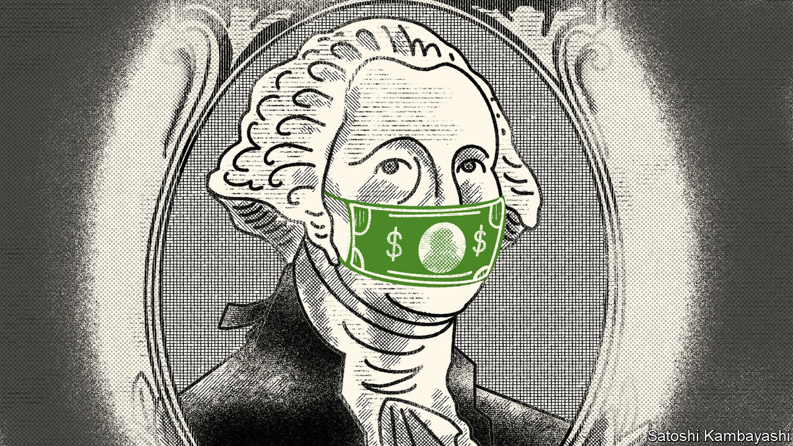
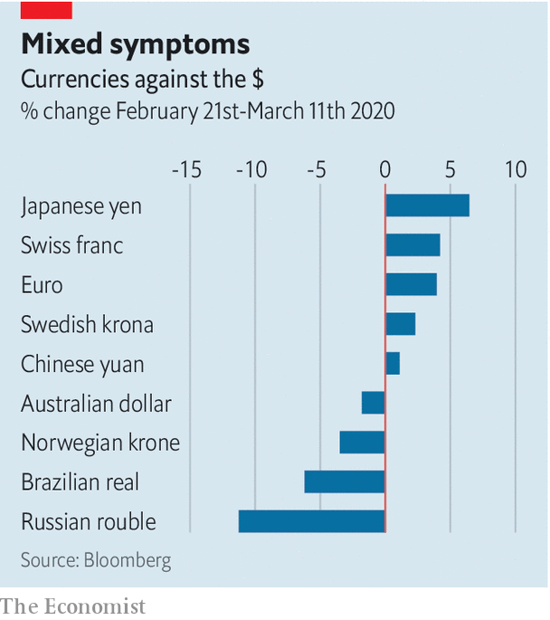

###### Buttonwood

# A spike in the dollar has been a reliable signal of global panic 

##### Are we due one? 

 

> Mar 12th 2020 

THERE ARE two types of sellers in financial markets. The first kind sell because they want to. They may need cash to meet a contingency; or they might coolly judge that the risks of holding an asset are not matched by the prospective rewards. The second kind sell because they have to. The archetype is an investor who has borrowed to fund his purchase and has his loan called. If there are lots of forced sellers, as can happen in periods of stress, the result is a rout.

Involuntary selling can amplify any decline in asset prices. A called loan is not the only trigger. It might be a ratings downgrade; an order from a regulator; or a jump in volatility that breaches a risk limit. What happens in the markets then feeds back to the broader economy, making a bad situation worse.


This brings us to the dollar. An evergreen concern is the scale of dollar securities issued or held outside America. In the midst of the financial crisis of 2007-09, the Federal Reserve set up currency-swap lines with other central banks to deal with a lack of dollars, as borrowers outside America were caught short. In stressed markets a spike in the greenback is a tell. Investors sell what they own to buy the dollar not because they want to but because they have to.

So far the dollar has traded reasonably. In recent weeks it has rallied against a clutch of currencies hurt most by the slump in oil and commodity prices and lost ground against the yen and Swiss franc (the other havens in a storm) as well as the euro (see chart). Perhaps there are stresses out there, but they are obscured by other factors weighing on the dollar. There has been a sense that it is due a fall. It looks expensive on yardsticks of value, such as purchasing-power parity. The Fed’s interest-rate cut earlier this month, with further reductions likely, means that holding dollars has become less appealing.

 


Yet it is easy to forget how bearish sentiment on the dollar was in 2008. Many expected it to fall in the teeth of a crisis that had, after all, originated in America. Instead it spiked as banks outside America scrambled to get hold of greenbacks in order to roll over the short-term dollar borrowings that funded their holdings of mortgage securities. In 2015-16 China ran down its reserves by $1trn in part to meet demand for dollars from Chinese companies who had borrowed heavily offshore. And notwithstanding attempts by countries, such as Russia, to de-dollarise their economies, the greenback is as central to the world economy as it ever was. If there are hidden strains in cross-border finance, they will eventually be revealed by spikes in the dollar.

It would be foolish to rule this out. No doubt pockets of stress will emerge in the coming weeks—a hedge fund, say, that has borrowed dollars to buy riskier sorts of assets and faces a cash crunch. But the sort of aggressive borrow-short-to-lend-long bets that intensified the 2007-09 crisis have been much harder to make. Banks have tighter constraints on their lending. Panic by overborrowed foreigners does not seem a first-order concern.

Other plausible, but voluntary, changes in behaviour would affect the dollar in a variety of ways, or not at all. Foreign investors might simply choose to sell (or refrain from buying) American securities amid the current turmoil—a sort of financial self-quarantine. But surplus savings must be put to work somewhere. Asian funds have been steady buyers of overseas debt securities. Japan’s Government Pension Investment Fund, a $1.6trn pool of retirement savings, had signalled that it will increase its holdings of foreign debt and equities in the coming financial year. There is no sign that it is backing away from this, says Mansoor Mohi-uddin, of NatWest Markets in Singapore. Indeed there is a logic to its front-loading foreign-asset purchases, as a means of weakening the yen and helping Japan’s exporters.

Japanese funds have in recent years preferred to buy euro-denominated debt, because the costs of hedging euro currency risk is low. But if the Fed keeps cutting rates, dollar hedges will become cheaper. Currency-hedged Asian investors might then tilt towards American assets. That would be neutral for the dollar (because of the hedging) but a welcome fillip for issuers of corporate debt in America.

The dollar remains an unloved currency. Witness the surge in gold prices spurred by seekers of an alternative. It is the currency investors are forced to buy, not the one they want to buy. The dollar’s calmness is reassuring. A sudden spike in its value would be a bad sign indeed.

