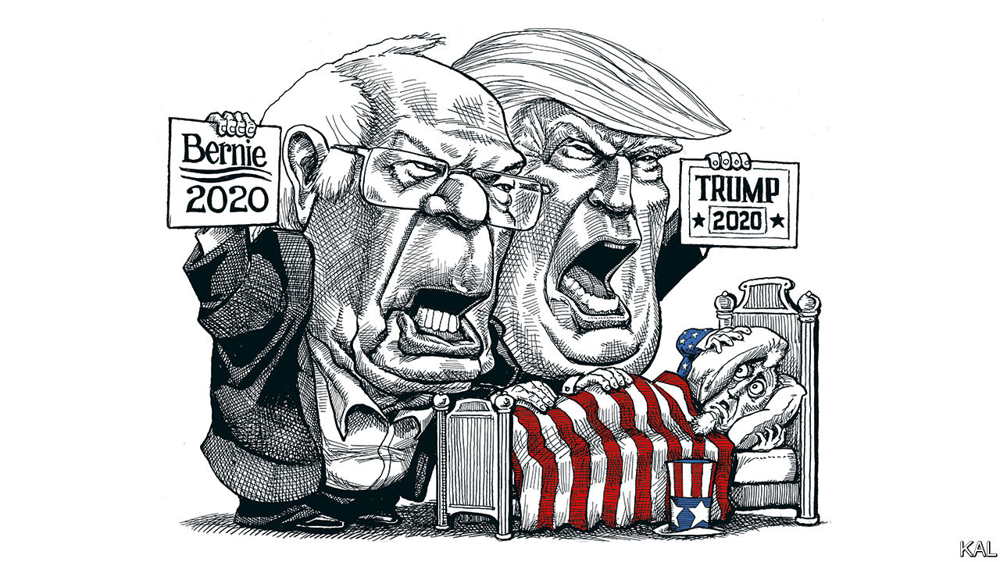

###### On Bernie Sanders, green technology, Mexico, Chinese MBAs, facial expressions

# Letters to the editor 

##### A selection of correspondence 

> Mar 14th 2020 

 


Feeling the Bern

“It will surprise nobody”, you said, “that we disagree with a self-described democratic socialist over economics” (“”, February 29th). But, as a 40-year subscriber to The Economist, I was indeed surprised by your leader on Bernie Sanders. I have always valued your commitment to free trade and to socially liberal policies: universal education, efficient and affordable health care, legalisation and control of drugs, workplace equality, broad immigration and integration, and so on.


Many of these social policies have been disrupted around the world by nationalist sentiments, driven by economic insecurity over rising financial inequality, which in turn is a result of corporate giveaways, trickle-down (or voodoo) economics, and outright corruption.

There are two ways of improving the situation. One is to ask corporations to share their wealth more widely with their employees and to do more for society. This doesn’t work because the benefits are spread unevenly, and it puts the civic-minded corporation at a competitive disadvantage to its less generous competitors.

The other approach is to allow corporations to go ahead and make their money, and for the government to tax them sufficiently to provide universal education and health care and other services. This was the norm under Franklin Roosevelt, Harry Truman and Dwight Eisenhower, underpins the democratic socialism of Scandinavia and other happy places, and is what Mr Sanders advocates. I fail to understand your hostility to it.

ROBIN HELWEG-LARSENGovernor’s Harbour, Bahamas

Starting with his campaign in 2016 Mr Sanders brought some much-needed civility to political discourse. He inspired many by talking about actual issues rather than the trash talk we have got used to over the past five years. He veers away from inane platitudes like “Hope and Change” and “Make America Great Again”. Does your newspaper really think that American capitalism is so desperate and fragile that it cannot handle a serious debate on the problems that confront the country today?

DAVID WARRENBerkeley, California

Mr Sanders is indeed “convinced that he is morally right”. Yet I recall that back in November 2012, Mr Sanders was one of only four senators to vote against the Magnitsky Act, which imposes sanctions on certain human-rights offenders in Russia. Notwithstanding his positions against fracking and private health insurance, or his sympathy with autocratic regimes, his vote against the Magnitsky Act alone is proof enough that he is far from being morally right.

STEVEN HONGNorth Vancouver, Canada

 


How to spend it

Besides the political and technological, there are plenty of other ways for Jeff Bezos to spend $10bn philanthropically on solving climate change (“”, February 22nd). You have reported, for instance, on the MethaneSAT project, which will police and shut down methane leaks from oil and gas operations globally, emissions which represent several per cent of the total climate warming effect (“The methane hunters”, February 1st). Perhaps the largest problem and thus biggest opportunity of all is the scale and cost of investment in solar, wind and energy storage projects, which must be constructed in emerging economies. Around $20trn must be invested in poorer areas of the world over the next ten years. Poor countries have spotty track records of respecting the rights of foreign investors, have weaker currencies and other challenges. Innovation in financing solar, wind and energy-storage projects in the form of “blended finance” is desperately needed to make these infrastructure investments more affordable for those who have, paradoxically, the highest cost of money today. The scale of the problem requires government intervention, but philanthropy on the $10bn scale can lead the way.

ION YADIGAROGLUNew York

 


Mexico’s government

In response to ’s column on Mexico’s government, (February 29th), this administration is fighting crime on many fronts. The newly created National Guard has curbed the rise in the number of murders. Kidnappings in December 2019 were down by 31% year over year; car thefts have fallen by 12%.

On the economic front, the progress made in ratifying the new trade deal with Canada and the United States will promote investment. In 2019 foreign direct investment grew by 4.2%. The Mexican government has also invested heavily in our southern states to boost growth and address economic inequalities. Meanwhile, it has kept inflation low, even while raising the minimum wage.

The administration has a clear strategy. It is committed to eliminating inequality and violence by ending the war on drugs, strengthening the rule of law, ending impunity, and promoting inclusive development. The use of force is no longer the first option. For the first time since 2010, attacks by criminal groups on federal forces have resulted in more arrests than deaths. At the same time, more than 9.2m people have benefited from social programmes or unconditional cash transfers to vulnerable groups. The results are clear: a fifth of our poorest citizens have seen their incomes rise by 24%. The challenges that our country faces are vast, but the statecraft Mexico urgently needed is at last being delivered.

ROBERTO VELASCO áLVAREZDirector-general of public affairsMinistry of Foreign AffairsMexico City

 


The new masters

The history of Chinese management education starts earlier than 1994 (“, February 15th). After diplomatic relations were established, Jimmy Carter’s science adviser in 1980 urged China to start the first management education programme at Dalian, a seaport. The costs for a new building and American faculty were shared equally by the two countries. Lectures were held in summer and autumn because of the poor heating. The audience was composed of nationally selected mid-level managers, economics and management professors (universities were closed during the Cultural Revolution) and Chinese government officials. The attendees’ level of English was quite low, so lectures were prepared in advance and translation was sequential. Some resulted in books which had as many as five printings.

To learn that now China has its own executive programmes abroad in countries like Switzerland, teaching economics and management with capitalistic characteristics, reflects the miraculous changes which have occurred over 40 years.

BERTRAND HORWITZAsheville, North Carolina

 


Keeping your chin up

At last, proof that facial expressions are not an accurate guide to how someone feels (“”, February 22nd). I tend to have a downturned mouth, more so with age, yet life is wonderful. Even more so now, since I have cut out your article, and intend to wave it at every builder or scaffolder who has the temerity to yell out, “Cheer up love, it might never happen.”

LUCY BERESFORDLondon

