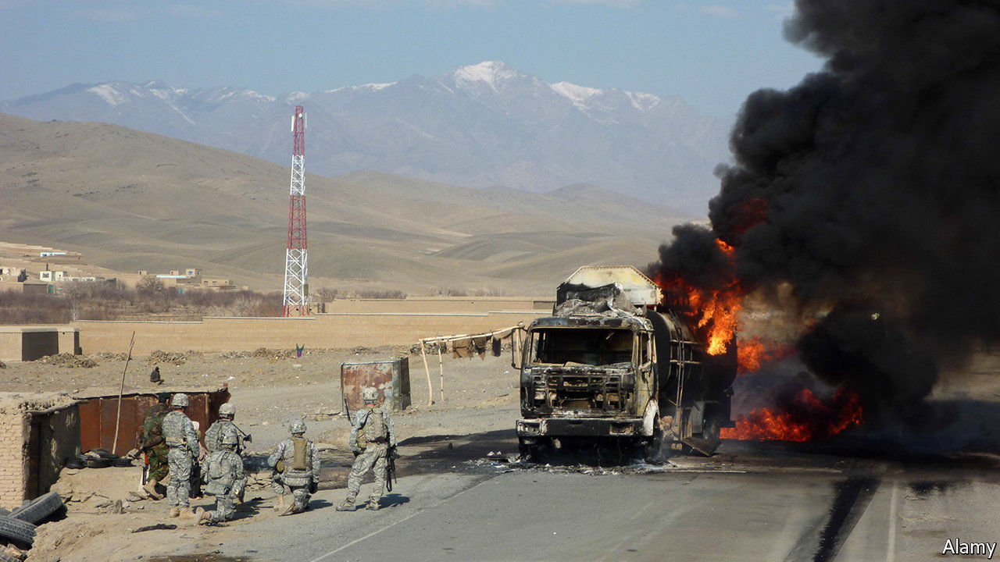

###### Atomic energy

# Nuclear power plants are coming to the battlefield 

##### They could supply energy to far-flung bases, power laser weapons and charge electric vehicles 

 

> Mar 14th 2020 

WAR ZONES are dangerous places. Where better, then, for a nuclear reactor? On March 9th America’s government awarded a trio of firms $39.7m to design “microreactors” that can supply a few megawatts of power to remote military bases, and be moved quickly by road, rail, sea and air.

The idea of small reactors is as old as nuclear power itself. In July 1951, five months before a reactor in Idaho became the first in the world to produce usable electricity through fission, America began building USS Nautilus, a nuclear-powered submarine. In the 1960s and 1970s small reactors powered bases in Alaska and Greenland, a radar facility in Wyoming, a research station in Antarctica and—from a cargo ship—the Panama Canal Zone. America still uses nuclear-powered submarines and aircraft-carriers. But land-based mini-reactors proved unreliable and expensive and have fallen out of favour.


Interest has been revived by recent wars, in which American forces proved extraordinarily hungry for energy. Early in the Iraq war, fuel made up over a third of the tonnage transported to the region. Between 2001 and 2010, over half of American casualties in Iraq and Afghanistan occurred during land-transport missions, many involving fuel deliveries to remote outposts. Portable reactors could substitute for unreliable power grids or the generators that often take their place.

America’s armed forces use about 30 terawatt-hours of electricity per year—about the same as Ireland—and more than 35m litres of fuel per day. In 2016 a report by the Defence Science Board, a committee of experts, concluded that demand would surge as new power-hungry weapons, like lasers and rail-guns, come to maturity. Vehicles are also moving away from fossil fuels: America expects to have all-electric brigades within the decade. A report by the army in 2018 said that Holos, a prototype mobile nuclear reactor, would be 62% cheaper than using liquid fuel.

It is not just American troops experimenting with mobile nuclear power. NASA is developing smaller “Kilopower” reactors for space missions, designed to power small lunar outposts. Russia already uses larger floating reactors for its nuclear-powered icebreakers. China plans to install similar devices on disputed islands in the South China Sea.

But the planned microreactors would be distinct in several ways. They are intended to be assembled in a factory and shipped in one piece, doing away with the need for tricky engineering in remote places. They should weigh under 40 tonnes and fit onto the back of an articulated lorry. And they are supposed to run themselves, with “minimal monitoring” from afar.

The risks are manageable, say proponents. Designs feature “passive safety” systems, which keep working even if electricity is lost or a component breaks. Cooling pumps can be replaced by natural convection currents, for instance. The reactors use “tristructural isotropic particle fuel”, in which blobs of fissile uranium (along with oxygen and carbon) are wrapped in layers of carbon and silicon carbide. The pellets can withstand high temperatures, contain radioactive contamination and limit the impact of accidents. The reactors themselves “would be shielded and protected, and possibly placed in a hole in the ground”, says Bill Lee, a nuclear engineer and materials scientist at Bangor University, in Wales. A nuclear meltdown should be “physically impossible”, says the Pentagon. The grunts on the ground will be hoping that is right. ■

