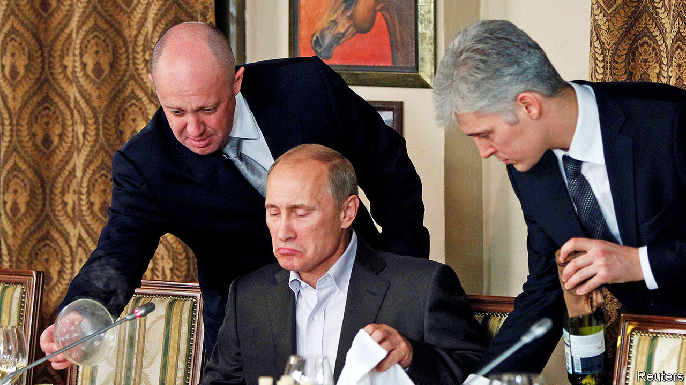
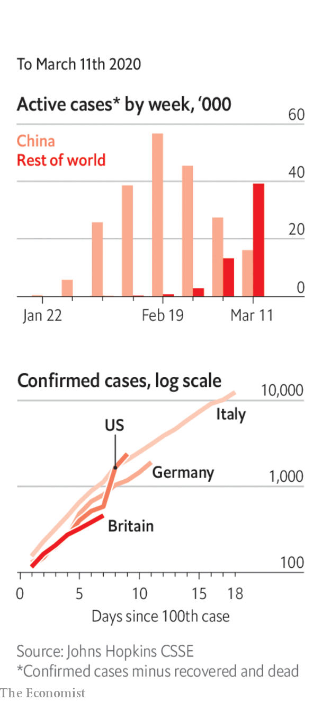

###### 

# Politics this week 

#####  

 

> Mar 14th 2020 

Vladimir Putin, Russia’s president, said that he would be prepared to continue in office past 2024, when his fourth and supposedly final presidential term expires. The Russian parliament voted this week to amend the constitution to reset to zero the number of consecutive terms that he has already served. See .

The trial began in the Netherlands of four men—three Russians and a Ukrainian—who are charged with involvement in the shooting down of Malaysian Airlines flight MH17 over eastern Ukraine in 2014. The four were not in court, having refused to turn themselves in, but the court decided that the trial can go ahead without them.


Rishi Sunak, Britain’s new chancellor of the exchequer, had been expected to increase borrowing. But the scale of fiscal loosening in the government’s budget was still surprising. A package of measures tallied up to a £30bn ($38bn) splurge, almost half of it for the emergency response to covid-19. The National Health Service will benefit the most, but a reserve fund for businesses and workers will also help with the economic hit the virus will cause. See .

Bernie burned by Biden

Joe Biden won the Michigan primary and several other states in the latest Democratic contests. Bernie Sanders could not repeat the surprise win he chalked up in Michigan four years ago. Kamala Harris and Cory Booker, two former candidates, endorsed Mr Biden, who looks like he has the nomination all but sewn up. See .

Harvey Weinstein was sentenced to 23 years in prison for his recent convictions for rape and sexual assault. The movie mogul has been cleared of charges that carry even lengthier prison terms.

Donald Trump ditched Mick Mulvaney as his chief of staff, and named Mark Meadows, a loyal congressman, as his replacement. Mr Mulvaney was the president’s third chief of staff, but fell foul of his boss some time ago, especially when he went off script about Mr Trump withholding aid from Ukraine in return for political favours.

Fighting for her life

Millions of Mexican women stayed home from work and school to protest against murders of women. The strike was spurred by recent brutal killings. The country classified 980 murders last year as “femicides”, that is, committed because of the victim’s sex, up from 411 in 2015.

Jair Bolsonaro, Brazil’s president, dined with Donald Trump at his Florida estate, Mar-a-Lago. Brazil and America signed an agreement on defence technology that could lead to more American purchases of Brazilian weaponry.

Guyana’s chief justice blocked the Elections Commission from declaring the result of a general election in the country’s biggest electoral district after foreign observers said vote counting had “lacked credibility and transparency”. Initial results gave victory to the government.

Circles of power

Both the incumbent, Ashraf Ghani, and his main electoral opponent, Abdullah Abdullah, were sworn in as president of Afghanistan in rival inauguration ceremonies. In the meantime, talks between Afghan politicians and the insurgents of the Taliban, which had been due to start on March 10th, are on hold, as the two sides argue about a planned prisoner exchange. See .

Myanmar’s army vetoed constitutional amendments that would have reduced its political power. The ruling National League for Democracy, led by Aung San Suu Kyi, had proposed shrinking the proportion of MPs appointed by the army and making it easier to amend the constitution, among other things. See .

North Korea launched several missiles into the Sea of Japan in an apparent military drill. It was its second missile test in the space of a week.

Lebanese bind

Mired in economic crisis, Lebanon did not repay a $1.2bn Eurobond, defaulting on its debts for the first time. Foreign reserves have plummeted and unemployment is rising. The government will try to negotiate a restructuring with its creditors, as it struggles with debt that is about 170% of GDP. See .

Two Americans and a Briton were killed by a rocket attack on a military base near Baghdad. Tensions have been high in Iraq, as Iranian-backed militia have sworn revenge for America’s assassination of a senior Iranian commander at Baghdad airport in January.

Prince Ahmed bin Abdel-Aziz, a brother of Saudi Arabia’s King Salman, and Prince Muhammad bin Nayef, a nephew of his who was previously the crown prince, were arrested with several other senior figures. The arrests were presumably ordered by the current crown prince, Muhammad bin Salman, who runs the show. This suggests that opposition to the crown prince’s authoritarian ways may be stirring in rival royal circles.

Abdalla Hamdok, the prime minister of Sudan, survived a gun-and-bomb attack on his motorcade. The assassination attempt highlights the precariousness of the country’s transition towards democracy.

The coronavirus crisis

 


The World Health Organisation officially declared covid-19 to be a pandemic: “We have rung the alarm bell loud and clear.” See .

America announced a travel ban on visitors from Europe (except Britain and Ireland).

The lockdown in northern Italy was extended to the whole country. Most shops were ordered to close.

In Germany, Angela Merkel said that 60-70% of the country’s population may contract the disease at some point.

Xi Jinping said there had been a positive turn to contain covid-19 in the province of Hubei. Outside Hubei, China reported three days with no newly confirmed cases of local infection.

The central bank of Nigeria will, in effect, ban imports of hand sanitiser. The governor said this would boost local production.

For our latest coverage of the virus and its consequences please visit  or download the Economist app.

