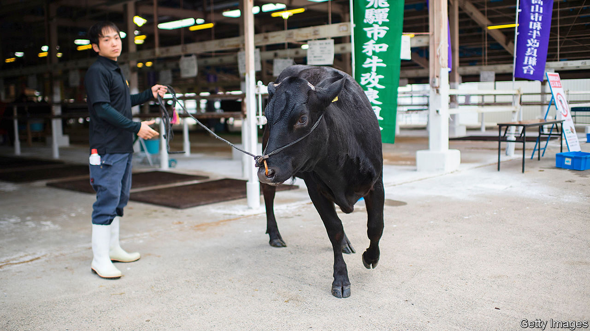

###### Sperm wail

# Japan tries to stop foreigners copying its cows 

##### A law to curb exports of bovine semen is coming 

 

> Mar 19th 2020 

“WAGYU IS NOT just meat. It’s all things that Japan is famous for: tradition and quality and conviction.” That is how a Western chef describes Japan’s fatty marbled beef. But to the government, wagyu is a valuable asset, at risk of being pilfered by foreigners. In January the farm ministry proposed a bill to criminalise unauthorised export of wagyu eggs or sperm. Smugglers could spend as long as ten years in jail, or pay a fine of up to ¥10m ($92,000).

Raising wagyu is a booming business. Japan exported 4,339 tonnes last year, worth a total of ¥29.7bn—about three-and-a-half times the volume and value it shipped just five years prior. Demand is rising as Asia grows wealthier. The nouveau riche in Hong Kong and Taiwan, and increasingly in Thailand and Macau, are paying exorbitant prices to dine on wagyu. (The biggest importer, surprisingly, is Cambodia. Analysts reckon that imports are re-exported to China, which until recently banned Japanese beef after an outbreak of mad-cow disease in 2001.)


Moreover, foreign cattlemen are definitely trying to muscle in on the market. In 2018 two men were caught trying to smuggle more than 100 samples of wagyu DNA into China. But trying to protect the industry by banning semen exports is like slamming the barn door after the bulls have—well, never mind. Australia, whose cattle farmers began crossbreeding Japanese and local cows in the 1980s, already exports seven times more wagyu than Japan.

To purists, moreover, only purebred beef from Japan is truly worthy of the name wagyu. It is not just genetics that mark it out, but the way in which it is reared. Some Japanese cattle-farmers soak feed in beer and give their cows regular massages (relaxation, along with the marbling, is thought to keep the beef tender). Foreign versions do not “taste at all like wagyu bred in Japan”, says Thierry Voisin, a Michelin-starred chef. To Suneya Masahiko, who heads the Japan Livestock Products Export Promotion Council, foreign wagyu is “inauthentic”. He sees the legislation as a chance to introduce “proper wagyu” to the world.

