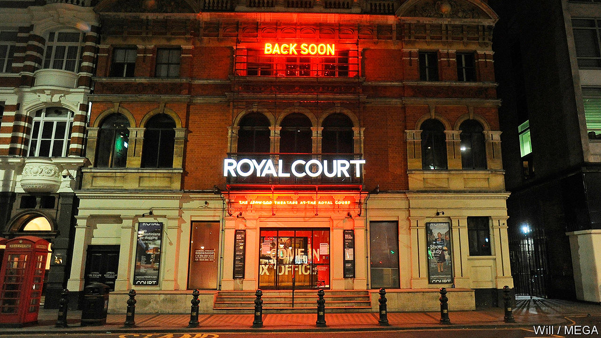

###### Entertainment

# The closure of London’s theatres 

##### In a pandemic, the play’s no longer the thing 

 

> Mar 19th 2020 

PETER SALMON has been cleaning costumes since he was 13. As a “small and wiry” teenager, he was sent inside the dry-cleaning machines to fix any hiccups. Now 67, he is trusted by London’s West End theatres to make everything from ball gowns to animal outfits gleam. Every morning, his vans come back from theatreland stuffed with pongy garb for his team of nine—including his brother, sister-in-law and two nephews—to wash, press and return before the curtain goes up. He has two boilers, just in case. “If one breaks down, we carry on,” he says. The show must always go on.

Soon, though, Mr Salmon’s three dry-cleaning machines and four presses will fall as silent as the capital’s stages. A handful of London’s 240 or so theatres had already curtailed runs in an attempt to slow the spread of covid-19. The rest followed suit on March 16th, when Boris Johnson recommended that Britons avoid gathering in confined spaces. The National Theatre has closed until April 12th. Others have turned off their spotlights indefinitely.


Arts institutions around the world are shutting their doors. Nowhere, though, has a greater concentration of live theatre than London. According to the Society of London Theatres, a trade body, more than 15m people saw a show in the capital last year, just edging New York. Only last month the society trumpeted its members’ 16th consecutive year of rising revenues, which came to £799m ($929m) in 2019. Now these same venues—many of them elderly relics with crimson carpets and box offices squeezed into cubby holes—are fighting for their survival. As David Babani, artistic director of the Menier Chocolate Factory theatre, notes: “It looks incredibly bleak.”

In New York Andrew Cuomo, the governor, ordered Broadway to close down for a month on March 12th. Even 9/11 only halted performances for two days, but Mr Cuomo said the measures were necessary to slow the spread of the virus.

London’s independent theatres are particularly vulnerable. The Arcola, in Dalston, solicited donations as soon as it announced its temporary closure, warning theatregoers that its future is at risk. Others begged ticket holders not to demand refunds. The government has promised grants and business-rate holidays; Arts Council England, a quango, has pledged emergency support.

Actors are accustomed to finding ways to pay the bills in fallow patches between shows, but businesses are laying off rather than hiring. Work has also dried up for stage hands and costume-makers. “The wardrobe girls have got no work,” says Mr Salmon. “They’re all really sweating.” If the shutdown forces such people to find other work, skills could be lost for good.

The crisis will, at least, spur innovation. Some theatres are planning to experiment with streaming productions online. Papatango, a charity that supports new writers, is soliciting monologues penned in self-isolation. And Fra Fee, an actor who usually performs to sell-out crowds at venues like the National Theatre, says he will post videos of Irish songs online to pep others up. “We’ve got a whole load of people sitting in their bedrooms going nuts,” says Ben Todd, executive director of the Arcola. “We will figure out a way to be useful.” ■

