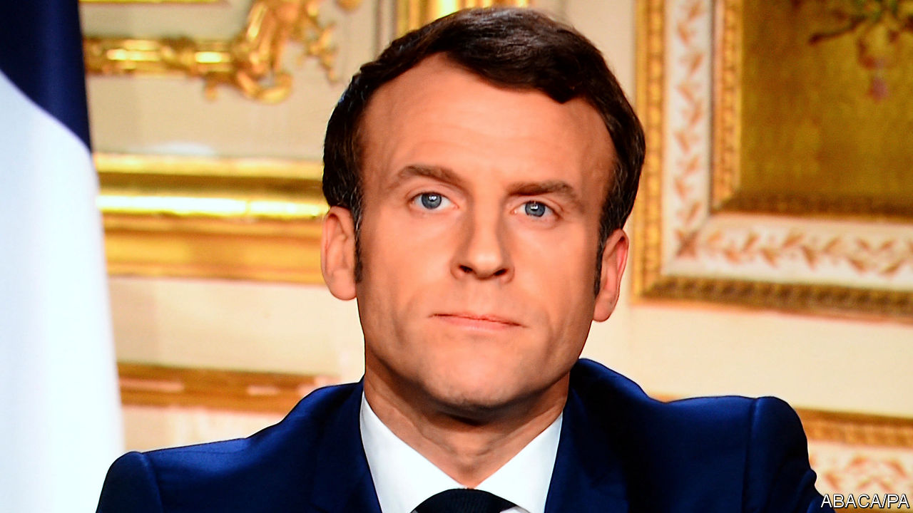

###### The virus and the vote

# France suspends local elections because of covid-19 

##### President Emmanuel Macron’s handling of the crisis gets high marks from the public 

 

> Mar 19th 2020 

AN EERIE SILENCE descended on the French capital at noon on March 17th. In a city famed for its café culture and street life, policemen with megaphones were on patrol, checking papers and ordering those still out without permission to go back indoors. All residents countrywide were told to stay at home, unless they need to shop for food or medicine, attend medical appointments, or go to an essential job. Yet just two days earlier the same government had urged the French to vote in the first round of the municipal elections in the country’s 35,000 cities, towns and villages.

As the country adjusts to the drastic new regime, questions are inevitably being asked. The week before confinement, mayoral candidates were still holding rallies, though with a cap of 1,000 people. On March 12th President Emmanuel Macron announced that the situation was worrying enough to close all schools and universities from March 16th. His prime minister, Edouard Philippe, introduced stage three on March 14th, shutting all cafés, restaurants, non-food shops, hairdressers, cinemas and sports centres. The elections, they said, would go ahead.


There followed surreal scenes on voting day. Polling stations were organised to ensure that staff and voters remained at least a metre apart. Returning officers counted the vote wearing masks and gloves. Official results were declared, showing, broadly, a strong Green vote, backing for incumbent mayors, poor support for Mr Macron’s party and a record low turnout. Yet, at the same time, Parisians were to be found gathered in parks or shopping in crowded street markets, ignoring advice to stay in. The next day, Mr Macron addressed the nation again, deploring the fact that people were behaving “as if, basically, life had not changed”. He suspended the second-round vote, due on March 22nd, shut France down, and declared, “We are at war.”

Why did Mr Macron not delay the elections earlier? His former health minister now says she knew it was a “masquerade” to go ahead. It turns out that postponement was still on the table as late as March 12th. Delaying a democratic vote, however, was a decision that required cross-party consensus, at least politically. There was already a climate of suspicion at the government’s recent use of a decree to pass its pension reform. Gérard Larcher, president of the Senate, opposed a postponement. Christian Jacob, the Republican leader (who has since contracted covid-19), had said publicly that a delay would constitute a coup d’état. Moreover, the scientific council advising the president suggested that voting would not pose a health hazard if sanitary rules were followed.

As France deals with an acceleration of cases, such questions will become second-order. A military hospital is being mobilised in Alsace, one of the worst-affected regions. Fully 66% of the French told a poll that they found Mr Macron’s first address, which mixed solemnity and science with much-needed warmth, convincing. An astonishing 35m people, more than half the entire population, watched his second. And, despite disapproving of the decision to hold a first-round vote, 57% of the French think he and his government are managing the crisis well—his highest approval rating for a very long time. ■

