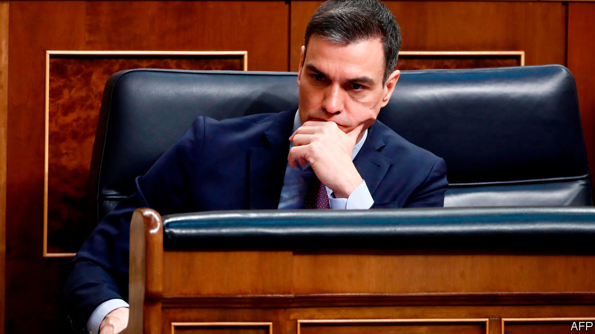

###### Sánchez’s big test

# Spaniards are uniting against covid-19 

##### Now is not the time for political bickering 

 

> Mar 19th 2020 

NEXT TO THE Street of the Virgin of Dangers, in the heart of Madrid, builders have been finishing years of work on a big new luxury hotel that was due to open in May. Like almost everything else in Spain’s economy, that plan is now up in the air. Facing Europe’s worst outbreak of covid-19 after Italy’s, Spain’s government on March 14th imposed a state of emergency, locking the country down for 15 days. Down the road from the hotel the Puerta de Sol, a normally busy transport hub, is deserted. With 14,370 cases and 630 deaths by March 18th, rising steeply each day, the shutdown is likely to last at least a month. It is a test not just of the patience of Spaniards but of their inexperienced coalition government. After a halting start, Pedro Sánchez, the Socialist prime minister, at least seems to have the country behind him.

In Spain’s decentralised democracy, health care is run by regional governments, and so in Catalonia and the Basque country is policing. The novel coronavirus has taken its strongest grip in Madrid, governed by the conservative opposition People’s Party (PP). As cases ramped up last week Mr Sánchez was accused of being “behind events” by Pablo Casado, the PP’s leader.


Acting unilaterally, the Madrid regional government closed all educational establishments as well as day centres for old people; the Basque government closed some schools; and Catalonia isolated 70,000 people around the town of Igualada. The opposition criticised Mr Sánchez and Podemos, his far-left coalition ally, for allowing a big feminist march to go ahead on March 8th. Several of those who took part, including the partners of both Mr Sánchez and Pablo Iglesias, Podemos’s leader, later tested positive for the virus (as have other politicians from the right).

The government at last got a grip on March 14th when, after a seven-hour cabinet meeting, it issued its emergency decree. The delays reflected disagreement between the economic team, which favoured caution, and those who favoured lockdown and sweeping compensation.

The decree puts the national government in charge of health care and policing. It prompted grumbling from Quim Torra, the separatist head of the Catalan administration and to a lesser extent from his Basque nationalist counterpart. Mr Sánchez insists that the virus is no respecter of ideology or place. Most of the opposition has swung behind him. That may make it easier for him to get a budget through Congress. He needs it: despite public debt of 96% of GDP, the government announced a big, and welcome, package to help laid-off workers and struggling businesses.

So far Spaniards seem to be rallying round. Each evening at 8pm residents stand on balconies to applaud harried health workers. Patience may flag. But for now, the virus has revived the nation-state after years of centrifugal pressure. ■

