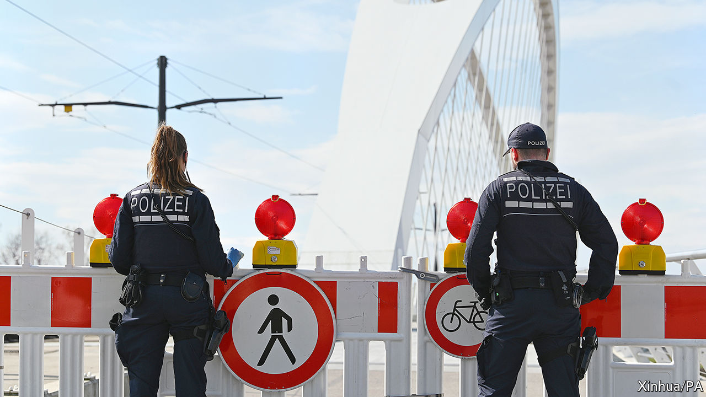

###### Frontier theatre

# Why Europe’s new border controls won’t help much 

##### The real work of beating the virus takes place at home 

 

> Mar 19th 2020 

TWO HUNDRED kilometres of glistening slopes, a gorgeous Alpine setting and a boisterous après-ski scene make Ischgl, a resort in the western Austrian state of Tyrol, one of Europe’s livelier winter playgrounds. It has also turned out to be one of its worst coronavirus hotspots. Hundreds of European cases, especially in the Nordic countries and Germany, have been traced to Ischgl, many of them to a bar renowned for its crowded, dancing-on-tables parties. Air, road and rail links from Austria to other countries have been cut, and governments have quarantined visitors returning from the now-shuttered resorts.

The speed with which the virus has raced from country to country has driven several European governments to adopt a familiar remedy: border controls. In the past week, as governments woke up to the scale of the pandemic, several began limiting entry to outsiders, albeit in haphazard and un-coordinated fashion. Central European and some Scandinavian countries moved first, sealing off entry to most foreigners. On March 16th Germany imposed controls at most of its land frontiers, citing the need to stop the spread of the virus but also to limit cross-border panic-shopping. Goods transporters and commuters were exempt, but for the first time in years they needed to show uniformed officials documentary proof of their right to cross the border. Hiccups were inevitable, especially at Poland’s tightly controlled frontiers. There were reports of 18-hour traffic jams at one crossing with Germany. Some 21,000 people were turned away in two days.


Such measures contradict the spirit, if not the letter, of the European Union’s Schengen zone. Schengen is meant to guarantee document-free travel across the borders of its 26 member-countries (four of which are not in the EU). It has provisions for emergencies. But the speed with which governments erected checks revived unhappy memories of the crisis in 2015-16, when migrants poured across Schengen’s external border into Greece and internal controls went up as far away as Sweden. Six Schengen countries have had partial controls in place ever since, making a mockery of what are supposed to be strictly time-limited exemptions. Now the virus is encouraging the barrier-builders.

The European Commission, as the body charged with keeping goods and services flowing across the EU’s single market, frets more than most. On March 17th European heads of government approved a proposal from Ursula von der Leyen, the commission’s president, to block foreigners from entering the EU for 30 days, with exceptions for legal residents, medical and health workers, and citizens of Britain plus the four non-EU Schengen members. Ms von der Leyen hopes that tough action at the external border will soothe leaders’ nerves enough to ease the internal ones, which she fears could hold up the cross-border provision of food, medical supplies or transport workers. But there is little sign of that yet.

Around 80 countries have restricted travel in some way since the outbreak began, including America, which has imposed a travel ban on Europe and closed its land border with Canada. At the start of an outbreak, when a place has few or no infections, such controls can buy time for governments to put in place social-distancing measures. They might also reduce the likelihood that infections will resurge once a country has got its internal situation under control, as China and South Korea appear to have done.

Yet most experts think border controls are largely useless for protecting areas in which infected people are already mingling. “From an epidemiological point of view border controls are a distraction, and potentially a damaging one,” says Christopher Dye of Oxford University. In a study in 2014, five analysts found that internal and international travel restrictions imposed during influenza outbreaks cut the number of new cases by less than 3%. During the Ebola crisis in west Africa, controls may have made things worse by encouraging infected people to sneak across borders, evading health checks.

There may be a case for governments to introduce checks as part of a suite of actions to convince citizens that the threat is serious enough to warrant adjusting their behaviour: border controls as theatre. But that must be set against the costs of such measures, from the risk of blocking goods transport to shoving airlines into bankruptcy. Ultimately, says Dirk Brockmann at Humboldt University in Berlin, the effect of closing borders is marginal next to social-distancing measures designed to limit interpersonal contact. That lesson may be getting through. Five European countries, including Austria, have now introduced draconian rules banning citizens from leaving home under most circumstances. The new coronavirus will be defeated inside borders, not at them. ■

