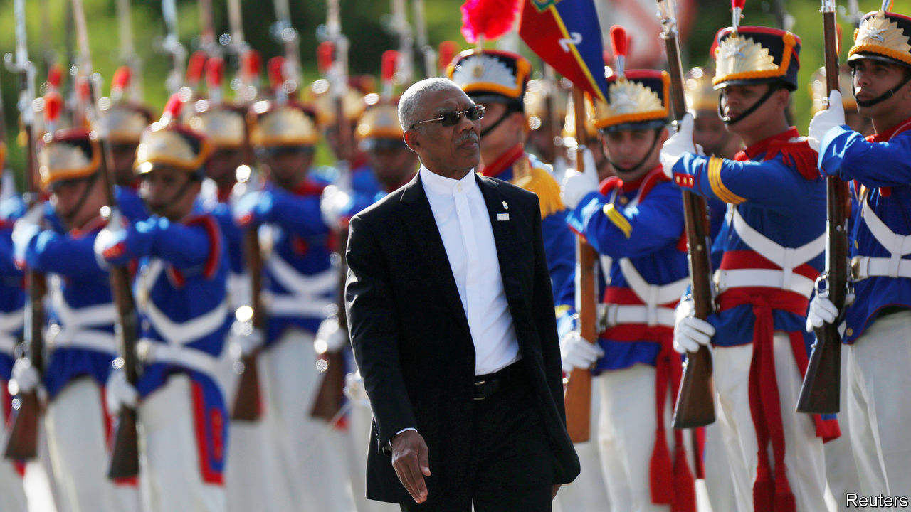

###### Petro power struggle

# Guyana’s dodgy poll is all about oil 

##### If the election is stolen, the windfall will surely be squandered 

 

> Mar 19th 2020 

GUYANA IS MINUSCULE. Its population of 780,000 is roughly that of Seattle. But it has recently struck oil. ExxonMobil, which holds the biggest share of the licence to the first productive offshore block, reckons that 8bn barrels can be pumped out of it. That puts Guyana’s reserves among the world’s top 20. Petrodollars could soon transform Guyana from South America’s third-poorest country into one of the richest.

The power to begin spending that bonanza was at stake in the general election held on March 2nd, the first since oil started flowing. The weeks since have been chaotic. No overall result has been declared. The opposition and outside observers suspect that the president, David Granger, lost his bid for re-election. He may be plotting to have himself sworn in for a second term regardless. The danger to democracy is obvious. A government that lacks legitimacy would be more likely to squander Guyana’s newfound oil wealth.


Its politics is set up to fail its citizens. Party divisions follow ethnic ones. Mr Granger’s A Partnership for National Unity represents mainly Afro-Guyanese, who are 30% of the population. The opposition People’s Progressive Party (PPP) defends principally the interests of the Indo-Guyanese, 40% of the total. The rift is made worse by an electoral system that makes members of parliament directly accountable to party leaders rather than to constituents. This poisons political debate, thwarts compromise and undermines any sense of unified national purpose.

The election this month was a delayed response to a vote of no confidence in Mr Granger’s government in December 2018. He put it off as long as possible, compounding the opposition’s mistrust. As the votes were being counted suspicion flared up. The government’s vote share in its stronghold, the region including the capital, Georgetown, appeared to offset its losses elsewhere. Western diplomats warned of fraud. Mr Granger agreed to a recount, to be supervised by observers from the Caribbean Community. But a court has issued an interim injunction blocking it. A further ruling is expected on March 20th. America’s secretary of state, Mike Pompeo, has warned of “serious consequences” if the votes are not counted fairly.

There are no innocents in this story. The PPP governed for 23 years until Mr Granger took office in 2015. Many Guyanese remember that period as one of large-scale corruption and Indo-Guyanese chauvinism. Mr Granger’s government, though not free of graft or racial animus, has held itself to a higher standard. The president is thought to be personally honest. He governs in partnership with the Alliance for Change, a multiracial party.

Although institutions are weak, in part because of very high emigration, the government has tried to deal with the risks that come with sudden oil wealth, such as corruption and an overvalued currency. All the money will flow into a sovereign-wealth fund. The rules for drawing it down are strict. The government has not indulged in a debt-fuelled spending spree in anticipation of the oil windfall, one reason it may have lost the election.

There is no reason to think that the PPP would govern better. It wants to scrap the law that created the sovereign-wealth fund, supposedly because it gives politicians too much control. A new law could create more opportunity for patronage and misspending. But pessimism about a PPP administration does not justify electoral theft. The votes must be counted honestly. Just as important, Guyana must find a way out of the dead end into which ethnic animosity has driven it. That will require a change of political culture and constitutional reforms. Petrodollars may help. But only if the government that controls them is honest, competent and legitimately elected. ■

