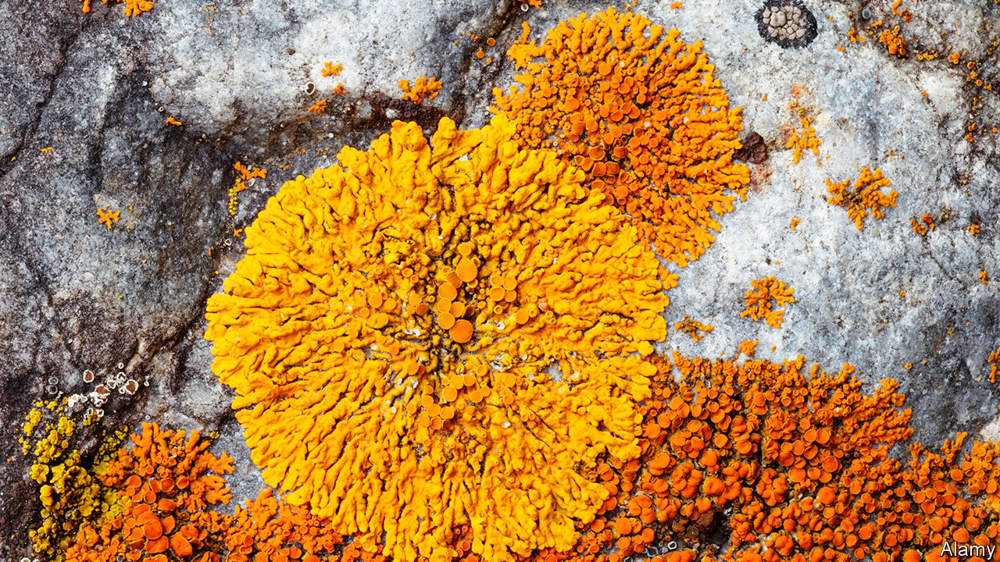

###### A little lichen relief

# Canada’s quest for a national lichen 

##### Scientists have narrowed down the country’s 2,500 species to a shortlist of seven 

 

> Mar 19th 2020 

CANADA HAS a national tree (the maple), a national animal (the beaver) and a national horse (the Canadian horse). Conspicuously missing is a national lichen. Scientists at the Canadian Museum of Nature in Ottawa want to put that right. It is conducting an online poll to choose one. More than 9,000 people had voted by March 17th. The ballot closes on March 26th.

The case for choosing a Canadian lichen is compelling. The country has more than 2,500 species of lichen, a composite of fungi and another element, algae or cyanobacteria (free-living photosynthetic bacteria). Only Russia has a comparable number. Inconspicuous on suburban tree trunks and driveways, lichens help prevent soil erosion and fix atmospheric nitrogen in the soil. They provide winter food for caribou (reindeer). So far, California is the only jurisdiction with an official lichen (lace lichen, chosen in 2015). Iceland, Scotland and the Faroe Islands have issued stamps, so at least their citizens are licking lichen.


The tough question is not whether to designate a Canadian lichen but which one. Lichenologists have drawn up a shortlist of seven. They include the common freckle pelt lichen, which “blankets moss, soil and low shrubs in exposed moist areas”, says the museum’s website. Canada has half the world’s endowment of this sort.

The bright orange elegant sunburst lichen (pictured) grows on rocks and bones. Hunters use it to find nests and burrows. Horsehair lichen, “intricate brown tresses festooning the branches of fir, spruce and pine”, is eaten by flying squirrels. Trevor Goward, a naturalist, favours it because it contains a third element, yeast (also a type of fungus). Its three-part composition best represents “the origins of Canada: First Nations, the French and the English”, he says. Troy McMullin, a botanist who launched the vote, is rooting for the star-tipped reindeer lichen, which “grows like a cauliflower and is instantly recognisable, if you have what I call lichen eyes”. 

But the road to national recognition is rocky. In a ballot four years ago, almost 50,000 Canadians voted on a national bird. They chose the loon, which appears on the one-dollar coin, but the Royal Canadian Geographic Society insisted on the grey jay. The government did not endorse it, perhaps because it had already singled out the beaver and backed a horse. Lichens may be luckless, too. The Department of Canadian Heritage is “not actively considering” adopting one as a symbol. The pro-lichen movement will have to be a grassroots one.

