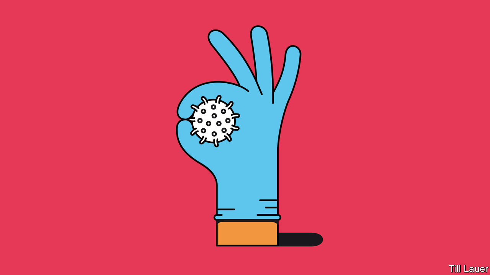

###### Banyan

# Let Taiwan into the World Health Organisation 

##### A champion against covid-19 is shut out of the body that fights the pandemic 

 

> Mar 26th 2020 

Editor’s note: The Economist is making some of its most important coverage of the covid-19 pandemic freely available to readers of The Economist Today, our daily newsletter. To receive it, register . For more coverage, see our coronavirus 

SPARE A MOMENT and admire Taiwan. Its handling of the new coronavirus pandemic has so far saved many, many lives. The figures tell the story. A country of 24m, it has far fewer infections than its neighbours: just 235 as of March 25th, with only two deaths.

Taiwanese officials seem to know what they are doing. The vice-president, Chen Chien-jen, is a noted epidemiologist and former health minister. It helps that the country has had a system in place to handle such crises, since the SARS epidemic of 2003, which led to 73 deaths. Back then, it was not clear who was in charge. So in 2004 the government set up the Central Epidemic Command Centre (CECC). Usually dormant, in an emergency its mandate is to work across government departments and commandeer the resources it needs. On January 20th President Tsai Ing-wen triggered the CECC and put the minister of health, Chen Shih-chung, in charge.


Its response was swift, and ranged from screening inbound air passengers to energetic testing and rationing face masks. A curious legacy of dictatorship under the Kuomintang, or Nationalist Party, organised along Leninist lines, is Taiwan’s system of neighbourhood wardens. These have helped enforce quarantines and deliver food to those who cannot go out to get it.

If Taiwan shines at anything, it is IT. National databases and big data have been put to use identifying those most at risk of infection. If that sounds like Big Brother, freedom-loving Taiwanese have widely accepted it for the common good. Meanwhile, the government is open and upfront about the progress of the outbreak. The media take the dissemination of information seriously. And a stiff fake-news law has helped shut down disinformation campaigns on social media originating from China, which are intended to sow mistrust of the government’s handling of the pandemic. If ordinary Taiwanese are broadly reassured, so is the economy. Business confidence has held up remarkably well. This is in striking contrast to the panic and uncertainty in Europe and America.

Strong economic and personal connections with China might be expected to complicate Taiwan’s response to covid-19. After all, even America got it in the neck when it banned flights from China. Yet Ms Tsai and her administration have been in the doghouse with the Chinese authorities for years. China, which claims the island as its own, dislikes her Democratic Progressive Party for its espousal of formal independence from China. Yet the chill made for crisper decision-making once the threat became clear. And those strong connections alerted the Taiwanese authorities to a worrying outbreak in Wuhan before the Chinese government had come clean about it. China’s initial cover-up eroded people’s trust in its response. In contrast, vigorous and timely action in Taiwan set a reassuring tone. As early as late December Taiwanese health officials were boarding flights from Wuhan to check passengers for symptoms.

Not all is rosy. It is harder to track infections among some 50,000 illicit migrants from South-East Asia, many of them care-workers. Taiwanese returning from other parts of the world risk setting off a new wave of infections. A Taiwanese press used to Chinese hostility has adopted a war footing against the coronavirus, including vigorous support for the government; if officials do fall short, or invade citizens’ privacy, it is not clear the press would call them out.

For all that, Taiwan’s performance is remarkable. Even more remarkable is that the country is not a member of the World Health Organisation. The simple reason is that a bullying China refuses it entry. It may not even attend the World Health Assembly, the WHO’s decision-making forum, as an observer. When Taiwan wrote to the WHO in late December asking whether there was human-to-human transmission in the virus outbreak in Wuhan, the WHO, the body now admits, did not reply.

Taiwan’s fight against covid-19 has shown that it can cope outside the WHO, even if there is a cost. But its exclusion causes wider damage. Taiwan’s early understanding of the threat of the coronavirus could have given others advance warning. Taiwan’s inability to disseminate its findings cost lives.

The WHO has praised China for “perhaps the most ambitious, agile and aggressive disease containment effort in history”, which is true. But the WHO could spare a word of praise for Taiwan, too. Better yet, it should insist that China end its unconscionable boycott.

Dig deeper:For our latest coverage of the covid-19 pandemic, register for The Economist Today, our daily , or visit our 

