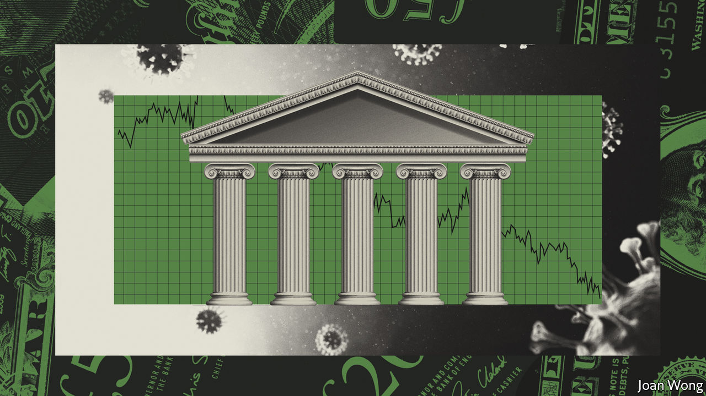
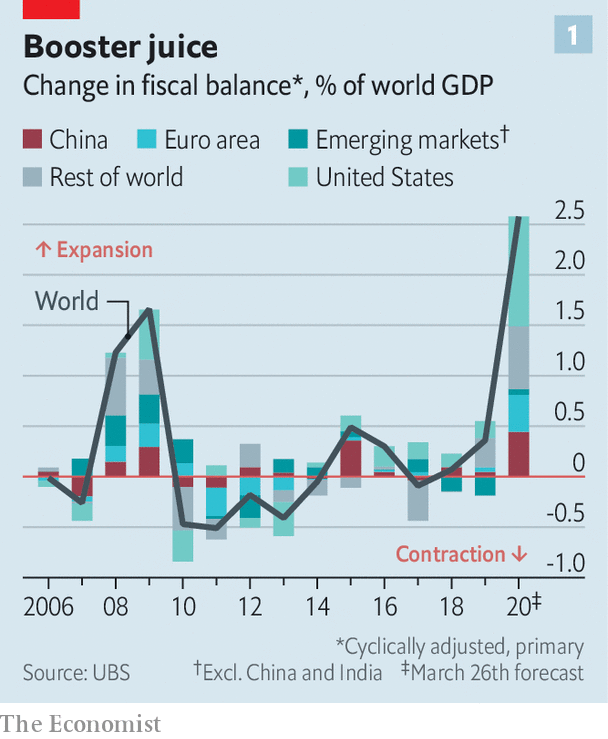
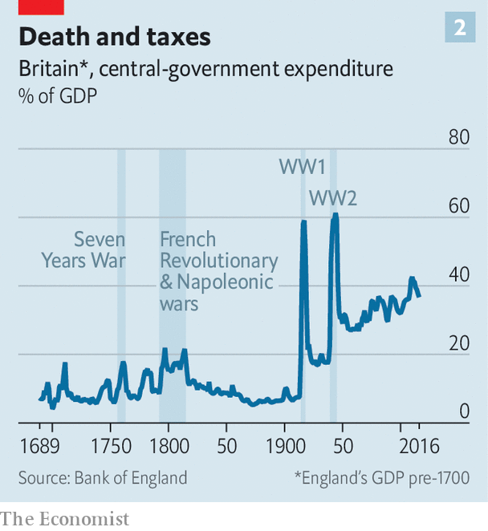
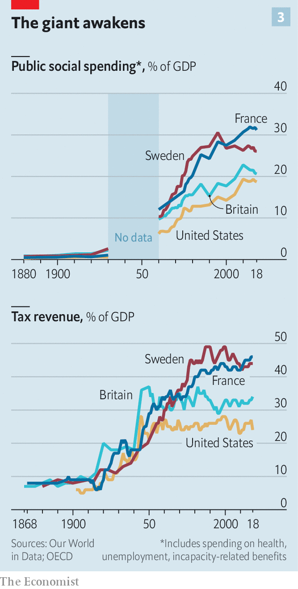
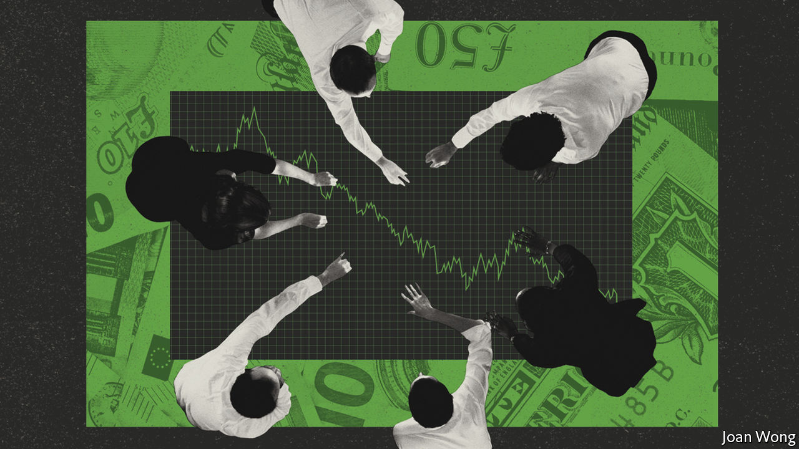

###### Building up the pillars of state

# Rich countries try radical economic policies to counter covid-19 

##### History suggests that the effects will be permanent 

 

> Mar 26th 2020 

Editor’s note: The Economist is making some of its most important coverage of the covid-19 pandemic freely available to readers of The Economist Today, our daily newsletter. To receive it, register . For more coverage, see our coronavirus 

“THE GOVERNMENT intervention is not a government takeover,” the American president argued. “Its purpose is not to weaken the free market. It is to preserve the free market.” The IMF pointed to the “unprecedented policy actions undertaken by central banks and governments worldwide”. The economic response to the financial meltdown of 2007-09 was big enough. But in answer to the covid-19 pandemic policymakers are launching even bigger, more radical interventions. Putting the economy on a wartime footing is supposed to be temporary. A look at 500 years of governmental power, however, suggests another outcome: the state is likely to play a very different role in the economy—not just during the crisis, but long after.

The policy response has been swift and decisive. Globally central banks have cut interest rates by more than 0.5 percentage points since January and have launched huge new quantitative-easing schemes (creating money to buy bonds). Politicians are throwing open the fiscal spigots to support the economy. As The Economist went to press, America’s Congress was set to pass a bill that boosts spending by twice as much as President Barack Obama’s package in 2009 (see ). On top of that, Britain, France and other countries have made credit guarantees worth as much as 15% of GDP, seeking to prevent a cascade of defaults. On the most conservative measure, the global stimulus from government spending this year will exceed 2% of global GDP, a much bigger push than was seen in 2007-09 (see chart 1). Even Germany, whose fiscal rectitude is the punchline of economists’ jokes, is spending more (see .


The upshot is that the state is swelling. Last year overall government spending accounted for 38% of GDP across the rich world. The stimulus effort, combined with a fall in nominal GDP in the next few months, will push that ratio well above 40%, perhaps to its highest-ever level.

 


To focus just on the numbers misses something crucial, though. There are important qualitative changes under way in how policymakers manage the economy—the responsibilities they have seized for themselves, what is seen as a legitimate action and what is not, and the criteria used to judge policy success or failure. On these measures, the world is in the early stages of a revolution in economic policymaking.

Central banks have in effect pledged to print as much money as necessary to keep down government-borrowing costs. The European Central Bank is promising more or less to buy everything that governments might issue; this should reduce the gap in borrowing costs between weaker and stronger euro-zone members, which widened in the early days of the pandemic. On March 23rd America’s Federal Reserve promised to buy unlimited quantities of Treasury bonds and agency mortgage-backed securities, if necessary. The rise in borrowing caused by America’s stimulus may be matched, at least initially, by bond purchases by the Fed, which smells a lot like money-printing to finance deficits. The central bank also announced new programmes to support the flow of credit to companies and consumers. The Fed is now the direct lender of last resort to the real economy, not just the financial system.

Politicians, too, are ripping up the rulebook. In a standard recession firms are allowed to go bust and people to become unemployed. Even in normal economic times, roughly 8% of businesses in OECD countries go under each year, while 10% or so of the workforce lose a job. Now governments hope to stop this from happening entirely. President Emmanuel Macron does not speak only for France when he vows that no firm will “face the risk of bankruptcy” as a result of the pandemic. Boris Johnson, Britain’s prime minister, contrasts his government’s response with the one during the last financial crisis: “everybody said we bailed out the banks and we didn’t look after the people who really suffered”. Larry Kudlow, the director of America’s National Economic Council, calls America’s fiscal stimulus “the single largest Main Street assistance programme in the history of the United States”, comparing it favourably with Wall Street bail-outs a decade ago.

 


To that end, governments across the rich world are channelling vast sums to firms, providing them with grants and cheap loans in an attempt to preserve jobs and prevent them from going bust. In some cases the government is paying the wages of people who cannot work safely: the EU in particular has embraced this policy, while the British state will pay up to 80% of the wages of furloughed workers. The American package includes loans to small businesses that will be forgiven if workers are not laid off. Households across the rich world are being given temporary relief on mortgages, other debts, rent and utility bills. In America people will also be sent cheques worth up to $1,200.

The vast majority of economists support these measures. Nominally they are temporary, designed to hold the economy in an induced coma until the pandemic passes, at which point the world is supposed to revert to the status quo ante. But history suggests that a return to pre-covid days is unlikely. Two lessons stand out. The first is that governmental control over the economy takes a large step up during periods of crisis—and in particular war. The second is that the forces encouraging governments to retain and expand economic control are stronger than the forces encouraging them to relinquish it, meaning that a “temporary” expansion of state power tends to become permanent.

The sinews of power

In recent centuries government spending across the capitalist world has leapt. In the 1600s the outlays of the entire English state accounted for about 5% of GDP, with practically no spending on public health or education, nor much regulation of economic life, save for crude contract enforcement (see chart 2). That began to change in the 18th century, and from the end of the 19th century Britain and other capitalist countries saw increased state intervention, with more government resources being devoted to public goods such as welfare and education and commensurate increases in taxes (see chart 3).

 


Governments have had some lean periods. In Victorian Britain state spending fell as a share of GDP—though that was largely because economic growth was so rapid, and the measure in chart 2 excludes spending by local governments, which became exceptionally powerful over the period. In the 1980s Ronald Reagan succeeded in stabilising America’s day-to-day federal spending. His reforms, as well as those of Margaret Thatcher in Britain, reduced the role of government in fixing prices; privatisations encouraged profit-making firms to provide formerly state-run services such as power and transport. Yet even during Reagan’s presidency the number of pages of federal regulations rose by 14%.

A back-of-the-envelope calculation finds that, of the more than 50 countries for which there are long-run fiscal data, two-thirds saw their government-spending-to-GDP ratio increase between 1988 and 2018. America’s ratio of day-to-day public spending to GDP is eight percentage points higher than it was in 1962, when Milton Friedman wrote “Capitalism and Freedom”, a book which warned of the dangers of socialism.

Historians argue over why the public sector has a tendency to expand. In the 19th century Adolph Wagner, a German economist, suggested that as places got richer, demands on government grew. An increasingly complex production process needed more regulation and contractual enforcement. Wealthier people would also demand more public welfare provision, the theory goes, perhaps because they worried less about their own material situation and could thus turn their attention to others.

Wagner’s theories also pointed to what economists call “hysteresis” in fiscal policy. Governments may intend to boost spending only for a short while. But then expectations change, making such expansionism hard to undo. It is now common sense that the state should provide education to children at no cost to parents, or support people who are out of work. American governments have in recent decades cut the share of public spending devoted to welfare. However, it remains politically impossible to bring it down to anywhere near its level in the mid-1960s, before President Lyndon Johnson’s “war on poverty” was launched. The upshot is that while it is easy to ratchet state spending up, it is much harder to push it down.

Perhaps the most important lesson of 500 years of history, however, is that nothing has helped boost state power in Europe and America more than crises. Historians broadly agree that the growing fiscal capacity of capitalist countries from the 1700s onwards was linked to the need to fight increasingly sprawling and expensive wars, especially those using navies and where the field of battle was far from home. (The Seven Years War of 1756-63 is widely considered to be the first global war because it involved a large number of countries, often fighting in foreign theatres.)

To win, countries required increasingly complex, well-resourced administrations which could supply fighters with weapons that worked and food that had not rotted. They also needed the money to pay for it, whether by levying more taxes or by becoming a reliable borrower in markets—which called for yet more bureaucracy. Growing state capacity, in turn, allowed for the emergence of the capitalism we know today, with properly regulated markets, efficient telecoms and transport, and healthy and educated citizens.

The winners of those wars also seized control of resources, from sugar and spices to linens, which proved integral to industrialisation. So it is no surprise that historians contend that wars and other crises have been an engine of economic development. It is no coincidence that the Netherlands, the first country to embrace capitalism, in the 17th century, was also at the time the world’s pre-eminent naval power, fighting and winning numerous wars over the period; or that Britain, which came to dominate the seas in the 18th century, then became the world’s largest economy. According to Larry Neal of the University of Illinois at Urbana-Champaign, the Industrial Revolution “occurred precisely during and because of the Napoleonic wars” of the late 18th and early 19th centuries.

The responses to crises since then have further consolidated the power of the state. France’s top rate of income tax was zero in 1914; a year after the end of the first world war it was 50%. Canada introduced income tax in 1917 as a “temporary” measure to finance the war. During the second world war income tax in America turned from a “class tax” to a “mass tax”, with the number of payers rising from 7m in 1940 to 42m in 1945 (today more than twice as many Americans are caught in the net). The second world war also led to calls for the introduction of cradle-to-grave welfare systems. So did the dynamics of the cold war: governments across the capitalist world wanted to forestall a communist rebellion. The state-led model pursued in Europe from the 1950s to the 1970s, in which bureaucrats controlled services from power networks to transport systems, would have been unimaginable without wartime experience, where the state managed practically everything and ordinary people made tremendous sacrifices, whether on the battlefield or at home.

The new ideology

What will be the lasting effects of the covid-19 pandemic? Start with the size of the state. Over the next year government debt will rise sharply, as spending jumps and tax revenues collapse. When the economy recovers, attention will turn to paying it down. “Capital and Ideology”, a new book by Thomas Piketty, a French economist, shows that after the first and second world wars many governments in the West turned to heavier taxation of the incomes and wealth of the richest to achieve that goal. Another option is “financial repression”, where governments force citizens to lend to them at below-market rates (see ).

Central banks’ innovations will also have lasting consequences. Few economists believe that the explicit co-operation between the fiscal and monetary authorities risks creating runaway inflation, as it has done in Venezuela and Zimbabwe, any time soon. (If anything, the bigger worry right now is deflation, not least because of a collapse in oil prices.) However, just as the use of quantitative easing in 2008-09 opened the door to more of the same down the road, it will become harder to make the argument that the “magic money tree” does not exist. Politicians in the future may lean on central banks to peg interest rates at zero to support government borrowing, even during times of economic growth and low unemployment. If central banks promised to fund the government during the coronavirus pandemic, they might ask, then why shouldn’t they also fund it to launch an expensive war against a foreign enemy or to invest in a Green New Deal?

The final impact of the current interventions relates to policymakers’ tolerance for risk. No one cheers when a firm goes bust, but often the process helps shift resources from less efficient to more efficient uses, thus raising productivity and average living standards over time. The novel notion that the government needs to preserve firms, jobs and workers’ incomes at practically any cost may endure, especially if the intervention proves successful in narrow terms. The policy will formally end once the pandemic has passed, but political pressure for similar support schemes—from the nationalisation of tottering firms to the provision of a universal basic income—may well be higher the next time a sharp downturn comes along. If politicians are able to preserve jobs and incomes during this crisis, many people will see little reason why they should not try again in the next one.

 


Calls for a more activist fiscal-monetary government will come against a backdrop of structurally higher demand for state spending. The public sector tends to provide labour-intensive services in which productivity improvements are difficult, such as health care and education. It must match the salaries of workers in other sectors in order to retain its own, even as they become less productive relative to the overall economy—a phenomenon which raises the cost of provision. Long before the coronavirus pandemic, fiscal wonks argued that government spending would soar during the 2020s, even in the absence of a crisis. That was not only or even primarily because an ageing population would raise demand for health care, but because health systems would be able to treat a wider range of illnesses more effectively, which would push up costs.

The likely economic effects of the pandemic reach far beyond the role of the state. Countries could become even less welcoming to immigrants—the better, they may believe, to reduce the likelihood of infection from foreign arrivals. On the same logic, resistance to the development of dense urban centres could mount, thereby limiting construction of new housing and raising costs. More countries may seek to become self-sufficient in the production of “strategic” commodities such as medicines, medical equipment and even toilet roll, contributing to a further rollback of globalisation. But the redefined role of the state could prove to be the most significant shift. The rules of the game have been moving in one direction for centuries. Another radical change is looming.■

Dig deeper:For our latest coverage of the covid-19 pandemic, register for The Economist Today, our daily , or visit our 

