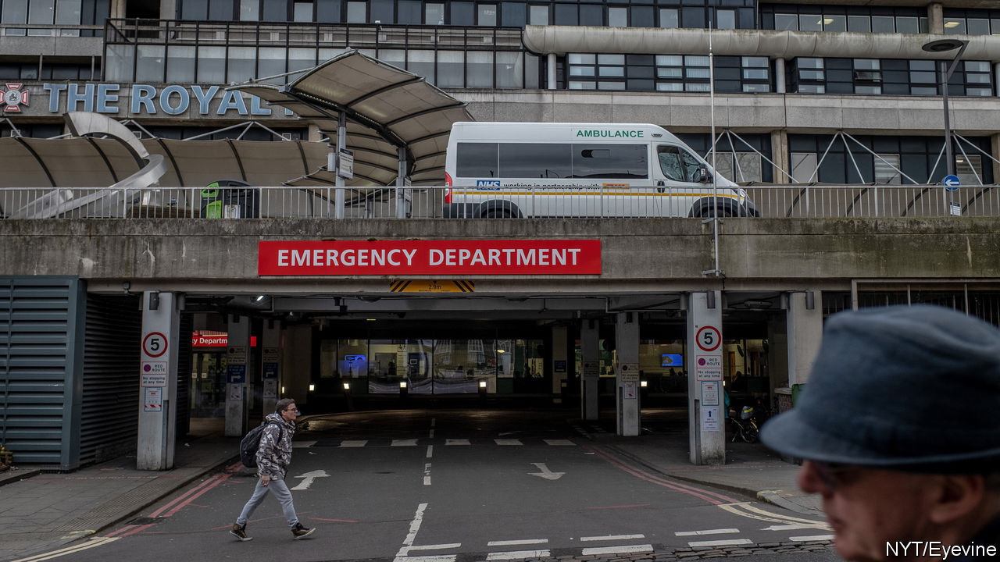

###### Health care

# How the National Health Service is transforming itself 

##### A vast, sprawling health service turns its attention to one task 

 

> Mar 26th 2020 

Editor’s note: The Economist is making some of its most important coverage of the covid-19 pandemic freely available to readers of The Economist Today, our daily newsletter. To receive it, register . For more coverage, see our coronavirus 

OVER THE past few weeks, the National Health Service has undergone extraordinary, wrenching changes as it prepares for the coming storm. They involve the mass redeployment of staff, the rapid procurement of equipment and even the creation of an entirely new hospital—the NHS Nightingale—with 4,000 beds in London’s Excel Centre, which had been due to host the World Spa and Wellness Convention. But they also involve smaller adjustments. Communication from NHS England, which runs the health service, has become noticeably terser so as to save time. That is an impressive feat, notes one insider: “Doctors love nothing more than the sound of their own keyboards.”

Britain is now on its way up a steep curve. As The Economist went to press, there were 9,640 confirmed cases of covid-19 and 466 deaths. Numbers are rising fastest in the capital, which is home to more than a third of confirmed cases. In an attempt to suppress the growth, the government has now aligned with much of Europe, instructing people to leave the house only to buy essentials and to exercise once a day. In a short statement announcing the rules, Boris Johnson invoked the need to protect the NHS four times.


The aim is to avoid a Lombardy-style collapse. To do this, the NHS is restructuring on a scale without precedent in its 72-year history. To begin with, its leaders hope to free up 30,000 of its 100,000 beds by postponing elective surgery and urgently discharging inpatients. So that hospitals can focus on preparations, all inspections have been halted. The usual “payment-by-results” mechanism, by which the health service’s internal market operates, will cease on April 1st. As Sir Simon Stevens, the NHS’s chief executive, has written: “Financial constraints...will not stand in the way of taking immediate and necessary action.” The chancellor has announced an extra £5bn ($5.9bn) for the health service, with more to come if needed.

Putting this cash to use, the NHS has struck a deal with private hospitals to acquire 8,000 beds, 1,200 ventilators and 20,000 workers. They will be joined by almost 12,000 retired NHS staff, 5,500 final-year medics, 18,700 final-year student nurses and a volunteer army, who will deliver medicine and check on the vulnerable. The call went out for 250,000 volunteers; within 24 hours, 405,000 had signed up.

The 23 royal medical colleges have identified what can be trimmed from regular practice, allowing specialists to be redeployed. Most outpatient and general-practice consultations are now happening by videolink or phone. In London, at least one hospital has been set aside for non-covid surgery; others will deal solely with those suffering from the virus. Experienced observers are staggered by the pace of change. “Stuff that normally takes a couple of years has been done in 72 hours,” says one.

Whether that is fast enough remains to be seen. Hospital chiefs in London are concerned that the extra capacity is already filling up quickly. Across the country they worry about shortages of protective equipment and testing, which are forcing staff with only minor symptoms to go into quarantine. The government is desperately trying to buy more ventilators.

Some influential voices are nevertheless hopeful. Speaking to a House of Commons committee on March 25th, Neil Ferguson of Imperial College London, whose modelling prompted the government to enforce a lockdown, said that although there would be “hotspots” where the NHS is overwhelmed, his calculations suggest that overall demand will now be within the system’s increased capacity. It will soon be clear whether he is right.■

Dig deeper:For our latest coverage of the covid-19 pandemic, register for The Economist Today, our daily , or visit our 

