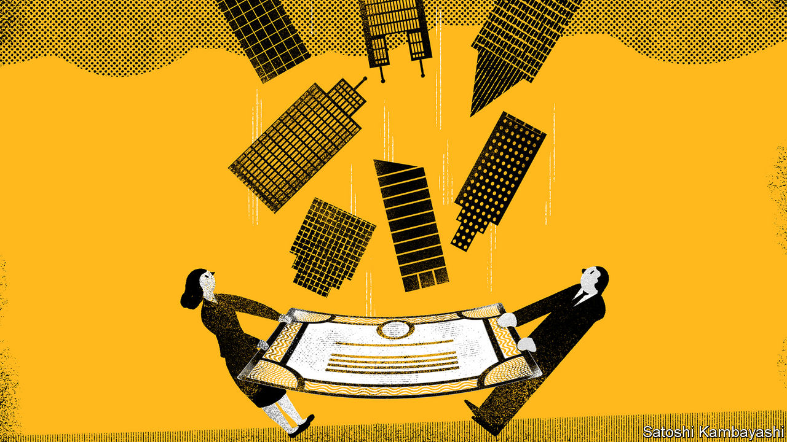

###### Buttonwood

# An imaginative template for dealing with the cash crunch 

##### The world of distressed lending offers a guide 

 

> Mar 26th 2020 

Editor’s note: The Economist is making some of its most important coverage of the covid-19 pandemic freely available to readers of The Economist Today, our daily newsletter. To receive it, register here. For more coverage, see our coronavirus hub

TAKE YOURSELF back, if you can manage it, to a more tranquil time—January, say. Imagine a smallish restaurant chain that had a bad Christmas. Its owner borrowed heavily to expand only to find its new outlets were slow to attract customers. The chain cannot meet its interest and other costs. A consultancy says $10m is needed to tide the firm over until its problems are fixed. The bank says it will forgo interest payments worth $5m, if the owner kicks in $5m of equity capital. A deal is struck.

Fast-forward a few weeks and imagine a similar chain that is temporarily shut down because of the covid-19 virus. The firm has no revenue, but it still has fixed costs. The hypothetical January deal is a template for dealing with the problem. But in a broader crisis, things are always trickier. The bank’s balance-sheet is stretched to the limit. The stockmarket crash has taken a bite from the owner’s wealth. And she is reluctant to sell a stake in the business.


An alternative is to turn to specialist private-credit funds. These are vehicles backed by long-term investors, such as insurance firms, sovereign-wealth funds and university endowments, which lend directly to companies, much as a bank would. Some will have discrete distressed-lending or “special-situation” arms. Many more are prepared to put up capital when others won’t. And everything is a special situation now. So the mindset and methods of these specialists will need to be broadly applied.

What might they offer our hypothetical restaurant chain? One option is a payment-in-kind (or PIK) loan. This affords the borrower flexibility. If the shutdown is protracted, it can roll up missed interest payments into the outstanding debt (ie, pay them in kind). Once the business gets back to normal, it can make interest payments in cash again. A PIK loan has two advantages, according to Mark Attanasio and Jean-Marc Chapus of Crescent Capital, a private-credit firm. It gives immediate relief, and it leaves the capital structure largely intact, so the owner retains control. The lender, in essence, says to the borrower “you take a spring break on interest payments; we believe in your recovery.”

Of course, the interest on any loan granted in a distressed situation will be steep. The opportunity cost to a lender is the double-digit yields now on offer in the high-yield bond market. A way to reduce the risk to the lender, and thus the cost to the borrower, is to secure a loan on fixed assets. Last week United Airlines agreed a one-year loan with banks backed by aircraft and other collateral, according to Bloomberg News. Part of the loan was then sold on to Apollo, a leading private-capital firm. More deals like this seem likely.

Not every business in need is a big airline. A lot of medium-sized firms, like our hypothetical restaurant chain, do not have many tangible assets. Property and equipment are leased. The firm’s worth is in intangibles, such as its brand. There is no value for a lender to recover if the company is liquidated. And in complex situations, such as this one, it is difficult to estimate the severity of the short-term damage and how quickly a business will recover. The ideal solution is an injection of equity capital. But shareholders are reluctant to issue equity in recessions, when stock values are depressed, as it dilutes the value of their stake. Convertible loans offer a way around this. These carry a lower rate of interest than a conventional loan, but give the lender the possibility of converting it into equity when things—revenues, profits, asset values—return to normal.

In our ideal world, there is one lender and one owner. The real world is messier. Lenders to firms in distress expect to be paid back before other creditors. But the company may have covenants on its existing debt that rule out a new lender pushing to the front of the queue. A unique situation calls for flexibility. “The right paradigm is a natural disaster,” says Jonathan Lavine of Bain Capital. “More than ever, banks, shareholders and other lenders will have to work together.”

The goal should be to keep healthy firms intact. There are some specialists that buy the debts of troubled companies in the expectation they will be forced into bankruptcy, wiping the shareholders out and leaving the debt-holders as owners. A change at the top is sometimes necessary. But in general, it makes sense only if the management has screwed up. That does not apply to the vast majority of companies now in distress. It will need a lot of ingenuity and capital to tide them over. It will also need a fair bit of goodwill.

Dig deeper:For our latest coverage of the covid-19 pandemic, register for The Economist Today, our daily , or visit our 

