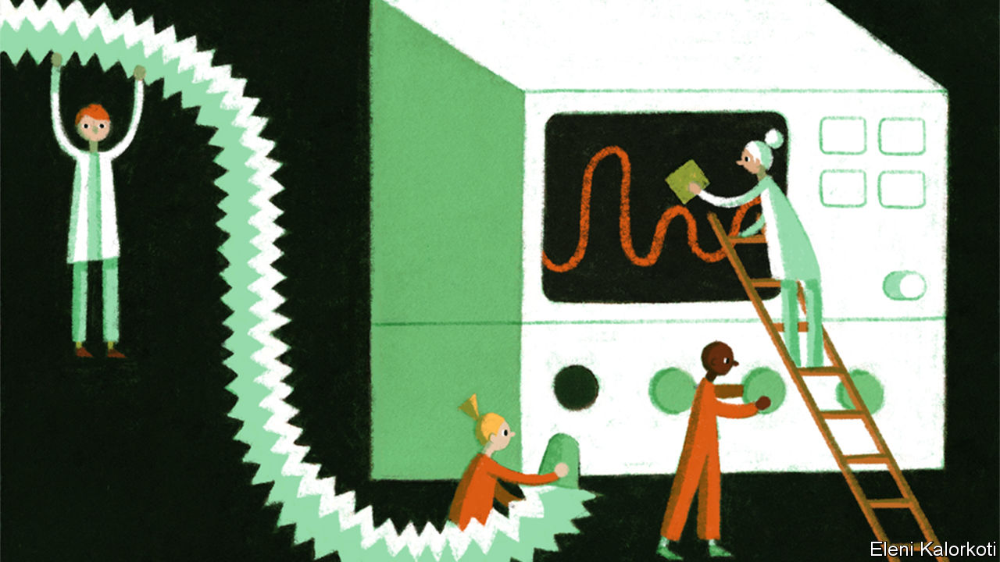

###### Wind rush

# Scientists and industry are dashing to make more ventilators 

##### New designs could be assembled by DIY enthusiasts 

 

> Mar 26th 2020 

Editor’s note: The Economist is making some of its most important coverage of the covid-19 pandemic freely available to readers of The Economist Today, our daily newsletter. To receive it, register . For more coverage, see our coronavirus 

ONE OF THE most worrying symptoms of covid-19 is the way the coronavirus attacks the lungs of those infected. This means some patients need a ventilator to help them breathe until their lungs recover. But there is a dire shortage of these machines in hospitals, so intensive-care units will be overwhelmed. Urged on by worried governments, ventilator manufacturers are working flat out and forming partnerships with carmakers, aerospace firms and others to boost output as fast as possible.

But their efforts will still be not enough to meet soaring demand. So hope is riding on scores of new projects to develop breathing devices that could be made rapidly by non-specialist companies and small workshops. These are mostly simpler devices; some could even be assembled by DIY enthusiasts. The response to this call to arms is unprecedented.


Yet difficulties and dangers lie ahead. At present ventilation is about the only way doctors have to treat those who are seriously ill from the novel coronavirus, and the shortage of available machines is terrifying. In America the Society of Critical Care Medicine estimates that roughly 200,000 ventilators may be available, though many are older machines that have been in storage and may not be capable of supporting patients with severe respiratory failure. By some estimates, nearly 1m Americans may need mechanical ventilation at the peak of the country’s covid-19 epidemic. And the number of potentially critically ill patients who need ventilating could be much higher. At some point the people needing ventilators will probably far outnumber the machines available. Similar shortages exist in other countries, and in some parts of the world the number of ventilators in a hospital can be counted on one hand.

In their desperation some doctors are trying to connect more than one patient to a single ventilator, even though manufacturers do not recommend this because individual patients need different levels of breathing support.

Ventilators work by pumping air, mixed with additional oxygen as required by the patient, into the lungs. Carbon dioxide is expelled as the lungs contract. The air can be supplied to a patient via a mask. If more breathing support is needed, a tube is inserted down the patient’s trachea and into his or her airways, a process known as intubation. Alternatively, air can be delivered through a tube inserted through an incision in the windpipe.

Ventilators need to be carefully adjusted to suit each patient. This includes setting the number of breaths the machine delivers per minute and the “tidal volume” of air that flows back and forth as the patient breathes in and out.

Ventilators can do other things too, such as helping patients start to breathe on their own. The most sophisticated machines, which can cost up to $50,000, are packed with sensors and patient-care features. But even when used by highly trained staff, ventilators can cause serious complications, such as overinflation of the lungs, in some patients. In the hands of amateurs they could be lethal.

Faster, faster

So what chance do science and industry have of dramatically ramping up production? The task is formidable. Some groups have little or no experience in the medical field and are trying to cram into a few weeks processes of design, testing, approval and manufacturing that usually take a couple of years.

Yet that does not mean it is impossible. It all depends on the options that are available, says Tim Minshall, head of the Institute for Manufacturing at the University of Cambridge. At one end of the spectrum, he says, existing ventilator producers can be helped to make more machines. In the middle are simpler designs for respirators that might be more easily manufactured and could be built by skilled companies that regulators trust. Then there are newcomers with prototypes but no direct experience in making medical equipment.

Behind all these efforts are companies, groups and well-intentioned individuals keen to make their open-source designs freely available to anyone prepared to start producing them. Hospitals and regulators will, naturally enough, be cautious, wanting to ensure that equipment is safe and reliable, adds Professor Minshall. It is not just the risk to patients and staff they are worried about, but also legal liability. A fast-track approval service, which some countries are planning, would help.

 


Existing producers are stretching themselves. Hamilton Medical, a Swiss firm that is one of the biggest manufacturers of ventilators, usually turns out 220 machines a week. After moving office workers onto the production line, it hopes to double that by the end of April. Siare Engineering in Italy produces 160 ventilators a month and aims to triple that with the help of army technicians. Medtronic, an American firm with its headquarters in Ireland, plans to more than double its 250 employees making ventilators at its Irish plant and move to round-the-clock production. In America Ventech Life Systems is collaborating with General Motors to scale up ventilator production, and Smiths Group, a British producer, is looking to see if other firms might be able to make its portable machines.

A number of industry groups have got together in response to a request by the British government for 5,000 new ventilators as soon as possible (the country’s National Health Service presently has access to some 8,000), and more later, bringing the total to 30,000. One group is led by Meggitt, an aerospace firm based in Britain that among other things also makes oxygen systems for aircraft. Another group is led by McLaren, a super-car-maker that runs a Formula 1 team. Like others involved in motorsport, McLaren is expert at prototyping and manufacturing things rapidly. Other firms are getting involved. Dyson, a British maker of vacuum cleaners, says it has a potential order for 10,000 versions of a ventilator it has developed.

Lots of academics are helping. Engineers and doctors from the University of Oxford and King’s College London hope to have prototypes of a simple ventilator that would cost less than £1,000 ($1,177) approved and working in trials at hospitals in London and Oxford in about two weeks. Like some others, the group is mechanising a device widely known as an Ambu (artificial manual breathing unit) bag. This consists of a mask connected to a rubber bag which, when squeezed by hand, pumps air into the lungs. The bag self-inflates when released. Oxygen can also be added to the pumped air through a port in the device. Ambu bags are often used by paramedics to resuscitate people and in emergencies on hospital wards.

The group’s machine, called the OxVent, places the Ambu bag in a sealed perspex box. Compressed air from a hospital airline is fed into the box to squeeze the bag and pump fresh air mixed with additional oxygen into the patient through standard tubing. This allows the device to be controlled by a simple box of electronics with all the essential adjustments needed for patient care, says Mark Thompson, a member of the Oxford team. The next step is to test for reliability and to find ways to manufacture the OxVent quickly. The group has already been in touch with companies eager to help. “It has been absolutely fantastic the support we’ve been offered,” adds Professor Thompson.

A group at University College London rallying ideas for making ventilators has also got a huge response from around the world, says Rebecca Shipley, a professor of health-care engineering. Using proven designs is probably the quickest way to get into production, she reckons. Catherine Holloway, a colleague who leads the Global Disability Innovation Hub, an organisation that promotes technologies to assist disabled people, thinks that “no frills” ventilator designs, already used in some poor countries, might be adopted to boost manufacturing capacity in richer regions.

At a very basic level, some designs could be built at home. Among them is an open-source ventilator developed by a collection of engineers in Barcelona. The oxyGEN machine, as it is called, uses a modified windscreen-wiper motor to squeeze an Ambu bag. Adjustments to the air volume can be made by fitting different-sized parts. But anyone trying to make one should take care. “It is a device designed to avoid life and death situations in emergency triages, not to replace other superior, professional and much safer devices,” the group cautions. Even so, as covid-19 continues to spread, and health-care systems are swamped, some doctors may be so desperate that they take the risk.■

Dig deeper:For our latest coverage of the covid-19 pandemic, register for The Economist Today, our daily , or visit our 

