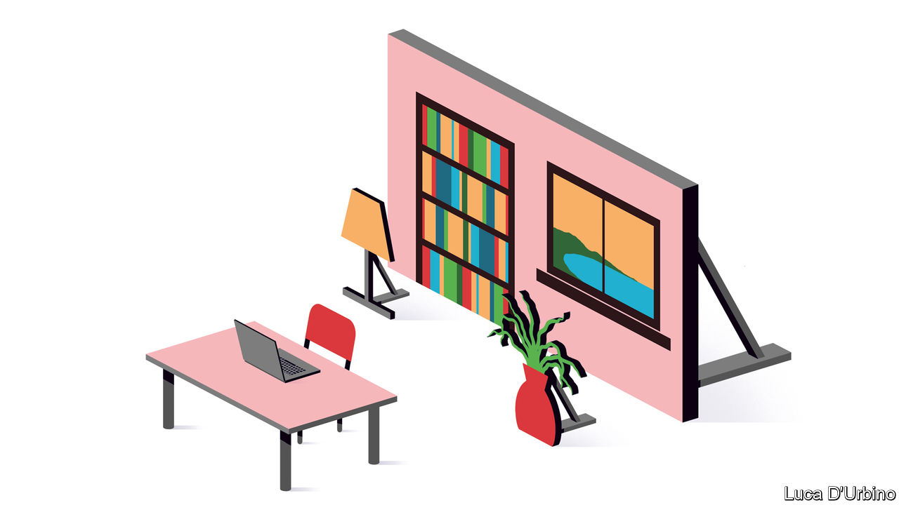

###### Through the keyhole

# Videoconferencing etiquette 

##### Working and entertaining online pose new challenges—and require new thinking 

 

> Mar 26th 2020 

Editor’s note: The Economist is making some of its most important coverage of the covid-19 pandemic freely available to readers of The Economist Today, our daily newsletter. To receive it, register . For more coverage, see our coronavirus 

AROUND THE world, coronavirus lockdowns have driven professional and social life out of the physical world and into the virtual realm. Though self-isolation means no longer seeing friends and colleagues in person, it has opened a sudden and alarming window on their private, domestic selves. Many readers, videoconferencing for hours every day, will find themselves unexpectedly familiar with other people’s kitchen layouts, wall decorations and interior design—depending, that is, on how they position their devices. (Never have so many ceilings been broadcast to so many for so long.)

For those unused to working from home, the sudden disappearance of boundaries between domestic and professional life can be trying (see ). But what about the lack of boundaries between other people’s homes and your own? Letting crowds of colleagues and acquaintances peer into your life can be unsettling, but it has one advantage: it opens up new opportunities for oneupmanship.


Even cramped living quarters can be subtly altered to create an impression of space. Simply move the desk to one side of the room, the sofa to another and the bed to a third. A lick of different-coloured paint on all those walls, and a couple of trompe-l’oeil posters of windows, looking out onto rolling countryside on one side and a secluded beach on the other, and—voilà!—over the course of a few meetings your studio flat is transformed into a mansion on an extensive beachside estate. If you have the necessary equipment and technical skills, of course, you can opt for a virtual background instead, and appear to be hovering over the city in your personal airship, or relaxing on your yacht.

Props can also help. If your bookshelves are visible, rearrange the books so the titles behind your head suit the occasion. For the intellectual soirée, the obscure Scandinavian novelist and the existential philosopher you never quite got around to reading will do nicely; for the professional backdrop, reach for Sun Tzu and Nassim Nicholas Taleb; for the high-net-worth cocktail gathering, bring out the hand-tooled leather-bound classics. Remember that high-definition cameras have sharp eyes: well-thumbed copies of “The Joy of Sex” are best left out of sight.

Electronics should, by and large, be invisible, as there is an inverse relationship between social status and size of televisions. High-end audio gear or home-cinema equipment, however, is acceptable in the background, suggesting as it does a superior, artsy approach to entertainment; steering the conversation towards the merits of valve amplifiers or the “texture” of a director’s oeuvre will let you advertise its presence in your house. Ostentatious sports equipment—golf clubs, skis, a Purdey shotgun—can be borrowed from friends and left just visible in a corner, implying a vast hinterland of expensive entertainments that are awaiting you once the lockdown is over.

What of the risk that the sudden appearance of screaming, chocolate-smeared children will undermine the impression of domestic perfection? Best if you can to hide them away in another room—“Minecraft” might keep them occupied—or dress them smartly and persuade them to serve you with trays of tea and biscuits or canapés, as appropriate. Either approach will convey the desired impression of domestic order and deference, to contrast pleasingly with the yells and curses to be heard in the background of your friends’ and colleagues’ homes.

Humanity is now coming together to fight a common enemy. In these dark times, it is essential to maintain some of the pillars of normal life—such as showing that you’re doing better than everybody else. ■

Dig deeper:For our latest coverage of the covid-19 pandemic, register for The Economist Today, our daily , or visit our 

