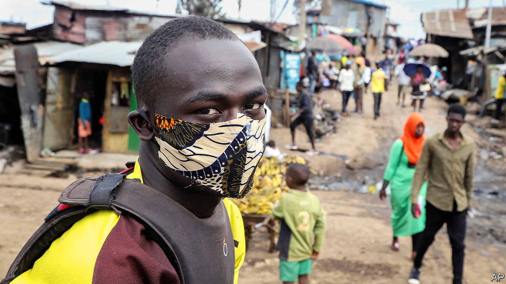
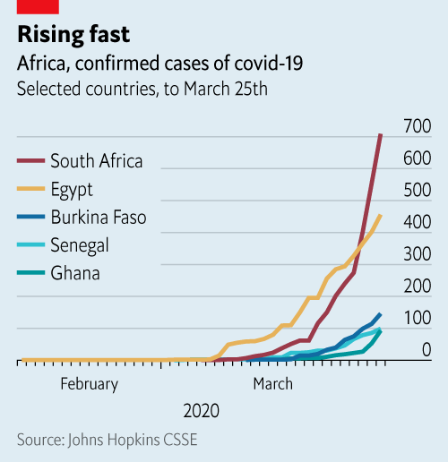
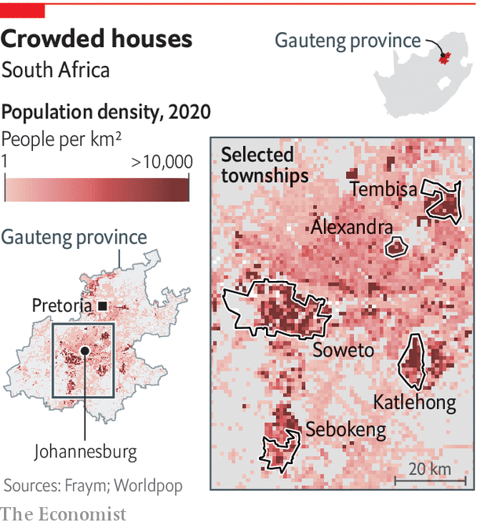
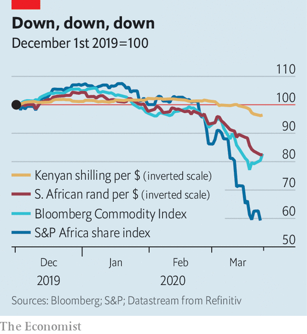

###### Continental contagion

# Africa is woefully ill-equipped to cope with covid-19 

##### People cannot stay away from work if they have no money 

 

> Mar 26th 2020 

Editor’s note: The Economist is making some of its most important coverage of the covid-19 pandemic freely available to readers of The Economist Today, our daily newsletter. To receive it, register . For more coverage, see our coronavirus 

“IN THE TOWNSHIP people are not worried at all,” says Lesedi Kgasago, a student from Soweto, Johannesburg. Among his friends “corona” is seen either as something that afflicts white people or a fiction. When life is a struggle it is hard to worry about a threat you cannot see.

Besides, asks Mr Kgasago, what can Sowetans do about it? “Self-isolation is just not practical in the ’hood.” Most of the township is poor and crowded. Just 55% of households have piped water. “There is a mentality of if we die, we die, but we’re going to have a good time,” he says.


That may now be more difficult. On March 23rd Cyril Ramaphosa, South Africa’s president, announced a nationwide lockdown. The number of recorded cases in the country is the highest in Africa, at 709 as of March 25th. The rate of increase is similar to that of Italy at the same stage.

Other countries in Africa could be just days behind. Most of its 54 states have confirmed infections. Some hope that hot and humid weather may slow the spread of the virus. But the evidence for that is inconclusive and any effect will be “modest”, reckons Marc Lipsitch of Harvard University. “We don’t know what it will do in Africa,” notes David Heymann of the London School of Hygiene &amp; Tropical Medicine. But there is no reason to think it would be different from anywhere else, he says.

It could be worse. Most rich countries have struggled to respond to the outbreak. African ones have fewer medics and less kit. Social distancing is far harder in overcrowded slums. Lockdowns could increase poverty and hunger. Nor do most African countries have the money to tide people and companies over.

Africa has some advantages. It is a young continent facing a virus that mainly kills the old. There are an estimated 47m Africans over 65 and 6m over 80, out of a population of 1.3bn. In Europe the figures are 143m and 40m out of 750m people.

Africa has also had more time to prepare. Governments have closed borders and restricted air travel. Many have banned large gatherings. The vast majority of children are no longer at school. These steps have been taken sooner in the course of the disease than elsewhere. Uganda, for instance, closed schools before it had any confirmed infections. South Africa’s lockdown was announced before Britain’s, though Britain had more than 16 times as many known cases. Sierra Leone has declared a 12-month state of emergency despite not having a single confirmed case.

Advance warning has also allowed Africa to boost testing capacity. Today more than 40 countries can test for covid-19, up from just Senegal and South Africa in early February. Although they have many fewer testing kits than richer countries do, more are on the way. Jack Ma, the founder of Alibaba and perhaps China’s richest man, has donated 20,000 testing kits, 100,000 masks and 1,000 protective suits to each African country.

Experience in dealing with other infectious diseases may prove useful. Roughly one in three deaths in Africa every year is from an infectious or parasitic disease, compared with one in 50 in Europe. Recent Ebola outbreaks, across west Africa in 2014-16 and in eastern Congo in 2018-20, have taught policymakers vital lessons.

 


People who have dealt with Ebola, such as David Nabarro, a special envoy for covid-19 to the World Health Organisation, say it is essential to win over communities. One sign of success in Sierra Leone was when Ebola became known in the Mende language as “bonda wote”, literally “family turn round”—a sign that people were changing behaviour. “I am absolutely convinced that African countries can get on top of this quicker than European countries,” says Dr Nabarro.

Experts also urge vigilance. “We are veterans of outbreaks,” says Monica Musenero, a Ugandan epidemiologist. The country has contained regular flare-ups of diseases such as Ebola and Marburg virus. Whereas Ebola always “announces itself”, covid-19 spreads quickly and quietly, she says. As doctors find cases of the new virus, they may be only “catching the tail”.

That is the worry across Africa, where outbreaks could rapidly overwhelm health systems. Sub-Saharan Africa has about one doctor for every 5,000 people, compared with one per 300 in Europe. Data are patchy, but the average American hospital may have more intensive-care beds than most African countries. Kenya has 130; Uganda 55; and Malawi about 25. In Zimbabwe there are probably even fewer in the public system, and doctors and nurses are on strike. Ventilators are scarce: Mali and Mozambique may have one per 1m people. Given the lack of capacity, the disease could be “horrific”, says Tom Frieden, a former head of the Centres for Disease Control and Prevention in America.

The underlying health of Africans may not help either. Doctors do not know if the more than 25m Africans infected with HIV are at greater risk from covid-19. Some speculate that anti-retroviral drugs may help fight the new virus, though early studies suggest otherwise. Even if this were the case, notes Denis Chopera, a Durban-based virologist, only about 60% of South Africans with HIV regularly take their pills.

The burden on health-care systems from covid-19 could impede treatment of other diseases. Studies of the Ebola outbreak in west Africa suggest that about as many people died because they could not get treatment for malaria, HIV and tuberculosis as from Ebola itself. Others died from being unable to give birth safely. Suppressing outbreaks of Lassa fever in Nigeria and measles in Congo could be hampered by the diversion of resources to covid-19.

Governments may also have a hard time convincing their citizens to take the new virus seriously. Fake news is one reason. Dodgy cures and conspiracy theories are spreading on WhatsApp groups, which typically have more members in Africa than elsewhere. In Congo the virus is seen as a “mzungu” (white person) disease. Some Ethiopians see their country as blessed and therefore protected. More than a quarter of Nigerians say they are immune, most commonly because they are “a child of God”.

Religion may be doing more to spread the disease than stop it. Senegal was slow to stop pilgrims from travelling to the holy city of Touba, despite an outbreak. A Christian gathering in South Africa has been linked to another outbreak. Thousands still attend megachurches in Nigeria. Although many pastors and imams are spreading the gospel of handwashing, others are talking nonsense. Orthodox Christians in Ethiopia have promoted quack “cures” involving garlic, lemon and ginger. Prices of these foodstuffs have risen by more than 200%, and fights have broken out in markets over them.

Many African leaders have been swift to ban religious meetings. Some churches are streaming services online. But this is not the case in Tanzania, where President John Magufuli has refused to close churches, saying: “That’s where there is true healing. Corona is the devil and it cannot survive in the body of Jesus.”

African governments face practical as well as spiritual obstacles. The state’s ability to enforce social distancing and lockdowns is questionable in cities, where two in every five Africans live. More than half of city-dwellers are in crowded slums (see map). In Alexandra, a slum in Johannesburg, there are more than 9,000 households per square km, compared with fewer than 700 in neighbouring Sandton, a posh suburb. In Kampala 71% of households sleep in a single room. Frequent handwashing with soap is difficult. In Makoko, a huge slum in Lagos, less than 20% of households have piped water. Conditions in refugee camps are often worse.

 


Persuading slum-dwellers to stay in one-room shacks with many relatives will be tougher than getting people in New York or London to stay on the sofa watching Netflix. And few can work from home. Six in ten Ugandan workers are either self-employed or help out in a family business. If people do not work they do not eat, says Steven Agaba, who lives in a poor part of Kampala, Uganda’s capital. He gestures at a man selling fruit from a tarpaulin spread across the muddy ground. “It will not be the coronavirus to kill us, but the hunger.” It may also send the poor back to their villages, further spreading the disease.

The precariousness of everyday life means that the economic effects of covid-19 in African countries will be both colossal and different from the rich world. The welfare of a billion people depends on how governments balance saving lives from the virus while minimising economic damage in a continent where more than 400m people live on the equivalent of less than $1.90 a day. It is not at all clear how this Gordian knot can be untied.

The hit to economies was already apparent even before the first case of covid-19 was reported in Africa. More than 80% of its exports go to the rest of the world, the highest share of any big region save Australasia. About half of these are raw materials. As commodity prices have plunged, so have forecasts for growth and tax receipts.

Other industries have been hammered too. Tourism, which employs more than 1m people in each of Kenya, Tanzania, Ethiopia and South Africa, has collapsed. In Kenya and Ethiopia, both exporters of flowers, bulbs are being fed to cows and roses are rotting in heaps. Manufacturing is stricken. Orders have dried up for clothes exporters in Ethiopia, Ghana and Lesotho.

Trade is at a trickle. Dozens of scheduled ships are either not turning up at Mombasa port, in Kenya, or arriving partly empty. Remittances could soon dry up—a disaster for the 13 African countries where that money is worth more than 5% of GDP. (In Lesotho remittances equate to 23%.) The overall effect is “more serious than 2008”, says Albert Zeufack, the chief economist for Africa at the World Bank.

In some countries such as Malawi, where most people subsist by growing their own food, the economic impact of covid-19 may be relatively small. But in many others, the clampdowns on economic life are adding to the pain. Restrictions on movement and commerce will be especially harmful to workers in the informal economy—that is, most of the African labour force. Roughly 85% of workers do not receive a regular reported wage.

On March 21st Rwanda closed its border with Congo. The livelihoods of petty traders who buy food in one country and sell it in the other are in peril. In Goma, on the Congolese side, Naomi Sifa sits with a pile of bananas a few metres from the desolate frontier. By selling them in Rwanda she would normally make 3,000 francs ($1.77) each day, just enough to feed her family. No longer. “If they keep the border closed, they will kill people with hunger,” she says.

The economic consequences of covid-19 have not escaped African epidemiologists. For John Nkengasong, director of Africa CDC, a public-health body, the virus could be a “national-security crisis first, an economic crisis second, and a health crisis third”, if the responses are not calibrated appropriately. That does not mean letting the disease rip, but it does mean “community engagement” and careful monitoring of knock-on effects on poverty and the treatment of other diseases.

African authorities will probably struggle to shut down cities to the extent seen in Europe, never mind China. For the moment, though, they are trying to combine restrictions on movement with some steps to ease the economic pain. The Seychelles, for example, has pledged salary guarantees for private-sector employees for three months. South Africa has announced a tax holiday for businesses to encourage them to keep paying workers, and its central bank is extending credit lines to keep firms afloat. Senegal aims to spend about 6% of GDP feeding people and helping firms, but it must appeal for funds to do so.

 


No country is able to match the sums being spent in the West. Social safety nets, where they exist, tend to support old people and mothers, not the jobless. Cash transfers would be the quickest and most efficient response to avert mass poverty. So far, in response to the covid-19 crisis, 69 countries globally have introduced, adapted or expanded social-protection schemes. Yet in sub-Saharan Africa only South Africa and Kenya have done so.

The lack of action is in large part because African countries do not have enough money to do more. Between 2010 and 2018 average public debt in sub-Saharan Africa rose from 40% to 59% of GDP, the fastest increase of any developing region. More than half of African countries are above the IMF’s recommended limit for public debt. The World Bank says that 29 out of 47 African countries need to tax more than they spend just to keep their debt constant as a share of the economy. But their tax revenues are about to plummet and the cost of borrowing is soaring as investors flee to safety.

A fiscal response on the scale seen in the rich world would require outside help. Abiy Ahmed, Ethiopia’s prime minister, has asked the G20 for an emergency package worth $150bn to boost health spending, shore up foreign reserves and patch up social safety nets. He wants the World Bank’s investment arm to tide over African companies hit by disruptions to global supply chains, for the IMF to increase its lending to poor countries and for existing debt to be rolled over or forgiven.

The West’s response may determine its relationships with African countries for decades. If the rich world declines to help more, China will probably dominate the response. Mr Ma’s gift may soon be followed by economic assistance, which could cement China’s position as the main partner for many African countries.

Other political consequences of covid-19 will soon become clear. One may be a rise in xenophobia. Ethiopia and Cameroon, among others, have seen attacks on foreigners or their property. Autocrats such as Uganda’s Yoweri Museveni or Mr Magufuli may take advantage of a distracted world, and find covid-19 a convenient reason to delay elections or arrest dissidents.

What will ultimately determine the fate of leaders on the continent, though, is how they combine their direct response to the virus with mitigating its vast indirect costs. Mr Ramaphosa has largely been open, decisive and bold. But even he will struggle to maintain public support as he tries to enforce a long lockdown. African countries face an unenviable task, which they cannot address alone. In trying to “flatten the curve” of the number of infected, they risk crushing their people. ■

Dig deeper:For our latest coverage of the covid-19 pandemic, register for The Economist Today, our daily , or visit our 

