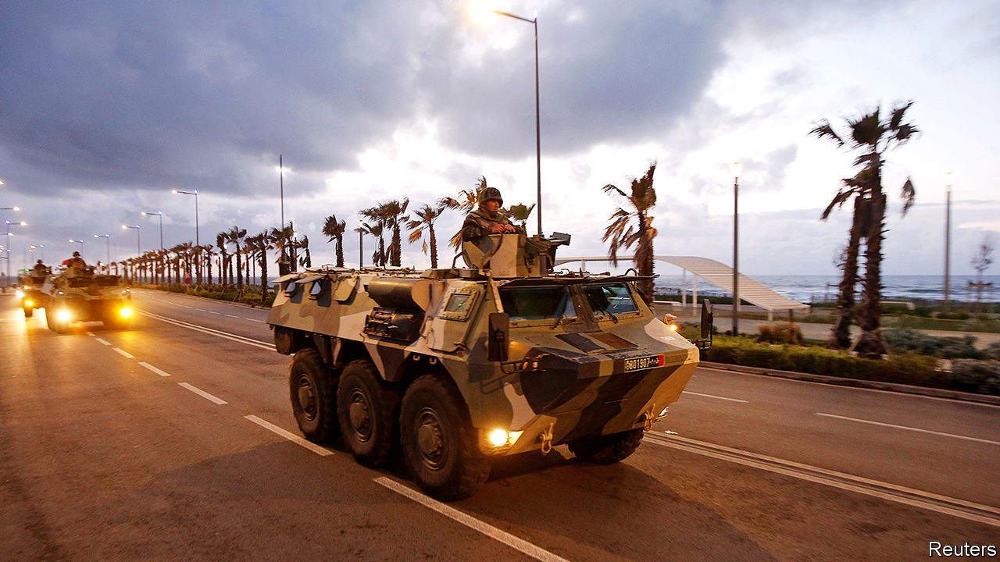

###### An even tighter grip

# As covid-19 spreads, Arab states are clamping down 

##### Security services spy a chance to extend their powers 

 

> Mar 26th 2020 

Editor’s note: The Economist is making some of its most important coverage of the covid-19 pandemic freely available to readers of The Economist Today, our daily newsletter. To receive it, register . For more coverage, see our coronavirus 

IF YOU BELIEVE the official numbers, covid-19 has not yet hit the Middle East and north Africa as hard as the rest of the world. Excluding Iran, where an outbreak is raging, the virus has killed around 100 people in the region, compared with thousands in Europe (which has more people). Nevertheless, Arab leaders are taking drastic steps to curb its spread, imposing curfews, closing businesses and quarantining cities. This is wise: countries such as Italy and Iran delayed action and were overwhelmed. It is also troubling. The region’s regimes have long played on people’s fears to justify their authoritarian rule.

Many governments have declared states of emergency, allowing leaders to rule by decree (as many do anyway) and deploy the armed forces. In Egypt, for example, the army has been sent out to disinfect areas. In Jordan it now guards public squares and helps enforce a ban on people leaving their homes. With the civilian authorities in Iran unable to cope, the Revolutionary Guards have sought more power and pushed for virus-related restrictions. In some Western countries, too, the army is out in the streets. But regimes in the Middle East and north Africa are less likely to loosen their grip on society once the crisis recedes.


They are also clamping down in ways not seen in the West. Morocco has detained people for rumour-mongering. “Those spreading fake news will be pursued,” says Abdelmadjid Tebboune, Algeria’s president. Jordan limited the number of journalists allowed to report outside, even before it recorded any deaths from the virus. Egypt banned a correspondent from the Guardian, a British newspaper, after she cited Canadian epidemiologists who think the outbreak in Egypt is worse than the government says. Arabs increasingly rely on state broadcasters, which deliver slanted news and questionable data alongside public-health announcements.

Even in the region’s freest country, Israel, there is concern that the government is overstepping. Binyamin Netanyahu, the prime minister, has ordered his spooks to use phone surveillance technology to track Israeli citizens in an effort to curb the spread of the virus. Some Israelis worry that this power will be abused. Mr Netanyahu and his allies are also accused of using the outbreak to delay his trial on corruption charges and keep him in office, as negotiations over a new government continue. “He is doing his utmost to exploit the opportunity the coronavirus introduced,” says Yohanan Plesner of the Israel Democracy Institute, a think-tank.

Elsewhere, though, draconian measures have been greeted with praise. As the virus spread, the hashtag “declare a state of emergency” trended on Twitter in the region. According to Ipsos, a pollster, 98% of Jordanians think their government is doing a “good” or “very good” job. They are seemingly happy with a new law that allows the king to seize private property, detain anyone who threatens public order and screen all media before publication. Even anti-government activists are sounding supportive. “Sometimes human rights and public-health needs clash,” says one in Morocco, which is under lockdown.

Social distancing has meant that the large anti-government protests rocking countries such as Algeria, Lebanon and Iraq have fizzled away for now. Opponents in the region are getting along better, too. Israel and the Palestinians are co-operating, to an extent, in the face of a common enemy. The United Arab Emirates and Kuwait have offered aid to Iran.

The calm may not last, though. The pandemic has hit the region’s economic mainstays, such as tourism and remittances, while a collapse in the price of oil has cut into government revenues, putting public-sector jobs at risk. Meanwhile, the WHO is casting doubt on the outbreak data coming from governments in the region. Insufficient testing means the number of infected people is undoubtedly higher than the official tallies. Most health systems are not equipped to deal with a large outbreak. As more people fall ill, the region’s authoritarians may regret having long spent more on their armies and security services than on hospitals and medical supplies. ■

Dig deeper:For our latest coverage of the covid-19 pandemic, register for The Economist Today, our daily , or visit our 

