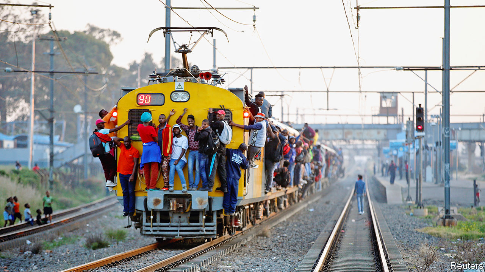
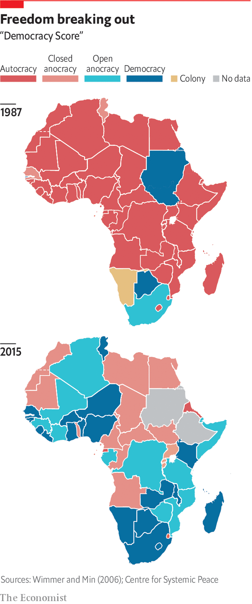

###### Migration

# Migration is helping Africa in many ways 

##### It is good for development and democracy, as well as helping people improve their lives 

 

> Mar 26th 2020 

“WHAT’S NIGERIA’S second city?” asks Ngozi Okonjo-Iweala, an irrepressible economist and former finance minister of Nigeria, before chuckling: “London!” She is exaggerating (about 200,000 people who were born in Nigeria live in Britain) but she has a point: one of the most powerful trends shaping Africa, and the wider world, is migration. There are three different types: to the West, within Africa and from countryside to city. All are helping make the continent richer and better educated.

Although many talk about waves of African migrants crossing into Europe, the numbers are still modest. Just 2.5% of Africans, or about 36m people, live abroad, compared with a global average of about 3.4%. Of those, less than half leave the continent.


Even so, African migrants generate a disproportionate share of headlines in rich countries. This is partly because nearly half of those who died crossing the Mediterranean during the height of the “migrant crisis” of 2015 were sub-Saharan Africans. But it is also because populist politicians have stoked fear of migration in many countries. In South Africa, which is home to about 2.2m mostly African migrants, politicians accuse foreigners of taking jobs and committing crimes. This rabble-rousing has led to repeated bouts of anti-foreigner rioting. Matteo Salvini, a former deputy prime minister of Italy, banned rescue ships carrying migrants from Italian waters, and Donald Trump has severely restricted immigration from several African countries including Nigeria.

But it is also because of concerns that the numbers of African migrants will rise dramatically. In 2017 the Pew Research Centre asked people in several African countries whether they would move to another country if they could. About three-quarters in Ghana and Nigeria said they would. So did more than half of Kenyans and South Africans. The reason is simple. The average earnings of African migrants to Europe is $1,020 a month, three times the pay back home, says the UNDP. One reason more people do not move is the high cost charged by people smugglers—on average about $2,400 for men and $3,900 for women—up to 20 times median monthly earnings in the countries they leave. Over the decade to 2017 about 1m Africans migrated to Europe. As Africa grows richer more people will be able to move, and migration will probably increase, argues Sir Paul Collier, a development economist.

Even if Africa’s migration rates were simply to rise to the global average, its fast-growing population would mean tens of millions of people would be on the move. This would be no bad thing. Though more rich countries seem to be putting up barriers, without migration Europe’s population is forecast to fall by about 10% by 2050. It is also ageing: for every 100 people of working age, there would be 118 retirees and children by 2060. Germany alone would need 500,000 migrants a year to offset its demographic decline.

Stephen Smith, who wrote a book on migration, worries that it is draining Africa of its educated young. Yet that overlooks the many benefits of migration, including how it is helping increase skills and education within Africa.

The easiest benefits to measure are the remittances that migrants send home. Nigeria, for instance, got $24.3bn in 2018 from its citizens working abroad, a 24% increase over 2016 and about eight times more than it receives in development aid. That is also more than ten times what Nigeria got in foreign investment in 2018. Senegalese working in Spain send back as much as half of their earnings (helping remittances make up 9% of Senegal’s national income). Not only are such flows far larger than aid, they are also often better spent. A big chunk of aid budgets goes on administration and buying four-wheel-drive cars for aid workers, but most of what migrants send goes directly to recipients (though, scandalously, fees charged by money agents can gobble up to a fifth of the cash). It is also often invested in education, housing and businesses. In Ghana children in families who get help from a relative abroad are 54% more likely to attend secondary school. Lower fees on money transfers could boost private spending on education by about $1bn a year, reckons UNESCO.

Rather than draining the continent of skills, migration shows those at home the benefits of an education, encouraging more people to go to school. About 400,000 Africans study at universities abroad, making up about a tenth of all foreign students worldwide (about the same number as China sent to study abroad in 2005 and about half as many as India does today). In 1960 when the Democratic Republic of Congo gained its independence the whole country had fewer than 30 university graduates. Now it has about 12,000 students studying at foreign universities.


This means that large numbers of bright youngsters are getting exposed to societies that are often more democratic, less corrupt and with more productive business environments than those they grew up in. Research supports the idea that migrants in democratic societies help promote democracy back home. One study of Senegalese living in America and France found that many were urging their family members to register to vote in elections. Another study, this time in Mali, found that returning migrants were more likely to vote. Their civic-mindedness seems infectious. Voter turnout rises even among non-migrants in neighbourhoods with returnees. The diaspora also provides a haven for the opposition. Oromo activists in America played a key role in the protests that have pushed Ethiopia in a more democratic direction.

 


It is not just politics that is being transformed but also business. Some returnees are actual rocket scientists such as Kwami Williams, a Ghanaian-born American who studied aerospace engineering at MIT and was about to take a job at NASA before he changed course and set up a business in Ghana. Or Ikenna Nzewi, a Nigerian-American who studied computer science at Yale before teaming up with two pals from MIT and Duke to set up a business, Releaf, to collect and process palm-oil kernels from smallholder farmers in Nigeria. Rather than migration leading to a “brain drain” or “brain gain”, it is actually circular, with people moving, learning new skills and then moving again, says Stephen Gelb of the Overseas Development Institute (ODI), a London think-tank.

The second big wave of migration is people moving within Africa. More than half of African migrants stay on the continent, most of them travelling along well-established migratory routes such as one that links Burkina Faso and Ivory Coast. There, about 10% of the population are migrants yet they generate close to 20% of its GDP. Migration boosts productivity in many other places. A study by the OECD found that because foreigners working in South Africa brought skills that were missing from the labour market, they did not take jobs from locals. Instead they helped boost employment and wages of South African-born workers, bumping up income per person by as much as 5%.

Countries that send migrants elsewhere in Africa also see many benefits through trade and investment. Lots of people like to eat the food they grew up with, so many end up importing it after they have moved elsewhere, an effect big enough to stand out in trade statistics compiled by UNCTAD. This is also true when they move to the rich world. They are creating a cultural melting-pot of music and film, too. “African youth culture is going to have a fundamental influence on global youth culture,” argues Cobus Van Staden at Wits University. It is exportable because it is open and “deeply in conversation” across cultures, he says, citing as an example how musicians from different African countries collaborate.

The third great migration is the shifting of people from the countryside to cities. Africa’s population is still largely rural, with just 41% living in cities. But this is changing fast. The number of people living in African cities is growing by 3.6% a year, compared with 2.4% in China and India. This rapid growth, a result of both a still-high birth rate and migration, means that Africa’s cities have to accommodate about 20m extra people each year. The UN reckons that over the next decade, all ten of the world’s fastest-growing cities will be in Africa. These include Dar es Salaam in Tanzania, which will almost double to about 11m people.

Many of the benefits of the other two sorts of migration are also seen when people move to cities. In Ghana three-quarters of people who moved from villages to slums sent money to their families back home. Almost nine-tenths thought their lives were better.

Africa is not only urbanising much more quickly than any other continent, it is also doing so at a much lower level of wealth than Asia or South America did. In other parts of the world the movement of people to the cities has generally meant a move into more productive jobs. But in Africa young people often end up hawking vegetables or trinkets on the side of the road. This is because many of the continent’s cities are so sprawling, with narrow jammed roads and poor infrastructure, that people cannot easily get to jobs. Nairobi, for instance, has one of the longest average commuting times anywhere because 41% of people walk to work.

It also costs a lot to transport food to cities, which pushes up prices and in turn forces up wages in factories, making it hard for them to compete on global markets. In short, many have become “consumption cities” with urban economies dominated by low-value services and goods that are consumed locally, rather than tradable goods or services. Better urban planning with denser housing instead of sprawling slums, with wider roads and public transport, would all go a long way to making cities more productive. So would reliable electricity: a study by the Centre for Global Development in Washington, DC, found that one of the biggest obstacles faced by Nigeria’s technology startups was frequent power cuts. “You can’t code in the dark,” says the founder of one firm.

But some of the solutions to urban problems can also be found in the countryside. A good place to start is by helping farmers become more productive. That could reduce food costs in the cities, making them more competitive for manufacturing. Higher incomes in villages could expand markets for goods made in the cities. Sometimes the path to industrialisation starts on the farm.■

