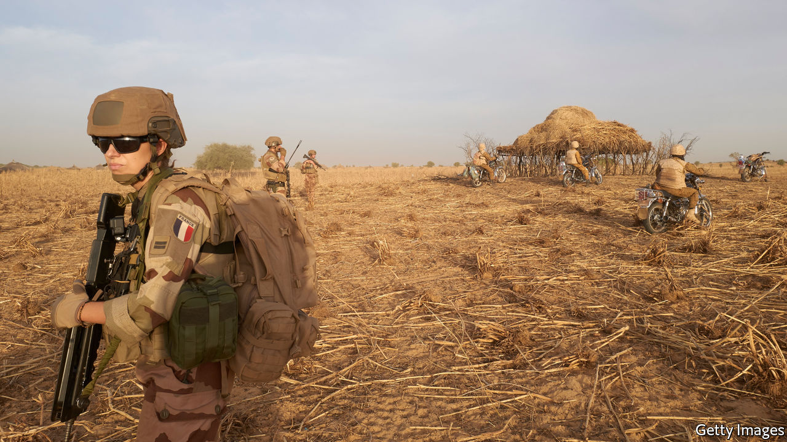

###### The forever wars

# Parts of Africa will remain unstable for decades 

##### The lack of education and jobs is a major cause 

 

> Mar 26th 2020 

ON THE EDGE of a shallow ravine in the far western corner of Burkina Faso two vehicles bristling with machine guns come to a stop. Several bearded white men lean out, keeping watch for jihadists. Nearby, other Western soldiers are helping their African counterparts stage a mock attack on an insurgent base.

These are some of the special forces from a number of Western countries who have been fighting jihadists in the Sahel for years. Many Western army and intelligence officials see extremists in the region posing a greater danger than the remnants of Islamic State in Syria and Iraq. America has sent about 6,000 troops to Africa, France 5,100 and Germany 1,100. There are almost as many Western troops in Africa as those fighting the Taliban and Islamic State.


Yet most foreign leaders are keeping quiet about it, worried that they will get little public support at home. President Donald Trump has reduced America’s troops in Africa by about 10%, against the wishes of his generals, and is considering a much deeper cut.

That is worrying because the jihadists are getting the upper hand. Last year more than 10,000 people lost their lives in violence related to Islamist groups in Africa. Mali, whose capital almost fell to jihadists in 2012 before French forces stepped in, is at the centre of the turmoil. Much of the countryside in its vast north has fallen, despite a UN peacekeeping force that is 15,000 strong. Now the extremists are spilling out into neighbouring countries. Burkina Faso, which was stable a few years ago, has lost control of the triangle of territory in its north, which borders Niger and Mali.

Western security officials had hoped it could act as a bulwark to stop the insurgents crossing over and destabilising coastal states such as Ghana and Benin. Now they are drawing new lines of defence. François Lecointre, chief of staff of the French armed forces, has said his troops will be in the Sahel “for the next 30 years”. Brigadier-General Dagvin Anderson, who commands American special forces in Africa expects “a generational, multinational effort”.

Stopping the jihadists will require not just troops, but also schools, economic development and accountable governments. Countries in the Sahel are not helped by climate and topography. Their people are poorer, less educated and have stubbornly high fertility rates. Just as countries such as Kenya and Ethiopia are slowing their population growth, women in countries such as Niger continue to have more than seven children each. The region’s rapidly deteriorating security is a warning to the continent as a whole of what may happen if its growing numbers of young people are not educated or are unable to find jobs at home or abroad.

The Islamist jihad has caused more than 1,000 schools to close across west Africa, leaving almost 2m children out of school. In one village of 6,000 people outside the city of Maiduguri in north-eastern Nigeria, near the border with Niger, the only education that the village’s 2,000 children get is learning to recite the Koran. There is not a book in sight, just the rhythmic chanting of children rising into the afternoon heat.

