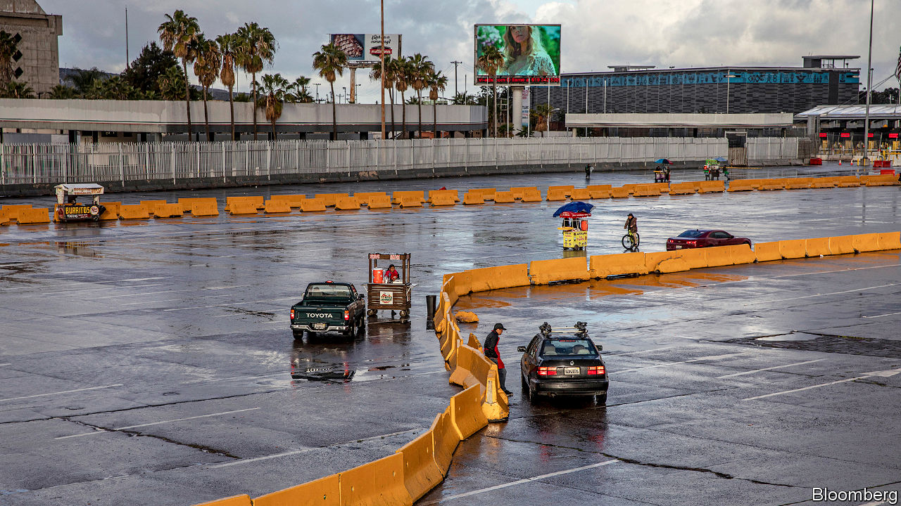

###### Distancing neighbours

# Mexico and the United States shut their border, sort of 

##### A carefully calibrated closure 

 

> Mar 26th 2020 

Editor’s note: The Economist is making some of its most important coverage of the covid-19 pandemic freely available to readers of The Economist Today, our daily newsletter. To receive it, register . For more coverage, see our coronavirus 

TIJUANA AND San Diego are rumbustious siblings. The San Ysidro border crossing, which links them, is the world’s busiest. Some 5m people a month make the northward journey between the cities. But covid-19 has brought about an abrupt change in their relationship. On March 19th California’s government ordered the state’s 42m residents to stay home to slow the spread of the new coronavirus. The next day Donald Trump, the American president, announced that the United States-Mexico border would be closed to all but “essential” traffic.

San Diego immediately became a ghost town, its streets bare but for a few dog walkers and homeless people. At each stop on an empty tram, a gloved attendant wiped clean the buttons that operate its doors. Traffic at San Ysidro slowed to a trickle. But at Tijuana beach, a few hundred metres across the border, couples strolled, vendors sold hot dogs and party-goers congregated around fires. Despite the notable absence of Americans, the pandemic seemed far away. “If we die, we’ll die among friends,” said one Mexican.


If covid-19 was a golden opportunity for Mr Trump to erect the wall that he has long sworn to build, he did not seize it. Although a dozen Latin American countries have shut their borders completely, Mexico and the United States have kept theirs porous. Mr Trump’s definition of “essential” travel is wide enough to let through lorries full of electronics. Both governments seem wary of disrupting commerce; some $1.4bn-worth of goods crosses the border daily. The annual flow is the equivalent of nearly half of Mexico’s GDP. Besides, border closures do little good once an epidemic has taken hold on both sides.

The decision to block partially the 3,200km (2,000-mile) border was mutual, announced by joint press release. Talks with the White House were “quite different from the take it or leave it” approach of past discussions, says a Mexican diplomat. Mr Trump forced Mexico (and Canada) to renegotiate the North American Free Trade Agreement, but the process helped build relationships. The manner of the border tightening shows that bridges built in those talks are still standing, says Agustín Barrios Gómez of the Mexican Council on Foreign Relations.

In theory, the restrictions keep out border-crossers who want to shop or visit people. Mexicans with work permits are exempt from the restrictions, as are Americans heading south for cheap dentistry. A supermarket attendant in Tijuana grumbles that despite California’s quarantine San Diegans raid the shelves for toilet paper, pasta and rice. But in a pandemic an open border can be an asset as well as a threat. Nearly 200,000 Mexican recipients of seasonal H2-A visas will harvest American crops. Mexican-made sensors of blood-oxygen levels and virus-blocking N95 masks will be used in American hospitals. Drugs and medical equipment will head south.

Even so, traffic has slowed sharply, which will hurt output and employment. “We are gonna have to close,” says a sales manager for a small firm in Tijuana that resells industrial materials. His workers cross into San Diego with tourist visas every other day to pick up supplies, which they deliver to factories on the Mexican side of the border. That is no longer possible. American citizens could do the job but will not accept the firm’s low wages, the manager says. Besides, half of the factories he serves are shut, he adds.

 The future is more uncertain still for the thousands of Central Americans and others on the border who await word on their applications for asylum in the United States. Their faint hopes of refuge have dimmed further: the Trump administration has stopped receiving applications and suspended hearings. Migrant camps are potential virus hotspots.

The numbers suggest that it is Mexico that should fear contagion more. They indicate that the outbreak in Mexico lags two weeks behind that of the United States. On March 25th California had 2,998 confirmed cases of covid-19. The neighbouring state of Baja California had 16. That is surely an under-count. By that date Mexico had tested about 4,500 people, compared with 422,000 in the United States.

Mexico’s populist president, Andrés Manuel López Obrador, is doing little to prepare Mexicans for what is coming. He continued to travel and hug supporters and encouraged families to visit restaurants, as “this strengthens the economy”. Other officials are taking the virus more seriously. On March 22nd the mayor of Mexico City shut bars and banned large gatherings. Two days later the federal health ministry ramped up testing and advocacy of social distancing. That would have happened earlier if the government had collected better evidence by testing more, say experts. The financial markets are predicting massive economic harm, from an American recession, low oil prices and a domestic outbreak of covid-19. The Mexican peso has dropped to its lowest-ever level against the dollar (see ).

Openness on the border was tested before Mr Trump and covid-19 came along. After the terrorist attacks of September 11th 2001, the United States enacted stringent inspections. The delays they caused threatened such economic damage that they “would [have] deliver[ed] to al-Qaeda the victory that it sought” had they been kept, says Alan Bersin, a former boss of United States Customs and Border Protection. The two countries fixed that by waving through “low-risk” workers with registered fingerprints, which freed border agents to watch for terrorists. That will not avert panic during a pandemic. If the disease becomes rampant in Mexico, Mr Trump could slam shut today’s semi-open border.■

Dig deeper:For our latest coverage of the covid-19 pandemic, register for The Economist Today, our daily , or visit our 

