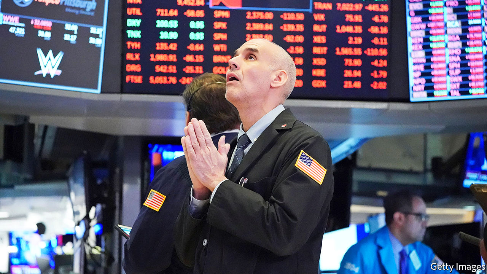

###### 

# Business this week 

#####  

 

> Mar 26th 2020 

In an unprecedented move the Federal Reserve said it would buy corporate bonds, including new issues and the riskiest investment-grade debt, action that it shied away from during the financial crisis a decade ago. The central bank is using a subsidiary of BlackRock to manage the investments. It is also buying government debt (unlimited quantitative easing), reviving a facility that enables it to absorb securities backed by student, car and credit-card loans, and has pledged to help small businesses. See .

Animal spirits


Markets had another manic week, as investors swung between despondency and optimism. On March 24th the S&amp;P 500 rose by 9.4%, its biggest one-day gain since October 2008. The NASDAQ was up by 8% and the Dow Jones Industrial Average by 11.4%. The FTSE 100 and German DAX recorded similar leaps.

Easing the pressure on big banks, the Bank of England cancelled its annual stress tests. This came after the central bank cut its benchmark interest rate to 0.1%, the lowest in its 326-year history.

Responding to plummeting oil prices, Saudi Arabia unveiled a package of aid for the kingdom’s businesses worth $32bn and raised its debt ceiling from 30% of GDP to 50%.

A measure of business activity compiled by IHS Markit fell to record lows for America, Britain and the euro zone. Worse is yet to come. The survey was taken before many of the more stringent lockdowns on companies and personal movement were introduced. See 

With passenger numbers down by 70% on Britain’s railways the government suspended for at least six months the franchise system through which train companies operate on routes. The Department for Transport is doing this so that it can take on all the revenue and cost risk, in effect nationalising any losses. Train companies will continue to run services for a small fee.

The International Air Transport Association increased its estimate of revenue losses for the airline industry this year to $250bn. Global carriers have asked governments to bail them out, but environmentalists want this linked to swifter action on carbon emissions.

Virgin Australia reportedly asked Australia’s antitrust authority to investigate public comments made by Alan Joyce, the chief executive of Qantas, Virgin’s arch-rival. Mr Joyce has suggested that Virgin should not receive state aid during the crisis, implying that it is “badly managed”, and has said he wants his airline to be the “last man standing”. Reports suggest Virgin is worried that Qantas is using the crisis to reduce competition. Meanwhile, and despite stretched credit markets, Qantas was able to raise A$1.1bn ($635m) in bank loans.

Norwegian Air, which was already struggling before covid-19 grounded flights, received its first cash injection from Norway’s government after securing a rescue package for the country’s airlines. Under the deal, commercial lenders provide 10% of loan guarantees and the government the remaining 90%. 

Boeing suspended production at its factory near Seattle for two weeks. Washington state has been hit particularly hard by covid-19 and dozens of Boeing’s workers have contracted the disease; one man has died. Airbus reopened its plants in France and Spain after a four-day hiatus, but reduced their output.

Workers at several Amazon warehouses in America tested positive for covid-19, forcing some of them to close while they were cleaned. Amazon is hiring 100,000 more people to cope with a surge in online shopping, but hundreds of employees have signed a petition urging the company to do more to protect them.

A sales update from Target provided a glimpse into the impact of coronavirus on large retailers. Total sales were up by more than 20% in March so far compared with the same month last year, and by 50% for food and household essentials. Clothing sales were down by a fifth, however.

Nike revealed that 80% of the stores that sell its products in China have reopened, after closing in February soon after the start of the virus outbreak.

SoftBank announced a sale of up to ¥4.5trn ($41bn) of assets to fund a share buy-back plan and reduce its debt. The troubled Japanese conglomerate’s share price soared after the announcement. That was not enough to stop Moody’s from cutting its rating for SoftBank’s bonds by two notches.

Frozen

Just in time for the family lockdown, Disney+ launched in Britain, Germany, Italy, Spain and several other European countries. Being stuck indoors has led to a surge in streaming, which has caused Netflix, Amazon Prime and others to reduce their playback quality in Europe to ensure films don’t stutter.

