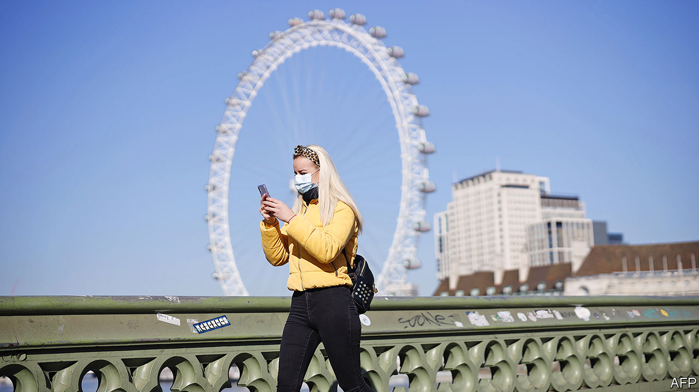
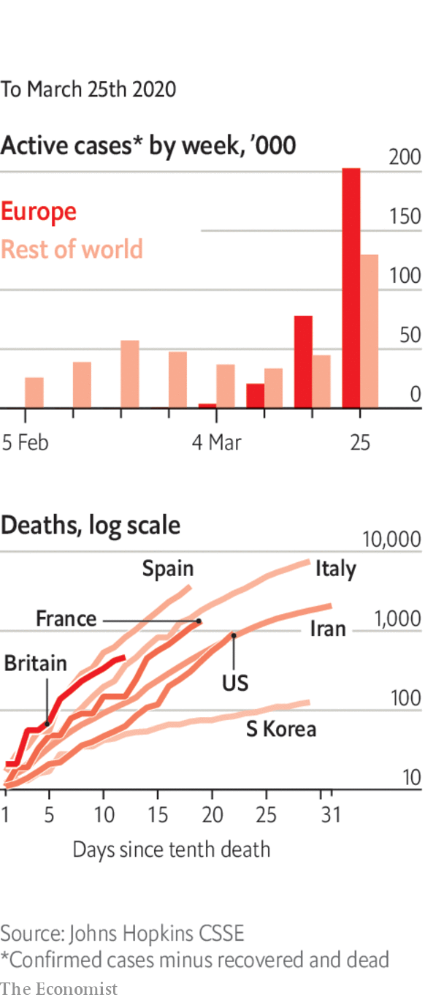

###### 

# Politics this week 

#####  

 

> Mar 26th 2020 

More countries rolled out wartime-like emergency measures to fight covid-19. In Britain people were told to leave home only in limited circumstances; gatherings of more than two people were banned. All non-essential businesses, pubs and restaurants were ordered to shut. The government announced an unprecedented aid package, including paying up to 80% of workers’ wages. The American Congress prepared a $2trn economic-rescue bill, the biggest in modern history, which provides relief to business and direct payments to workers. Germany tore up its strict fiscal rules and launched a raft of emergency measures totalling €750bn ($810bn). See .

In America more states went into lockdown, but the message to stay indoors was somewhat undermined by Donald Trump’s insistence that some restrictions should be relaxed so that the economy can get working again by Easter.


India’s prime minister, Narendra Modi, sparked panic-buying when he said the entire country would be placed on lockdown within hours for a duration of three weeks to slow the spread of the new coronavirus. He later clarified that food shops and other essential services would remain open. See .

Abe Shinzo, Japan’s prime minister, announced that the summer Olympics would be delayed by a year because of the pandemic. Athletes have been complaining that restrictions on movement related to the outbreak made it impossible to train. Tokyo’s governor warned of an “explosive spike” in cases in the city. See .

The government of Bangladesh released on bail Khaleda Zia, the leader of the Bangladesh Nationalist Party, the main opposition, to allow her to seek medical treatment. See .

The supreme leader of Iran, which is fighting one of the world’s worst outbreaks of covid-19, rejected an offer of aid from America. “Possibly your medicine is a way to spread the virus more,” said Ayatollah Ali Khamenei, revealing an odd worldview. China’s ambassador to America said it was “harmful” to speculate about the origin of covid-19. His remarks appeared aimed at a baseless conspiracy theory, promoted by some Chinese diplomats, that the American army may have brought the virus to China.See .

Could it be?

Hubei, the province in China worst-hit by covid-19, allowed most of its people to move freely again, as long as they have no symptoms. Officials said the lockdown of the province’s capital, Wuhan, where the disease was first discovered, would end on April 8th, 11 weeks after it was imposed. China continued to report few if any newly confirmed domestic cases of infection. See .

The Speaker of Israel’s parliament, Yuli Edelstein, resigned instead of complying with a Supreme Court order to hold a vote on his replacement. The opposition bloc, which won a majority in the last election, hopes to appoint a new Speaker and may seek to bar Binyamin Netanyahu from leading a new government. Mr Edelstein, an ally of the prime minister, had been accused of obstructing those moves.

Prosecutors in Turkey charged 20 Saudi citizens for the murder of Jamal Khashoggi, a Saudi dissident writer, in Istanbul in 2018. A former adviser to the royal family and a former deputy head of intelligence were accused of instigating the killing, the rest with carrying it out.

Risking legal action, Lebanon said it would stop paying its maturing Eurobonds in foreign currencies, as the heavily indebted country deals with an economic and financial crisis.

Boko Haram, a jihadist group operating mainly in north-eastern Nigeria, killed 92 soldiers in an attack on an army base in Chad. In a separate incident the group killed 50 soldiers in Nigeria.

The World Bank and the IMF said that Somalia will qualify for debt relief under the Heavily Indebted Poor Countries Initiative. Outstanding debt of more than $5bn will decline to $557m over three years.

At least 23 prisoners died in a riot at one of Colombia’s largest jails. Prisoners fearful of contracting covid-19 attempted to break out of La Modelo jail in Bogotá.

Political parties in Chile agreed to postpone a plebiscite due to be held on April 26th on whether to set up an assembly to write a new constitution. Bolivia delayed a general election that had been planned for May 3rd. Both are in response to covid-19.

As the covid-19 pandemic deepened in Europe, both Italy and Spain overtook China to become the countries where the largest and second-largest numbers of people have died from the disease. See .

In Russia, Vladimir Putin put on hold his plans for a popular vote on constitutional changes that could allow him to stay in office for another 16 years. The vote had been scheduled for April 22nd, Lenin’s birthday. He blamed covid-19. The mayor of Moscow criticised his slow response to the crisis.

Alex Salmond, a former leader of the Scottish Parliament, was cleared of sexual assault charges by the high court. The Scottish government has conceded that its own investigation into the matter breached its guidelines. See .

Coronavirus briefs

 


In America, some senators and congressmen were accused of having used intelligence information on the covid-19 outbreak to sell stock before markets crashed.

New York’s governor warned about the “astronomical numbers” of infections in the state, but also said that social distancing seemed to be working.

Amid a wave of panic-buying, the British government urged shoppers to behave responsibly. Hoarders are thought to have £1bn-worth ($1.2bn) of extra food in their kitchens that they have not eaten.

Mississippi followed Texas and Ohio in classifying abortions as non-essential medical procedures during the crisis. 

Among those testing positive for covid-19 were Prince Charles and Rand Paul, a Republican senator. Angela Merkel went into self isolation after her doctor tested positive.

