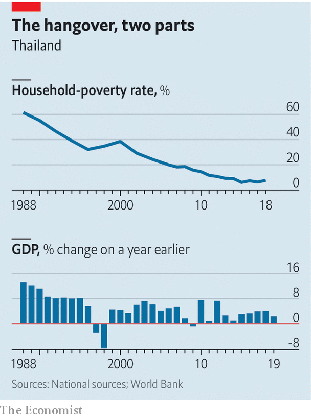

###### Sigh-am

# Thailand’s economy was suffering before the virus 

##### A once leading country risks falling behind its neighbours 

 

> Apr 4th 2020 

DESPITE COUPS, floods and mass protests, visitors have flocked to Thailand in recent decades. Almost 40m of them arrived last year to blister on its beaches and dance in its discos. But as the globe shuts down because of covid-19 and holidaymakers stay at home, the land of smiles feels glum. Travel and tourism, broadly defined, were worth more than 3.5trn baht ($109bn) in 2018, according to the World Travel and Tourism Council, equivalent to about 20% of the country’s GDP. The Kasikorn Research Centre, a Thai outfit which conducts economic analysis, estimates that if the covid-19 pandemic lasts into September, Thailand’s losses will amount to 400bn baht ($12.1bn).

The country has scrambled to respond to the coronavirus, which has infected at least 1,771 people. But the policies adopted were initially confused. At first foreign visitors were required to present embassy approvals and certificates declaring themselves free of covid-19 before boarding planes to Thailand. Now a state of emergency has been declared and the country’s borders are closed to foreign visitors. Bangkok is under a “soft lockdown”, with entertainment venues and malls shut. The governor of Phuket, normally a tourist hub, declared there is now a curfew in place for visitors between 8pm and 3am.


The economic response to covid-19 has been more robust. On March 10th the government unveiled a stimulus package worth $12.7bn, about 2.5% of GDP, which includes tax deductions for businesses and a 20bn baht fund for workers affected by the pandemic. On March 24th the government promised another 45bn baht in cash handouts. The Bank of Thailand, the country’s central bank, cut its key interest rate by 25 basis points to 0.75% after a special meeting on March 20th. It is also leading efforts to shore up systemic liquidity by offering special credit facilities and support for bond markets, among other measures. More is likely to be needed.

The Thai economy seemed sickly even before the new coronavirus emerged. It grew by just 2.4% last year, the slowest pace since 2014. This year it seems sure to shrink. Growth has been disappointing for more than a decade. From 2009 to 2019, Thailand’s growth rate (3.6% on average) lagged behind poorer neighbours like Vietnam (6.5%) and the Philippines (6.3%), and even richer ones such as Malaysia (5.3%). A small number of huge firms, family-owned businesses and state-owned enterprises dominate the economy. They face little pressure from competitors to innovate.

 


The poverty rate has stagnated for the past few years, having fallen dramatically in the decades before (see chart). About a tenth of the population lives on less than $2.85 a day. Average household consumption declined in 2017-18, while household debt stands at about 80% of GDP, one of the highest ratios in Asia. About a third of the labour force still works in agriculture, which is plagued by inefficiency. Thailand’s most severe drought in decades has cut production of sugar, rice and rubber.

Thailand’s demography is not too appealing to investors either. The country is ageing: its fertility rate is lower than Europe’s. Over a quarter of Thais will be older than 65 by the middle of the century. It took France 160 years for the share of its population aged 65 or above to rise from 7% to 21%; the UN estimates Thailand will do the same in just 35 years. The elderly lack retirement savings—national surveys suggest that eight in ten of them rely on income from their children.

Thailand’s low labour costs once persuaded carmakers, steel producers and others that it was a good place to build factories. But competitiveness had been slipping. Against the dollar the Thai baht was one of the best-performing currencies in Asia last year. The coronavirus has reversed those gains, but Thai workers’ wages still seem expensive when compared with those in places like Vietnam. In December Mazda, a Japanese carmaker, shifted production of its SUVs to Japan. In February General Motors, an American giant, pulled out of Thailand altogether.

This combination of economic ills would test the wisest lawmakers. Thailand’s elites are distracted by internal strife. There have been two coups since 2006. Almost five years of military rule damaged Thailand’s international standing and prevented it from negotiating free-trade agreements with Western countries, argues one Bangkok economist. The government prefers flashy but ineffective schemes like “Thailand 4.0” which includes the Eastern Economic Corridor (EEC), a special economic zone.

There are some small spots of good news as Thailand tackles covid-19. Its universal health-care system means citizens will have greater access to help when ill than many others in developing countries. And the government’s existing welfare scheme means it is ready to funnel money to people through the crisis. Building new infrastructure, such as a new railway and airport planned near Bangkok, would bolster its competitiveness in the long term. But the grim truth is that Thailand’s maladies will outlast the pandemic. ■

