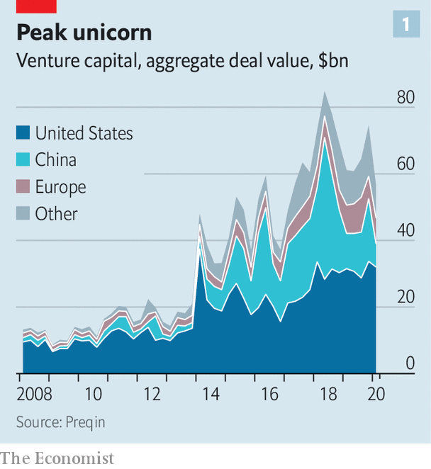
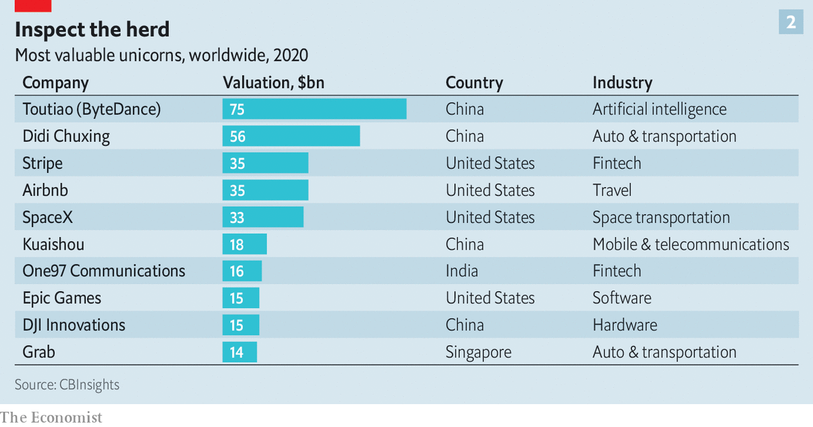
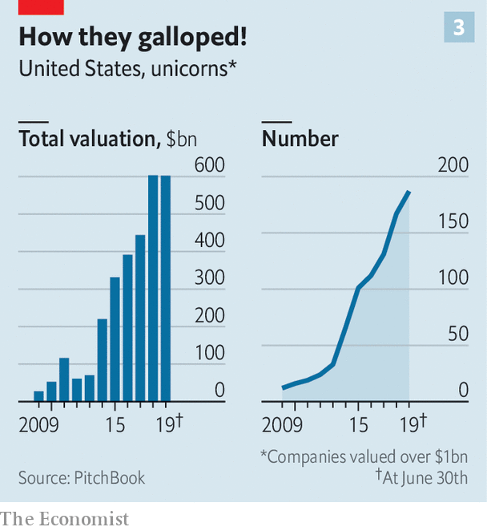
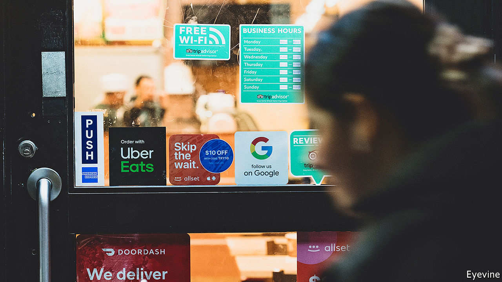

###### Exit unicorns, pursued by bears

# Technology startups are headed for a fall 

##### The consequences will not all be bad 

 

> Apr 4th 2020 

Editor’s note: The Economist is making some of its most important coverage of the covid-19 pandemic freely available to readers of The Economist Today, our daily newsletter. To receive it, register . For more coverage, see our coronavirus 

FOR A SENSE of how covid-19 is affecting the world’s technology “unicorns”, as privately held firms worth $1bn or more have come to be known, consider two of them. Lime, a scooter-rental firm valued at $2.4bn, has halted its services in Europe and America, where most citizens have been told to stay off the streets. DoorDash, a $13bn food-delivery company, has suddenly found itself useful to a self-isolating society as a whole, not just couch potatoes; deliveries have surged.

On the surface, DoorDash stands to benefit from the pandemic, and Lime to suffer. In fact, the coronavirus may prove more indiscriminate than that. It strikes at a time when many of the world’s 450-odd unicorns were looking ropy. Their perpetually loss-making business models—only a small proportion are in the black—were increasingly being questioned. So were their exuberant valuations, which added up to perhaps $1.3trn globally. A reckoning was afoot; some unicorns would “go under”, Dara Khosrowshahi, boss of Uber, a ride-hailing giant which relinquished its unicorn status by going public last year, told The Economist on March 2nd.


Among investors, “fear of missing out” has been giving way to “fear of looking stupid”, says Alfred Lin, a partner at Sequoia Capital, a venerable Silicon Valley venture-capital (VC) firm. Plenty have given up trying to do new deals; instead they are trying to save old ones. One firm is telling its companies to expect 30% less revenue in the next two quarters and to cut costs accordingly. On March 5th Sequoia put out a memo entitled “Coronavirus: The Black Swan of 2020” warning that the outbreak will depress startups’ growth and calling on its portfolio firms (one of which is DoorDash) to rein in costs, conserve cash and brace for capital scarcity.

Most telling, the gospel of growth at all cost has gone out of the window. After years of initial public offerings (IPOs) being done without much focus on profits, “path to profitability” is the new watchword, says Ryan Dzierniejko of Skadden, Arps, Slate, Meagher &amp; Flom, a law firm. “The law of economic gravity has returned as it does every decade or so,” says Michael Moritz, another Sequoia partner. For some unicorns, dispensing with eight flavours of sparkling water and five selections of Thai curry may be a good start, he adds.

The unicorn reality check was under way before America declared a national state of emergency over covid-19 on March 13th. Venture capitalists reckoned that a third of American unicorns would thrive, a third would disappoint and a third would be taken over or die. As investors the world over scurry to safe assets amid a market meltdown, Mr Khosrowshahi’s prediction may come true faster than he thought. Some discern an echo of the dotcom bubble, which burst 20 years ago. Others are more sanguine. Whoever is right, startup pastures that emerge in the aftermath will look very different to today’s.

Unicorns have come a long way since Aileen Lee, founder of Cowboy Ventures, a VC firm, coined the term in 2013, to convey wonder and rarity. Nowadays every startup wants to be one, for bragging rights and to hire the cleverest coders. “For millennials and Gen Zs being a unicorn became a filter,” says Jeff Maggioncalda, CEO of Coursera, a unicorn that offers online learning courses and university degree programmes. A small Austin-based scooter startup called itself, simply, Unicorn; the attempt to leverage nominative determinism failed when the firm went bust in December after spending all its cash on Google and Facebook ads.

For the past decade huge sums from sovereign-wealth funds, mutual funds and hedge funds poured, directly or via VC firms, into startups that were unicorns or, their backers believed, might be one soon. Total annual VC investment in America leapt from $32bn in 2009 to $121bn in 2018. Some $822bn has flowed into American startups since 2010. About as much has gone to those in the rest of the world. Fat cheques allowed cash-burning firms to put off facing the scrutiny of public markets, with their pesky insistence on earnings.

The euphoria began to ebb last year. First, in May, Uber’s blockbuster IPO priced at a 30% discount to what the company’s investment bankers had promised. Today its market capitalisation is $43bn, more than a third below what it was on its first day of trading. Unicorn IPOs of Lyft, Uber’s main rival, and of Slack, a corporate-messaging service, disappointed. Then, in October, WeWork, a supposedly “techie” office-rental group, scrapped its IPO after it became clear that investors had no appetite for shares in a firm that lost as much money as it generated in revenues. Its valuation was cut from $47bn to less than $8bn.

 


Other debacles followed. Brandless, an online retailer that sold unbranded products for a fixed $3, folded in February. Zume, a firm selling robot-made pizzas, shut its main business in January. Both, as well as WeWork, were backed by the $100bn Vision Fund, the opaque VC vehicle of SoftBank, a Japanese tech conglomerate, and its boss, Son Masayoshi. OneWeb, a British satellite-internet startup formerly valued at $3.3bn and also backed by Mr Son, has filed for bankruptcy.

After the WeWork fiasco smart VC money turned more cautious, particularly with regard to Vision Fund firms: they went from garnering praise to seeming problematic. Now investors, customers and suppliers “think you must be a crappy company” if you were backed by the fund, says the boss of one, who keeps assuring them “we are not the next WeWork”. A Vision Fund spokesperson says: “We’re sorry to hear it. That has not been our experience with our other founders.”

In fact the malaise extends well beyond Mr Son’s empire. In the last quarter of 2019 American venture-backed firms raised 16% less capital than in the previous quarter and big funding rounds—over $100m—fell by a third. Last year China, home to four of the world’s ten most richly valued unicorns, entered a “capital winter”, as investors turned against firms handing out huge subsidies to consumers in a reckless pursuit of customers. Some Chinese unicorns went bust, including Tuandaiwang, a peer-to-peer lender once valued at $1.4bn. 

The coronavirus shock comes at a time when most tech unicorns were already exhibiting underlying health problems. Some, most notoriously WeWork, never really deserved the label in the first place. Their businesses had at best a tenuous claim to techiness—and so to the “flywheel” effect behind the likes of Amazon or Facebook, in which a large user base makes them more attractive to more users, and so on. Other companies are bona fide technology firms but, like Uber or Lyft, find that digital flywheels gum up. And too many unicorns rest on shaky and opaque financial structures that may exaggerate their lofty valuations.

Start with “fake tech”. These include capital-intensive firms such as WeWork (where accommodating more customers means leasing more office space) and direct-to-consumer retailers such as Casper, which sells snazzy bedding. “We consider ourselves a tech company first,” declared its co-founder, Neil Parikh, in 2016. Stockmarket investors considered it a mattress retailer. In February it listed at $575m, less than half its $1.1bn private valuation.

Pie in the sky

Zume, recounts a VC investor close to it, “only used to talk about the robots, never about the pizza”. When its lorries rounded corners, melted mozzarella ran everywhere. “When we ordered a margherita,” the investor remembers, “it tasted bad.”

Some proper tech unicorns nevertheless discovered that in the physical world, where many at least partially reside, flywheels encounter friction. In theory their markets are almost limitless, with nearly half of humanity carrying a smartphone. Their business models, like Uber’s, enjoy certain network effects: demand from more riders in a given city lures more drivers to the platform; more drivers in turn attract more riders by making rides easier and cheaper to hail. And they can lower upfront costs by outsourcing things like accounting and data storage to the cloud.

 


The trouble is that, in practice, variable costs—subsidies paid to drivers to generate business, say—rise with every new customer. People “thought software changes everything”, says Aaron Levie, co-founder of Box, a listed enterprise cloud firm. But in many cases the digital platform is only a small part of the cost structure: “The physical assets stay expensive.”

No network effects means lower barriers to entry for rivals. The flywheel breaks down because riders have no reason to favour an Uber over a Lyft. Most will go for whichever is cheaper—which leads both firms to fight for customers with cut-price rides subsidised by their VC backers’ cash. In the words of Marco Zappacosta, co-founder of Thumbtack, a local-services marketplace, “Some companies ended up selling $1 for 80 cents.”

Randy Komisar of Kleiner Perkins, a big VC firm, offers an alternative rule of thumb. For a unicorn to count as genuinely “tech”—and therefore profitably scalable—its actual product must be technology, he says; “it can’t just be using technology.” Businesses selling physical goods or services often don’t make the cut. Those providing cloud-based services, especially to corporations—like Snowflake (which helps firms warehouse data in the cloud) or PagerDuty (which assists companies’ digital operations)—do. It helps that, like Slack and Zoom, a video-conferencing firm that also went public last year, they are coronavirus-proof. Indeed, lockdowns are boosting their business by pushing firms to move more functions online.

That is not to say that the consumer internet is dead. Airbnb, a home-sharing website, has seen bookings fall by 40% in big European cities as the pandemic halted trips. It may delay its IPO, which was expected to be this year’s biggest. But despite racking up losses of late, it is well-managed, cash-rich and, thanks to an unmatched global reach that puts up a high barrier to entry, likely to make money again once people get back to travelling.

Neil Shen of Sequoia Capital China says that investors still believe in the ability of some Chinese firms, especially $10bn-plus “super-unicorns”, to dominate their giant home market. Meituan-Dianping, a food-delivery firm, and Pinduoduo, an e-commerce site, were criticised for losing money ahead of their IPOs in 2018. Both ex-unicorns have since taken off. On March 30th Meituan even reported a quarterly profit (though it warned of a coronavirus hit in the coming months). One promising candidate to follow in their footsteps is ByteDance, the parent company of TikTok, a hit video-sharing app—and, with a valuation of $75bn, the world’s biggest unicorn (in which the Vision Fund also has a stake).

The complex and opaque financial practices behind the calculation of unicorns’ valuations are the third pre-existing condition that afflicts most of them—including those which pass Mr Komisar’s test, boast solid business models and hold enough cash to tide them over a rough few months or more. These conditions lead firms to overstate their value in two main ways.

The first has to do with ownership structure. A private firm’s headline valuation is the product of the number of shares and the price per share at the last funding round. But shares issued in later rounds often have downside protections such as seniority over other investors and IPO return guarantees. These lower the value of common equity issued in previous rounds. In 2018 Ilya Strebulaev of the Stanford Graduate School of Business examined the legal terms of 135 unicorns’ various share classes and found that firms were overstating their valuations by 48% on average. 

The second issue is one of governance. Recent years have seen frequent use of “inside rounds”, in which existing backers stump up more money. These can be a vote of confidence from people who know a business well. But they are also a way for VC firms to mark up their portfolios, generating higher internal rates of return that are more attractive to institutional investors (and form the basis on which many partners get paid). According to Mike Cagney, co-founder of three fintech unicorns, SoFi, Provenance and Figure, an unwritten VC rule advises against a firm which led one investment round in a startup leading the next. That inside rounds have become more common in recent years creates a credibility issue for Silicon Valley, he says. 

 


As a result of such finagling, of the roughly 200 American unicorns probably only half merit the moniker, reckons one veteran founder. Although the frequency of “down rounds”, in which valuations fall rather than rise, does not yet appear to have increased, activity in the opaque secondary market for unicorn shares suggests that a repricing is under way.

Sellers in such marketplaces (chiefly company insiders and VC firms seeking an early exit) appear to outnumber buyers in transactions involving such darlings as Grab, a $14bn Singaporean ride-hailing group, and Didi Chuxing, a Chinese rival. Phil Haslett of EquityZen, one such marketplace in New York, revealed in March that shares in many big private startups were changing hands at roughly 25% below their most recent funding round, in part as rank-and-file employees lined up to cash in. The trend has intensified as virus-linked uncertainty pummels risky assets.

These ructions point to one certainty: a shake-out looms. Firms that have most to lose from virus-related measures are shedding workers. Even before covid-19, Lime laid off 14% of its staff and exited a dozen cities. On March 27th Bird, a rival, announced that it was sacking a third of its workers to conserve cash. In all, unicorns have trimmed their payrolls by several thousand people. That is probably not the end of retrenchment. Workers who remain are seeing the value of their shares dwindle and prospects of an IPO windfall recede. Even viable listings are on ice until the markets’ pandemic fever breaks.

In the meantime, the unicorn world is astir with talk of consolidation. SoftBank has reportedly long wanted DoorDash and Uber Eats to merge. A tie-up now looks appetising. The Japanese firm may once again try to combine Grab and Gojek, a rival in Indonesia, where a price war is leading both to lose perhaps $200m a month. In America Uber may try to woo Lyft, whose share price has fallen faster than its own. 

 


Selling to strategic buyers offers another way out. In February Intuit, a financial-software giant, bought Credit Karma, a personal-finance portal, for $7bn. Many potential acquirers are, however, hoarding cash until the pandemic passes.

The uglies are coming

If all else fails, “sell it to one of the big uglies”, says one VC chief. The “uglies” in question—Apple, Microsoft, Alphabet, Amazon and Facebook—are collectively sitting on more than $570bn of gross cash. In normal times regulators would balk at a takeover by one of the tech giants. But these are not normal times. As a painful recession looms, preserving jobs—including not just those of well-paid coders but of the much larger army of gig-economy workers—may override antitrust concerns.

Even if some unicorns are spared—through mergers, acquisitions or just good fortune—the coronavirus is certain to ravage the herd. It will probably put the term itself, which has come to denote excess and broken promises, out to pasture. A new word may be needed, says Mr Khosrowshahi, to describe what is left. ■

Dig deeper:For our latest coverage of the covid-19 pandemic, register for The Economist Today, our daily , or visit our 

