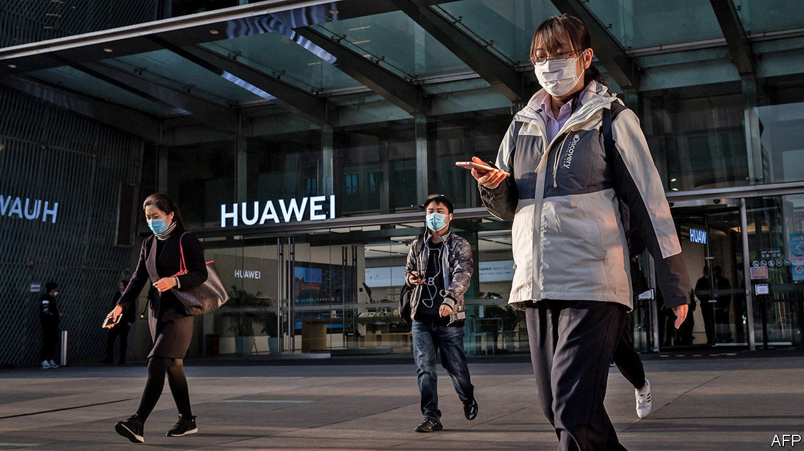

###### Indestructible

# Huawei reports resilient results 

##### Neither American sanctions nor covid-19 seem able to slow its rise much 

 

> Apr 4th 2020 

Editor’s note: The Economist is making some of its most important coverage of the covid-19 pandemic freely available to readers of The Economist Today, our daily newsletter. To receive it, register . For more coverage, see our coronavirus 

ERIC XU, ONE of Huawei’s three rotating chairmen, did not hold back. “Nonstop pressure from the US government, in a deliberate attempt to spread disinformation, has put our company under the spotlight,” he wrote in the firm’s annual report, released on March 31st. This was meant to explain why the telecoms-equipment giant missed its revenue target of $135bn by $12bn.

America has barred exports of some American technology to the Chinese champion. It is threatening to impose further sanctions soon and has tried, with mixed success, to strong-arm American allies to reject Huawei’s next-generation 5G-networking kit.


For all Mr Xu’s outrage, the results were rather impressive. Revenues rose by 19% year on year. They have more than doubled in four years. Net profit rose by nearly 6% to 63bn yuan ($8.8bn). The firm’s cashflow from operations rose by 22% year on year, to 91bn yuan.

The firm responded to America’s assault by redoubling its efforts at “indigenous innovation”, through which it sources and invents as much as it can in China. This will not be easy. Though its premium smartphones now have fewer American parts, its overall use of American inputs actually rose last year to nearly $19bn, from $11bn in 2018.

On the bright side, its kit remains popular outside America. Although American measures limited its use of Google’s Android smartphone operating system, its consumer-business group increased sales by 34%, to 467bn yuan, owing to strength in China and emerging markets. Its 5G gear is more advanced and less costly than offerings from European rivals, Ericsson and Nokia. Huawei now boasts over 90 5G contracts worldwide, half of them in Europe.

Duncan Clark of BDA China, a consultancy, likens Huawei to the villainous robots in “Terminator” films: not just indestructible but “able to rebuild itself after any attempt to take it down”. Even covid-19 may not slow it down. As more people Zoom to work, governments everywhere covet the sort of zippy mobile networks Huawei helps build.

Dig deeper:For our latest coverage of the covid-19 pandemic, register for The Economist Today, our daily , or visit our 

