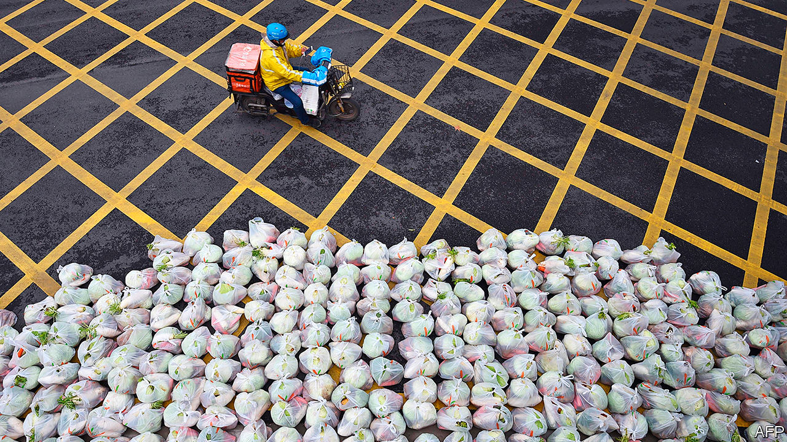
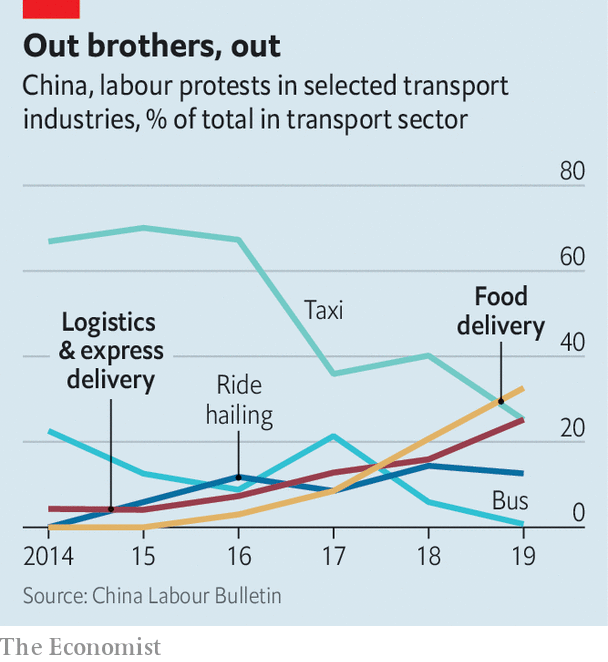
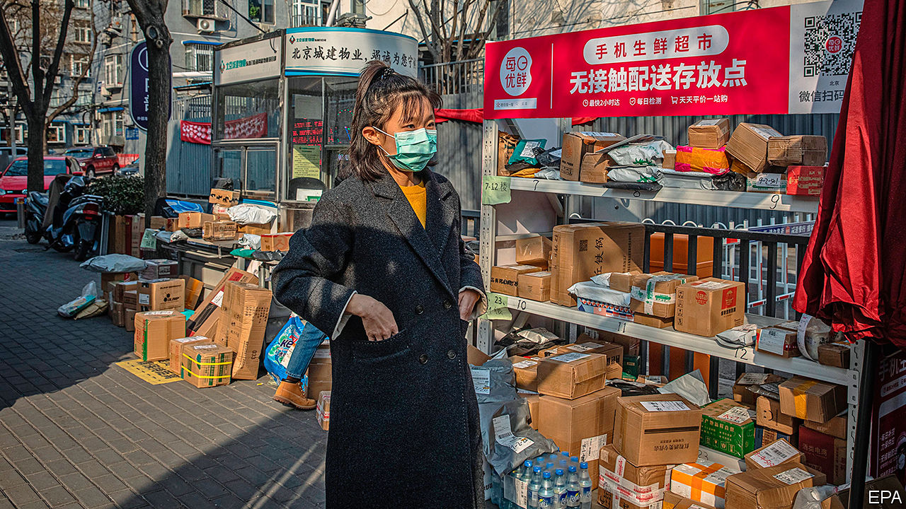

###### Visible and vocal

# Delivery apps have transformed urban life in China 

##### They have also created a new kind of worker 

 

> Apr 4th 2020 

Editor’s note: The Economist is making some of its most important coverage of the covid-19 pandemic freely available to readers of The Economist Today, our daily newsletter. To receive it, register . For more coverage, see our coronavirus 

DURING THE recent peak of covid-19 cases in China, large metal shelving-units appeared at entrances to residential compounds across Shanghai. Outsiders were not allowed in. But somewhere was needed to hold the myriad packages ordered online by the millions of residents who were staying at home. The shelves groaned under the weight of disinfectant and vitamin tablets, sacks of rice and flour, cooking oil and vegetables.

Food-delivery firms played a crucial role in helping people in China endure the lockdown that began in Hubei province in late January, and the less stringent forms of quarantine that were subsequently implemented in cities across the country. Since early March there have been very few newly detected cases of covid-19 except among travellers from abroad. So controls have eased, allowing shops and restaurants to reopen. But many people are playing safe and staying largely housebound. State media have been calling home-delivery workers “heroes”. Few would disagree.


Even before the crisis they were beloved of urbanites. The combination of an abundant supply of cheap labour, a large middle class and near-universal access to smartphones had fostered the growth of online food-delivery services to a degree unmatched in the rich world. People could have everything from coffee to congee whisked to them in under 30 minutes on the back of a scooter, typically by one of the sector’s two titans, Ele.me and Meituan-Dianping. More than 400m people, or about half of the country’s internet users, had encountered a waimai xiaoge, or “takeaway lad” (more than nine in ten are men) at their door. Residents had become so used to receiving hot meals from them that they jokingly compared them to parents.

After the novel coronavirus hit, their services became a lifeline. When officials told firms to stay shut, they allowed exceptions for “essential” services, including those delivering cooked food and groceries. Wary of eating meals prepared by others, many people turned to online supermarkets. Sales of dumpling wrappers and sauces grew more than sevenfold on Meituan’s grocery service—even as takeout orders more than halved, as the giant reported in a downbeat first-quarter forecast. The new joke is that the covid-19 epidemic has turned China into a nation of chefs.

The lives of the xiaoge have changed, too. Zhang Shuai, a 24-year-old from the central city of Zhengzhou who delivers for Meituan in Shanghai, has to wear a mask while working. The firm takes his temperature twice a day, notes it on a card pinned to his jacket and uploads it to the app for users to see. He undergoes many more checks when he picks up orders and carries them into residential compounds, most of which are now open again to outsiders.

Yet the job is still alluring to people like Mr Zhang. Indeed, he signed up with Meituan when infections were mounting. It was just too hard to find any other job, he says. And, at 10,000 yuan ($1,400) a month, his earnings are higher than the average urban wage in Shanghai, partly thanks to subsidies from Meituan and tips from grateful customers. He will quit only when the disease ends. Another migrant worker says he shares his single-room accommodation with five other riders. Is he anxious about living cheek-by-jowl with them? “I’m not afraid of death,” he grins, speeding off.

The gig economy has transformed Chinese cities. Young workers from villages were once largely invisible to urban residents as they toiled on production lines. Now many of them eschew regimented factory work in favour of less structured lives. They have become omnipresent, clad in their firms’ coloured jackets and weaving perilously through traffic. Millions also work for other kinds of app-based transport services, for example as couriers or drivers for ride-hailing companies.

The xiaoge have helped build food delivery in China into a $46bn business, the world’s largest and twice the size of America’s. In 2018 Meituan and Ele.me had about 6m riders between them. Demand for workersis growing fast. Sanford C. Bernstein, a research firm, reckons Meituan will need more than 1m delivery people a day next year, 200,000 more than last year. On average last summer, its yellow-jacketed army handled 20,000 orders a minute.

For migrants from the countryside, the job is an unusually easy ticket to city life. Factory workers must have a skill, and often a home-town peer to vouch for them. But some riders are hired as soon as they upload copies of an identity card and health certificate to an app. The pay is usually better than on an assembly line.

 


Nearly one-third of Meituan’s riders were once factory hands. Their switch reflects a nationwide trend. In 2018, for the first time, more migrant workers took up jobs in services than in manufacturing.

The epidemic could result in even more of them doing gig work. Many of China’s battered companies are shedding staff, but not food-delivery firms. Freshippo, Alibaba’s e-grocer, has engaged 2,000 staff from 30 idled restaurant chains. Since the start of the epidemic Meituan has hired more than 450,000 new riders, most of them for work in their home provinces because of virus-related travel restrictions.

In recent years gig jobs have given workers a cushion, says Ji Wenwen of the China University of Labour Relations. In Hegang, a coal town by the Amur river on the Russian border, a tenth of takeaway riders were once miners. One of them is Luo Qiong, who makes twice as much with Ele.me as he did down the pit. “I earn more than local civil servants,” he says proudly.

The dreams of today’s migrants are often different from those of factory workers in the earlier years of China’s industrial boom. Many have never worked the land and have no intention of returning to it. They are better educated. A fifth of delivery workers have been to university or vocational college. And they want respect. In surveys, nearly half of riders at Meituan express anxiety about their status. Fewer than one in three at Ele.me feel they are respected enough by customers.

Such frustrations may grow. During the epidemic, firms rolled out contactless delivery systems, with packages being hung on door knobs or, in some big-city office and apartment blocks, placed in dedicated lockers installed by the companies. Face-to-face interaction with waimai xiaoge, once a near-daily feature of city life, ceased. It may never be fully restored.

Food delivery allows migrant workers to choose their own work hours, but the stress is still immense. Many riders are hired by middlemen who impose tough requirements for the job. The pressure is evident: heavily burdened delivery people often run the final distance to drop-off points. The Hong Kong Confederation of Trade Unions, a pro-democracy labour group, describes gig workers as an “immense army of precariats”.

Among the army’s recruits is a lanky 22-year-old in a baggy Ele.me jacket who prefers to be identified only by his surname, Liu. He says that, in his distant home-town near the eastern city of Suqian, he would need to “work as long as the machines” in order to earn as much as he does in Shanghai. He now puts aside 5,000 yuan a month. But he works six days a week, ten hours a day, even in the grimmest weather. Mr Liu says he jumps red lights every day to avoid late-delivery penalties. In the first half of 2019, Shanghai recorded 12 road accidents a week involving food-delivery riders. Many go unreported.

 


Over the years, factory workers have used their collective power to press for better pay and conditions. It is harder for dispersed delivery workers to do this, says Geoffrey Crothall of China Labour Bulletin (CLB), an NGO in Hong Kong. If some riders go on strike, algorithms can redirect orders to others still working.

Still, riders use social media to their advantage. They have large chat groups on messaging services such as WeChat and QQ, in which they discuss delivery routes but also employment terms and grievances. Meituan says that two in five of its riders were recommended for the job by home-town friends—recreating, to some extent, the solidarity of the factory. Mr Liu has found a WeChat group filled only with riders from his town. Delivery workers also forge bonds when they congregate, as they often do in areas with good internet connections or near busy food courts.

Such networking enables them to co-ordinate strikes. CLB says the food-delivery industry has become “a major source of worker unrest” (see chart). The NGO recorded the first strike by waimai xiaoge in 2016. The tally is now 121. Protests have been about wage arrears, pay cuts and fines.

Because workers are not formal employees, companies can usually ignore their complaints. In 2018 a rider was banned from Ele.me’s platform for going on strike for two days about low wages. Still, the two biggest firms know well the public’s sympathy for takeaway riders, who formed one section of a national-day parade through Tiananmen Square in October. They would also rather avoid lots of churn in their workforce.

To boost loyalty, Meituan has created a category call lepao, or happy runners, who get paid more for accepting orders in faraway places. It has also helped set up a mental-health hotline for delivery workers. During the epidemic the firm has offered free online counselling to riders. It will pay up to 300,000 yuan in medical fees to those with covid-19.

In the long run, riders are unlikely to be satisfied. Pun Ngai of the University of Hong Kong says they risk becoming “trapped in the middle”—unable to move forward in urban life and unwilling to retreat to a rural one. Asked, pre-covid, why he had recently travelled 1,700km from his home in the western province of Gansu to Shanghai, a newly arrived waimai xiaoge replied, beaming: “Everyone likes a big city.” He paused. “But you can’t do this for ever. You need to do something that gives you a way up.” Contacted recently, he said he had quit. “Too tiring,” he grumbled. ■

Dig deeper:For our latest coverage of the covid-19 pandemic, register for The Economist Today, our daily , or visit our 

