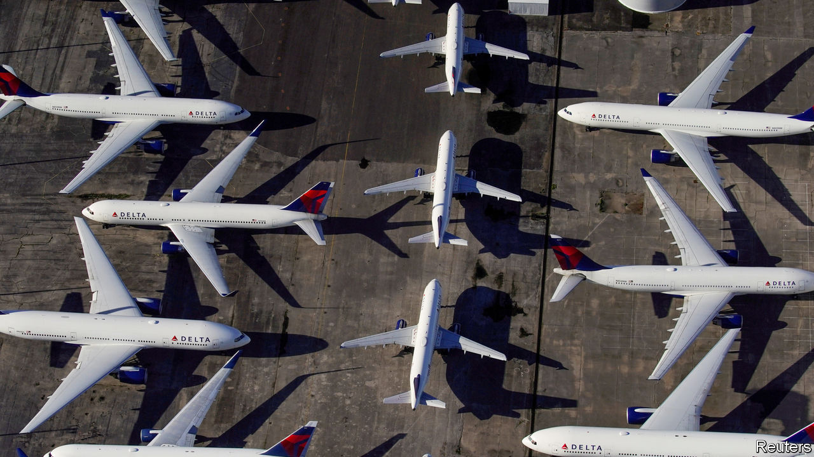
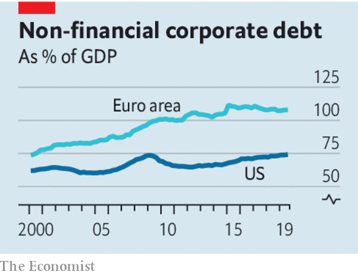

###### Bottomless Pit, inc

# Bail-outs are inevitable—and toxic 

##### How to design corporate bail-outs to protect taxpayers 

 

> Apr 4th 2020 

Editor’s note: The Economist is making some of its most important coverage of the covid-19 pandemic freely available to readers of The Economist Today, our daily newsletter. To receive it, register . For more coverage, see our coronavirus 

IN THE PAST month the biggest business handout in history has begun. The goal of helping firms survive temporary lockdowns is sensible, but it is hard not to feel uneasy (see ). At least $8trn of state loans and goodies have been promised to private firms in America and Europe, roughly equivalent to all their profits over the past two years. Over half a million European firms have applied for payroll subsidies. Some of these handouts will involve grubby choices: Boeing, embroiled in the 737 MAX crashes, might get billions of taxpayer dollars. Broad rescue schemes could also leave a legacy of indebted, ossified firms that impede the eventual recovery. Speed is essential, but governments also need a clearer framework to organise the jumble of schemes, protect taxpayers and preserve the economy’s dynamism.

That $8trn is a big number, and includes state and central-bank loans, guarantees and temporary subsidies to keep paying inactive workers. The total running costs of all American and euro-zone non-financial firms (excluding payments to each other) are $13.5trn a year, of which $11.6trn is wages. But there is still no guarantee that this mountain of money can prevent chaos. Firms also need to refinance $4trn of bonds in the next 24 months, and debt markets are still wary about racier borrowers. Carnival, a cruise line, has issued bonds at a crushing 11.5% interest rate. The plethora of support schemes—there are at least ten in America, with different eligibility rules—will baffle some firms and exclude others. A quarter of listed Western firms are heavily indebted, and if those facing slumping demand gorge on state loans they may wreck their balance-sheets. For a few giants the potential losses are so big that they alone could impose a significant burden on the state. Volkswagen says it is burning through $2.2bn of cash every week.


Ideally private investors would swoop in—Warren Buffett is sitting on $125bn of spare funds and Blackstone’s funds have $151bn. But the duration of lockdowns is unclear, so they may be reluctant. As a result, alongside widely available cheap state loans, bespoke state bail-outs are starting. America’s latest stimulus package earmarks at least $50bn for the airlines and other firms vital for “national security” (Boeing and chums). Germany has loaned $2bn to TUI, a travel firm, and Singapore’s sovereign fund, Temasek, has bought more shares in Singapore Airlines.

Such bespoke deals are easy to sign but often go sour. Uncle Sam lost over $10bn on the General Motors rescue of 2009 and the Wall Street bank bail-outs left an especially bitter taste. Negotiations can be hijacked by politicians who want pork or sway over firms’ strategies. If bailed-out firms end up indebted and burdened by long-term job guarantees, the economy can become ossified, sapping productivity. And it is unfair to ask well-run firms to compete with state-backed rivals.

 


What to do? Governments need to offer support for business in an integrated way. There should be blanket offers to all firms of cheap loans and help in paying the wages of inactive staff for three to six months with few strings attached. This is what the $8trn of loans and guarantees mostly try to do, but there are gaps and doubts about how small firms will get cash. One answer is making sure banks have the resources to lend—even if this means suspending their dividends, as Britain did this week. The goal should be to freeze most of the economy temporarily, until the lockdowns ease.

In time, though, more ruthlessness will be necessary. The cost of extending unlimited credit to all firms is unsustainable and the economy must eventually adjust to new circumstances: for example, e-commerce firms need more workers whereas cinemas may never fully recover (see ). Assistance beyond six months should be limited to firms that provide essential services—such as telecoms, utilities or payments—or are at the centre of critical industrial supply chains. These firms may be eligible for long-term loans but they must come at a price, in the form of equity stakes for the taxpayer. A rough yardstick is that for every $100 of long-term loans, taxpayers should get $10 of equity. If these firms are already heavily indebted there is no point in crippling them further. Instead, creditors must take a big haircut.

Lastly, governments should not interfere in other ways. There will be populist calls to force airlines to give more legroom, car firms to build electric charging-points and manufacturers to build factories in rustbelts. But bail-outs of individual firms are a bad mechanism for dealing with these issues. The one rule that governments should impose is to ban firms getting bespoke deals from paying cash to shareholders through dividends and buy-backs until state loans are repaid.

This year will see state intervention in business on an unprecedented scale. With luck it will not be remembered as the year in which dynamism and free markets died. ■

Dig deeper:For our latest coverage of the covid-19 pandemic, register for The Economist Today, our daily , or visit our 

