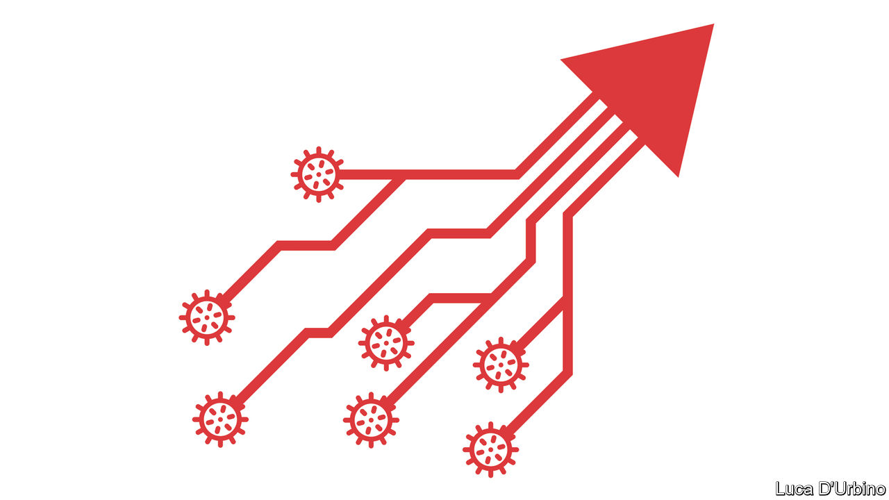

###### Winners from the pandemic

# Big tech’s covid-19 opportunity 

##### Tech giants are thriving in the corona crisis. They should seize the moment to detoxify their relationship with society 

 

> Apr 4th 2020 

Editor’s note: The Economist is making some of its most important coverage of the covid-19 pandemic freely available to readers of The Economist Today, our daily newsletter. To receive it, register . For more coverage, see our coronavirus 

THE PANDEMIC will have many losers, but it already has one clear winner: big tech. The large digital platforms, including Alphabet and Facebook, will come out of the crisis even stronger. They should use this good fortune to reset their sometimes testy relations with their users. Otherwise big government, the other beneficiary of the covid calamity, is likely to do it for them.

Demand for online services has exploded and the infrastructure behind the internet has proved to be admirably reliable (see ). Newcomers such as Slack and Zoom, which help businesses operate remotely, have become household names. And although some tech supply chains are creaking and online advertising spending has dipped, overall the big five firms are seeing surging demand.


Facebook has said that messaging activity has increased by 50% in those countries hit hard by the virus. Amazon is planning to hire 100,000 new staff to keep up with higher e-commerce orders. The big tech firms are also a bastion of financial stability: together Alphabet, Amazon, Apple, Facebook and Microsoft have $570bn of gross cash on their balance-sheets. Shares in these firms have outperformed the market since late January.

Just as the big firms are standing even taller, many of the tech industry’s younger, smaller firms are being crushed in the worst slump since the dotcom crash 20 years ago (see ). Even before the coronavirus hit, trouble was brewing in the land of unicorns, as tech startups worth more than $1bn are called. Among many firms catering to consumers, the strategy of growing at all costs, known as “blitzscaling”, had turned out to be flawed. Some firms, particularly those stuffed with capital by SoftBank’s $100bn Vision Fund, had already started laying off people. All this will make it easier for the big firms to hire the best talent. Collapsing firms could be snapped up by the tech giants.

If that happens, the odds are that regulators will do little or nothing to stop a round of consolidation. In America antitrust investigations against Alphabet, Google’s parent, and Facebook have essentially been put on hold, as officials deal with other priorities and refrain from destabilising firms during a crisis. A new federal privacy law seems further away than ever. Even tech sceptics in the European Union want to rethink their approach to regulating artificial intelligence (AI). In an abrupt twist, “surveillance capitalism”, as critics call big tech’s business practices, is no longer seen as exploitative, but essential to tackle the virus. And no one is complaining about Facebook and Google zealously taking down misinformation about covid-19, and increasingly relying on AI to do so. Yet, before the pandemic, such activity would have triggered howls of outrage over censorship and bias.

In fact, more than ever it is clear that big tech firms act as vital utilities. Therein lies the trap, because almost everywhere other utilities, such as water or electricity, are heavily regulated and have their prices and profits capped. Once this crisis passes, startled citizens and newly emboldened governments could make a push for the state to have similar control over big tech.

The companies seem to sense this danger. Their best defence is to propose a new deal to the citizens of the world. That means clear and verifiable rules on how they publish and moderate content, helping users own, control and profit from their own data; as well as fair treatment of competitors that use their platforms. This approach may even be more profitable in the long run. Today the most valuable firm in America is Microsoft, which has been revived by building a reputation for being trustworthy. It is an example that the other big tech platforms—or digital utilities, as they are about to become known—should follow. ■

Dig deeper:For our latest coverage of the covid-19 pandemic, register for The Economist Today, our daily , or visit our 

