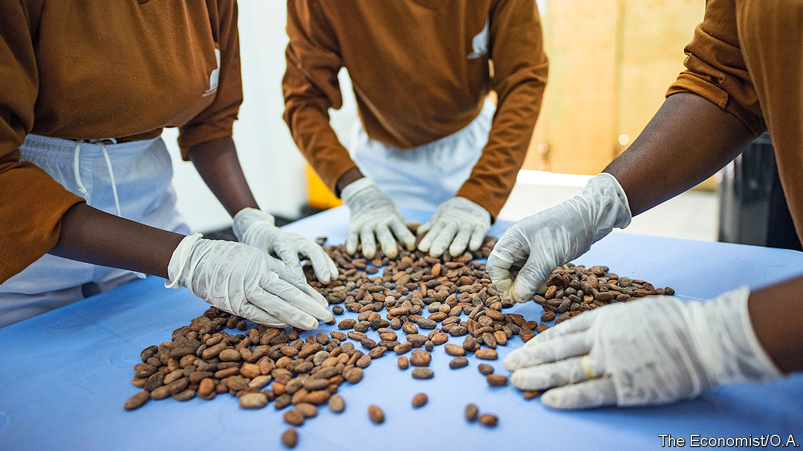

###### Sweet dreams are Congolese

# A chocolate factory in a conflict zone 

##### Dominique Persoone, a bad boy chocolatier, hopes to save gorillas 

 

> Apr 4th 2020 

DOMINIQUE PERSOONE, the bad boy of Belgian chocolate, has served powdered chocolate that has been snorted like cocaine at a party for the Rolling Stones and had the sticky stuff drizzled on naked women for a photo shoot. His latest escapade is making chocolate in the jungles of eastern Congo.

The scheme is less madcap than it may sound. The factory is just outside the Virunga National Park, a vast reserve that is home to endangered mountain gorillas and other wildlife. The park is threatened by hundreds of militiamen who poach its animals, and by farmers who sneak in to plant crops. One way of protecting it is to create jobs by making posh chocolate from local cocoa.


The new factory sandwiched between dense rainforests and the Rwenzori mountains will churn out up to 5,000 bars a week. Many will be sold in Mr Persoone’s shops in Antwerp and Bruges.

The factory runs on hydroelectric power generated in the park, as do nearby soap and chia-seed factories. Emmanuel de Merode, the park director, hopes reliable power will attract more investment. “People have perceptions of eastern Congo as a disaster area,” he says. “We can create excellent chocolate and show them it is not.” But the region still faces huge problems. Just after seeing off an outbreak of Ebola, cases of covid-19 are cropping up. Mountain gorillas are susceptible to it, so Virunga has closed its gates to tourists.

At the chocolate factory, Jacqueline Zawadi gossips with two fellow workers as they shell cocoa beans. Her husband was one of the more than 200 rangers who have been killed by poachers or militiamen since 1996. The park has employed her since his death. Three other factory workers peer into a whirring machine. Dark chocolate swirls around as it mixes with sugar and butter. Fresh chilli and ginger are sprinkled into some batches to give the chocolate an extra kick. “It is not quite perfect,” admits Roger Marora, a worker. “But it is very nearly perfect.”

Mr Persoone, who has received test bars in the post, does not yet agree. He will give the signal to export only when the chocolate meets his standards. “I am putting my name on the bars,” he says. “They have to be good.”

