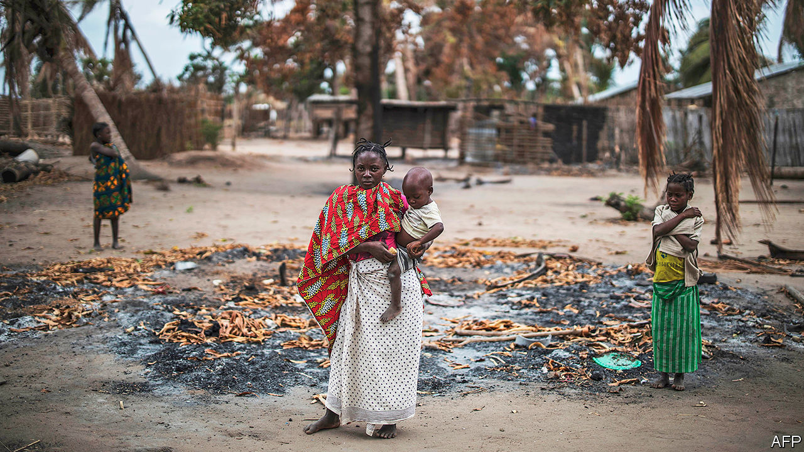
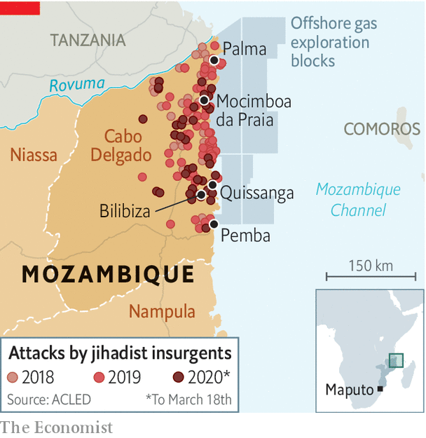

###### Jihad on Africa’s eastern shore

# Mozambique’s mysterious conflict is intensifying 

##### The killing jeopardises Africa’s largest gas project 

 

> Apr 4th 2020 

MICHAEL SMELLED trouble before he saw it. In January the 28-year-old from Bilibiza, in the northern Mozambican province of Cabo Delgado, caught a whiff of smoke. A village had been torched nearby. Within hours houses and schools in Bilibiza were burning as 10,000 residents fled.

It was the second time in two years that Michael (not his real name) had run for his life. In 2018 his village was attacked. At least five people were killed. A friend was decapitated. Today Michael, his wife and three young children live in Pemba, the provincial capital. They sleep outside, chicks and pigeons pecking at their feet.


Violence has engulfed Cabo Delgado since 2017. On one side is a poorly understood Islamist insurgency. On the other are the government’s heavy-handed security forces. Aid agencies estimate that more than 1,000 people have died and at least 100,000 have had to leave their homes. On March 23rd the rebels made their boldest move yet, taking the town of Mocimboa da Praia, before retreating. Two days later they took Quissanga, 100km north of Pemba.

Until recently southern Africa had been relatively free from the jihadist attacks that have wrought havoc in the Horn of Africa, Nigeria and the Sahel. No longer. South Africa, in particular, is worried. The uprising also threatens what could be Africa’s largest-ever energy project: the development of gasfields in the Rovuma basin. Before this year analysts forecast that energy firms would spend more $100bn by 2030 to turn Mozambique into “Africa’s Qatar”.

Cabo Delgado has long been the most neglected part of Mozambique. It suffered horribly in the war of independence (1964-74) and the subsequent civil war (1977-92). It has the country’s highest rates of illiteracy, inequality and child malnutrition. It is one of just a few provinces with a Muslim majority, which had long drawn on a moderate Sufi tradition.

That tradition began to be challenged in the 2000s. Muhammad Cheba of the mainstream Islamic Council of Mozambique recalls how some young believers began insisting on wearing shoes in mosques, ostensibly because the Prophet did so. Then around 2008 a sect known as Ahlu Sunnah Wa-Jamo (“adherents of the prophetic tradition”) was set up. In a report last year, IESE, a Mozambican research outfit, noted that the group was heavily influenced by Islamists from east Africa. Mocimboa da Praia lies on a long-standing migration route, near the porous border with Tanzania. Close links were made between the group and cells in Kenya, Somalia, the Great Lakes and Tanzania.

The fundamentalists argued that mainstream Muslim leaders were in cahoots with a corrupt elite made up of criminal bosses and the ruling party, FRELIMO. The result: a closed shop that locks out the province’s Swahili- or Mwani-speaking Muslims from opportunities in both the legal and illegal industries that flourish in Cabo Delgado. Smuggling ivory, rubies, timber and heroin is rampant. These trades reportedly involve close links between organised crime and politicians.

The arrival of international companies is viewed with suspicion, too. Luiz Fernando Lisboa, the bishop of Pemba, questions whether investments by large companies have benefited ordinary people. Farmers and fishermen have been uprooted to make way for mining and energy infrastructure.

There is a deep mistrust of local elites in Cabo Delgado, adds Joseph Hanlon of the London School of Economics. It is believed, for instance, that they cause cholera outbreaks and get lions to eat people.

In its trajectory from sect to insurgency, the region’s guerrilla group resembles Boko Haram, argues Eric Morier-Genoud of Queen’s University Belfast. From around 2013 it began calling itself al-Shabab (“youth”), like the Somali outfit (with which it has no known direct links). Two years later it began military training. In 2017 it attacked for the first time, in Mocimboa da Praia. Today there are believed to be many units in the province, with members from northern Mozambique, Tanzania and Congo, among other places.

 


More attacks were carried out in the first quarter of 2020 than in any three-month period since the war began (see map). Raids are occurring farther south. Attacks were once carried out with machetes; now fighters have automatic weapons.

Unlike the publicity-hungry jihadists of Boko Haram, the insurgents of Cabo Delgado have recorded just two videos containing bog-standard demands—the imposition of sharia and the closing of secular schools. “We are not fighting for wealth, we only want Islamic law,” said one fighter.

That is probably not entirely true. Though the insurgents are not holding towns, they appear to retain control over the illegal trade routes that go through them. Some of their funding may come from businessmen involved in smuggling. Young, poor recruits are given money to join. If they do not fight, they risk having their heads chopped off.

The attack of March 23rd also suggested that the group is drawing closer to Islamic State (IS). In July 2019 IS claimed the insurgents as part of its central African franchise. Those who took Mocimboa da Praia carried the black flag of IS. The nature of the most recent attacks—taking but not holding towns—fits with the IS playbook, says Jasmine Opperman, a security analyst.

It is less clear whether attacks are being directed by IS. The video of March 23rd appeared to be aimed at recruiting Mozambicans, points out Mr Morier-Genoud. He adds that while the IS link is strengthening, the insurgency remains locally oriented.

The authorities’ response has been counter-productive. Police have arrested hundreds of “suspects”, holding some without trial. Conscripts dispatched to the north do not speak local languages, lack equipment and have rock-bottom morale.

To bolster his forces President Filipe Nyusi last year enlisted the Wagner Group, Russian mercenaries linked to the Kremlin. Yet they have found it hard going, reportedly losing at least 11 men last year. The role of the Wagner Group, like much else in this conflict, remains murky. Local journalists have been jailed for reporting on the violence. “They don’t want this conflict to be known by the world,” says one.

The energy companies developing the Rovuma basin, such as Total and ExxonMobil, have tried to isolate themselves from the chaos. Security companies are paid more than $1m per month to keep workers safe. These guards get armed escorts from some of the government’s better troops. An airstrip has been built in Palma, the town serving offshore installations.

Since the end of the civil war FRELIMO has shown no sign of caring about the people of Cabo Delgado. But it does care about spoils. And the risk of losing billions of dollars in gas revenues may be reason to rethink its strategy. While it dithers, though, the rebels may be gaining support. A video of the attack of March 23rd seems to show local residents applauding the insurgents. When a government is losing the battle for hearts and minds to murderous jihadists, it really is in trouble. ■

