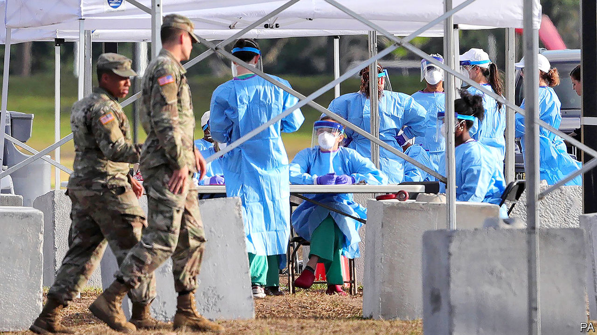

###### 

# Politics this week 

#####  

 

> Apr 4th 2020 

Scientists advising the American government about the covid-19 outbreak predicted that between 100,000 and 240,000 Americans could die, even with partial lockdowns and social-distancing measures in place. Donald Trump warned his compatriots “to be prepared for the hard days that lie ahead”. The United States now has more reported infections than any other country. New York city has recorded more deaths from the coronavirus than all but half a dozen countries. Lagging behind other states, Florida at last ordered people to stay at home. See .

Fortress China

With most of its newly confirmed cases of covid-19 now being found among travellers from abroad, China closed its borders to most foreigners. On a visit to Zhejiang province, President Xi Jinping said curbing imported cases, which mostly involve returning Chinese citizens, had become the “most important” task in the country’s fight against the virus and could remain so “for a long period”. State media coverage of the trip showed Mr Xi without a mask; he had always worn one on previous outings during the crisis.


Fights broke out on the border between Hubei and Jiangxi provinces after Hubei allowed people to move freely across it for the first time in two months. In many parts of China Hubei residents are treated as potential carriers of the virus.

India’s prime minister, Narendra Modi, apologised for the suffering he caused by locking down the country with so little preparation. Millions of migrant workers struggled to get home to their villages. Many crowded into transport hubs, making social distancing impossible. Videos emerged of police beating people who broke the quarantine laws. See .

Japan reaffirmed its 2015 goal to reduce greenhouse-gas emissions by 26% by 2030 based on levels from 2013, disappointing environmentalists who want it to cut deeper and faster. Japan is the only G7 country still building coal-fired power stations.

Meanwhile, this November’s UN climate-change summit, COP26, was postponed until next year. The talks, which are expected to speed up action on reducing emissions, will still take place in Glasgow.

A narco state

America charged Venezuela’s dictator, Nicolás Maduro, and 14 other members of his regime with drug-trafficking, money-laundering and “narco-terrorism”. The State Department offered a reward of $15m for information leading to Mr Maduro’s arrest. The indictments allege that he co-founded the “cartel of the suns”, which sought to flood America with cocaine. The State Department later said America would lift sanctions on Venezuela if it agreed to its framework for restoring democracy. See .

The ELN, a guerrilla group in Colombia, declared a one-month ceasefire starting on April 1st. It called the decision a “humanitarian gesture” in response to the covid-19 pandemic. The ELN killed more than 20 cadets at a police academy in Bogotá in January 2019.

Nothing will stop them

Fighting in Yemen continued despite calls for a truce to fight covid-19 instead. Saudi Arabia, which supports the Yemeni government, said it intercepted missiles launched by Houthi rebels towards Saudi territory. The Saudi-led coalition then bombed targets in Sana’a, the Yemeni capital. Yemen has not yet recorded any cases of covid-19.

Israel’s prime minister, Binyamin Netanyahu, self-isolated after an aide tested positive for covid-19. Mr Netanyahu himself tested negative (though the health minister came down with the disease). He is in talks with Benny Gantz, the leader of the opposition, over forming a unity government. See .

Ethiopia postponed parliamentary elections scheduled for the end of August because of covid-19. The poll will be the first test of the popularity of Abiy Ahmed, a reformist prime minister, who assumed the role in 2018 after the resignation of his predecessor.

Opposition parties in Guinea rejected the result of a constitutional referendum that could allow President Alpha Condé to run for a third term of five years, saying it was marred by violence. Electoral officials said 91% of votes cast were in favour of the new constitution.

Grasping an opportunity

Hungary, which has been dismantling checks and balances on the executive for a decade, passed a covid-19 emergency law that gives Viktor Orban the power to rule by decree as prime minister. The opposition says the country has become a dictatorship. But the EU did not criticise Hungary by name, and the European People’s Party, the EU-level group that includes Mr Orban’s Fidesz party, made no move to expel it. See .

European leaders were at loggerheads over the issuance of so-called coronabonds, government bonds jointly guaranteed by all countries of the euro zone. Rich northern countries have refused to countenance these, but a group of nine mainly southern countries are warning of economic calamity and threats to the single currency if they are not created.

Coronavirus briefs


Boris Johnson contracted covid-19, the first political leader of a country to do so. The British prime minister is self-isolating at Number 10.

Austria made it compulsory to wear face masks in supermarkets. The Czech Republic and Slovakia have put similar measures in place.

The captain of an American aircraft-carrier docked in Guam asked the navy for help following an outbreak of covid-19 on board. Around 100 sailors on the USS Theodore Roosevelt have tested positive for the new coronavirus.

The world’s biggest condom-maker, which is based in Malaysia, warned of a global shortage because it has had to shut factories. Forecasters have already predicted a baby boom because of couples staying at home.

The Wimbledon tennis tournament was cancelled.

