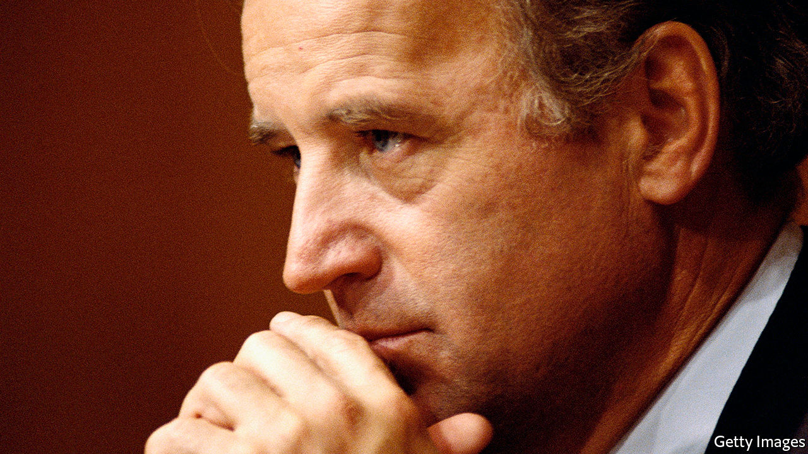

###### Reade’s digest

# How to weigh an allegation of assault against Joe Biden 

##### Democrats who thought Brett Kavanaugh should not be on the Supreme Court are ignoring Mr Biden’s accuser 

 

> Apr 4th 2020 

IN MARCH 2019, about a month before Joe Biden began his presidential campaign, a former state representative from Nevada, Lucy Flores, accused him of unwanted kissing, touching and hair-sniffing. Several other women—including Tara Reade, who worked for then-Senator Biden for nine months in 1992 and 1993—subsequently made similar complaints, prompting Mr Biden to release an apologetic video in which he acknowledged that “the boundaries of protecting personal space have been reset and I get it.” Recently, however, Ms Reade has levelled a more serious charge.

In an interview broadcast on March 25th she said that Mr Biden touched her in ways that made her feel “like an inanimate object”. She said that one day a scheduler in Mr Biden’s office told her to bring the senator his gym bag. When she did, he allegedly held her against a wall and put his hands up her skirt. When she pulled away, she says Mr Biden said, “Come on, man, I heard you liked me.” Ms Reade says that she was later moved to a windowless office and frozen out.


Mr Biden’s campaign denies the accusation. Marianne Baker, his executive assistant at the time, says she had “absolutely no knowledge or memory of Ms Reade’s accounting of events, which would have left a searing impression on me.” Sceptics have pointed out inconsistencies in Ms Reade’s testimony (which are not uncommon in stories of sexual assault), her history of floridly praising Russia and Vladimir Putin, and her support for Bernie Sanders.

Ms Reade sought help from the TIME’S UP Legal Defense Fund, which helps victims of sexual harassment. She could not find a lawyer to take her case, and the outfit does not offer public-relations help to accusers without lawyers. Some cite that, and the fact that the PR firm affiliated with the fund is run by a Biden adviser, as evidence of a stitch-up.

The fund replies that the PR firm in question did not know about Ms Reade until journalists started calling. The fund worried about getting involved in a case against Mr Biden because tax-exempt non-profits are barred from political campaigns. And Ms Reade was interested less in going after Mr Biden than in those accusing her of being a Russian agent, which is outside the fund’s purview.

The most striking thing about Ms Reade’s story may be the silence with which it has been greeted—particularly from some of those who argued that a sexual-assault allegation should disqualify Brett Kavanaugh from the Supreme Court. That may stem partly from the difficulty of vetting her story. There were no witnesses, though Ms Reade says she told her brother and a friend. But Mr Biden may have to answer questions eventually. Donald Trump’s supporters may wave away dozens of allegations of sexual misconduct and assault. Mr Biden probably does not have that luxury.

Dig deeper:


