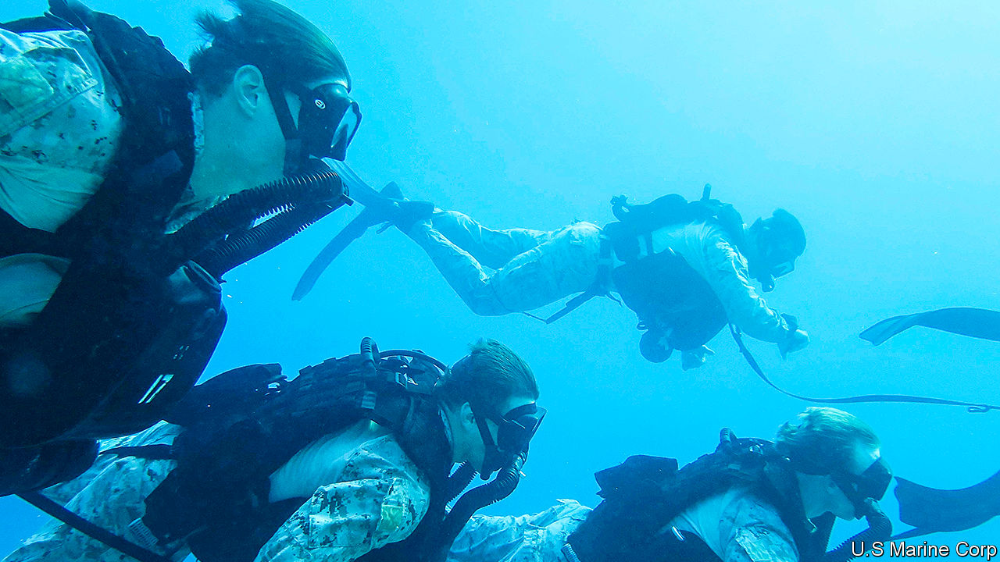

###### Send the marines

# The US Marine Corps sheds its tanks and returns to its naval roots 

##### After decades as dirt sailors, the marines are getting back to salt water 

 

> Apr 2nd 2020 

THE OFFICIAL hymn of the United States Marine Corps, a jaunty tune written by Jacques Offenbach in 1867, proudly declares that “From the Halls of Montezuma/ To the shores of Tripoli/ We fight our country’s battles/ In the air, on land, and sea”. But despite their naval origins and ethos, America’s marines have spent most of the past two decades waging war in the deserts, mountains and cities of Iraq and Afghanistan. On March 26th General David Berger, the corps’s commandant, proposed a radical transformation of the force into America’s first line of defence in the Pacific.

The Marine Corps emerged out of the Continental Marines, the naval infantry force raised in 1775 by the American colonies during the revolutionary war against Britain. As soldiers who were deployed at sea, they served as raiding parties and an insurance policy against mutiny by press-ganged sailors. Over the next century they acquired a legendary reputation for far-flung campaigns.


The marines’ publicity bureau, established before the first world war, carefully cultivated an image of an elite force with a macho, Spartan streak. That reputation was bolstered by their starring role in the brutal island-hopping battles against Japan during the second world war.

The image of seafaring, beach-storming warriors blurred after the terrorist attacks of September 11th 2001, when the marines turned from a naval strike force into a duplicate army tasked with weeding out insurgents in grinding land campaigns. The result, says Mark Folse of the US Naval Academy, who served as an enlisted marine in Iraq and Afghanistan, is “an entire generation of marines who have little to no experience of the navy.”

Then the wheels of American strategy turned again. In 2018 the Pentagon published a new national defence strategy which declared that “great power competition” with Russia and China would be the priority. A series of war games showed that China’s precision missiles would make it much harder for America to fight its way into the western Pacific, says General Berger. On becoming commandant in July, he published guidance calling for radical change. “Visions of a massed naval armada nine nautical miles offshore in the South China Sea preparing to launch the landing force...are impractical and unreasonable,” he warned. Junior marine officers, writing in War on the Rocks, a website, pressed their superiors for change.

The ten-year “force design” released last week offers it. It is at once a return to the corps’s naval roots, and a drastic revamp. It aims to cut the corps down to 170,000 personnel while slashing artillery and aircraft, with the number of F-35 jets falling by over a third. Most drastically, marines will get rid of all their tanks. In their place comes a commando-like infantry force with nimbler weapons: drone squadrons will double in number and rocket batteries will triple.

The idea is that in a war with China, America’s hulking aircraft carriers might be pushed far out to sea by the threat of missiles. But groups of 50 to 150 marines, wielding armed drones, rockets and anti-ship missiles, could get up close, fanning out on islands along and inside the chain from Japan to the Philippines. Like a high-tech echo of the insurgents they once fought, they would jump from one makeshift base to another every couple of days to avoid being spotted and targeted, says General Berger. They could identify targets for more distant ships and warplanes, or pepper the Chinese fleet with fire themselves—dispersed, island-hopping warfare to stop any attack in its tracks.

Some worry that this would be a dramatic change for a service that has proudly served as a jack-of-all-trades for presidents in a pinch. Seven hundred marines have been stationed in Norway since 2018 and in January thousands were hurriedly sent to the Middle East amid tensions with Iran.

“The marines used to lean towards versatility as a virtue, covering many middle threats,” says Frank Hoffman of the National Defence University. “This force design is optimised for deterrence in one location. It’s not a force for Donbas, Lebanon or Syria.” General Berger insists that is not so: “We know we never choose the crisis.” Missile-toting commandos dotted around rugged outposts would be “very applicable anywhere”, he argues, from the Arctic to the Strait of Hormuz.

Buy-in from the navy is especially important. The plan depends on tight integration with the marines’ sister service, not least because the corps does not own its own warships. The number of American ships—the navy is set on 355—is less important, notes Chris Brose of Anduril Industries, a former staff director for the Senate Armed Services Committee. Whether a weapon is fired from a marine squad or navy destroyer thousands of miles away is irrelevant, he says, as long as they are integrated and add up to a greater capability.

Congress will also take some persuading. “It won’t be Democrats versus Republicans,” says Mike Gallagher, a Republican congressman and former marine officer who serves on the House Armed Services Committee. “I think it will be entirely generational. The younger members, particularly those who have served, are embracing these changes, and are more than willing to divest ourselves of legacy capabilities, even at the cost to our own districts. The older members…will be loth to embrace change, particularly when it affects things that are produced in their districts.” ■

