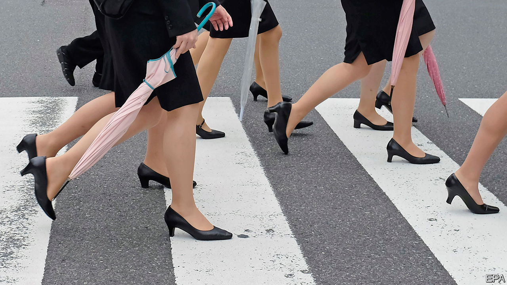

###### Heels at high water

# Japanese women rebel against painful dress codes 

##### Some employers care more about how they look than how they feel 

 

> Apr 11th 2020 

ISHIKAWA YUMI worked eight-hour shifts as an usher in a funeral parlour, always in heels. Her employer insisted. Her toes bled. “Why do we have to hurt our feet at work, when men can wear flat shoes?” she complained on Twitter. The tweet exploded.

Encouraged, she gathered 18,800 signatures on a petition calling for a ban on employers requiring women to wear high heels, which she submitted to the government last June. Ms Ishikawa became the face of the #KuToo campaign—a pun on Japanese words for shoes (kutsu) and pain (kutsuu), with a nod to the #MeToo movement.


More than 60% of Japanese women with jobs have been forced to squeeze their feet into heels at work or have witnessed colleagues having to, according to a survey. Female staff at Takashimaya, a department store, must parade around the shop in 5cm heels. The former defence minister, Inada Tomomi, felt obliged to totter about in heels even on the deck of a visiting American aircraft carrier.

Dress codes at many Japanese firms are rigid. Some ban glasses for women (but not men), on the grounds that they are unflattering. This is especially unreasonable for those who find contact lenses uncomfortable. “Women have always been told to follow the dress code, even if it causes pain,” says Ms Ishikawa. Japanese bosses, who tend to be older men, often expect their female underlings to gaman (endure it).

The government has dug in its heels. A former labour minister, who received Ms Ishikawa’s petition last year, insists that wearing high heels at work is “necessary and appropriate”. The petition itself has received no official response to date. Japan ranks the second lowest out of the 29 rich countries in The Economist’s glass-ceiling index, which measures equality for women in the workplace.

But corporate Japan is slowly responding to #KuToo. In late March Japan Airlines announced that its female flight attendants can kick off their heels and swap skirts for trousers if they choose. All three big mobile-phone operators have relaxed their rules on heels. Ms Ishikawa is collaborating with a shoe company to produce chic heel-less shoes. “Society is changing,” says Ms Ishikawa. “We can’t be ignored.” Pointless rules about footwear may soon be given the boot.

