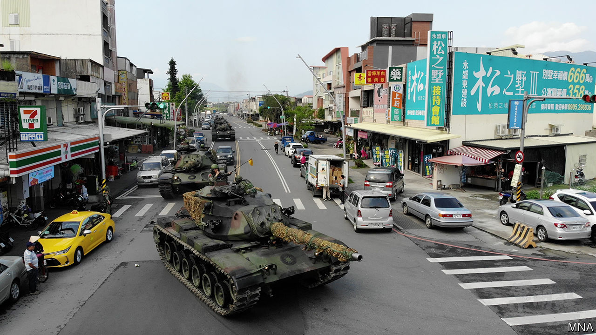

###### Strait and harrow

# With the world distracted, China intimidates Taiwan 

##### Chinese warships and fighter jets are testing Taiwan’s defences 

 

> Apr 11th 2020 

THE TANKS queued patiently with the cars, delivery trucks and bright yellow taxis before rolling serenely through the traffic lights. The drill, in Yuanshan, a town south-east of Taipei, was intended as practice at repelling a Chinese invasion. Some of the tanks, covered in webbing, hid in a copse, about as inconspicuously as is possible for a 50-tonne vehicle. The unit had good reason to be rehearsing. In recent months China has been rattling more sabres than usual at Taiwan, which it considers part of its territory. With covid-19 subsiding in China but consuming America, some in Taiwan feel vulnerable.

China sends around 2,000 bomber patrols a year into the Taiwan Strait, which separates the two countries, according to Taiwan’s defence minister. These are taking increasingly menacing routes. In 2016, when Tsai Ing-wen, an opponent of reunification with China, was first elected Taiwan’s president, China began sending bombers to circumnavigate the island as a show of force. Last year it deliberately sent fighters across the mid-point of the strait for the first time in two decades. In December China’s first domestically built aircraft carrier, the Shandong, was sent through the strait two weeks before Taiwan’s presidential election, in which Ms Tsai won a second four-year term.


China has not let the coronavirus get in the way of this muscle-flexing. “Our air operation command centre has had alarms on a daily basis since February,” says Alexander Huang of Tamkang University. That month, even as the epidemic raged in Hubei province, Chinese jets probed Taiwanese airspace several times, prompting Taiwan to scramble its own planes.

On March 16th China conducted its first night-time exercise near Taiwan, sending a clutch of fighter jets and surveillance aircraft, which can peer farther than ground-based radar, well past the mid-point of the strait. The same day Taiwan’s coastguard said that Chinese speedboats—probably part of the maritime militia, a paramilitary force that sometimes uses fishing vessels—had rammed one of its cutters near the Kinmen islands, a part of Taiwan barely 5km from the mainland.

“At the height of outbreak of the pandemic worldwide, if the Chinese Communists attempted to make any military adventure leading to regional conflict, they would be condemned by the world,” warned Taiwan’s deputy defence minister on March 30th. “We are all ready and have made the best preparation.”

It helps that America has been underlining its support for Taiwan. On February 12th America sent two B-52 bombers up Taiwan’s east coast, two days after Chinese jets had crossed the median line. An American warship has also sailed through the Taiwan Strait in each of the past three months—an expression, the navy says, of America’s “commitment to a free and open Indo-Pacific”. Last year America agreed to sell Taiwan a whopping $8bn-worth of weapons, including 66 F-16 fighter jets.

But the  uss Theodore Roosevelt, an American aircraft-carrier that was exercising near China weeks ago, is stuck in Guam thanks to a coronavirus outbreak among its crew (see ). In March the Chinese army held two weeks of exercises with Cambodia, even as America and its allies were cancelling drills. The effects of the virus aside, the military balance is shifting. “Based on current trends, and barring …technological breakthrough, America will probably have lost the ability to defend Taiwan within the decade,” says Brendan Taylor of the Australian National University. “Policymakers should be worried about the growing risk of strategic crisis during this window.” ■

