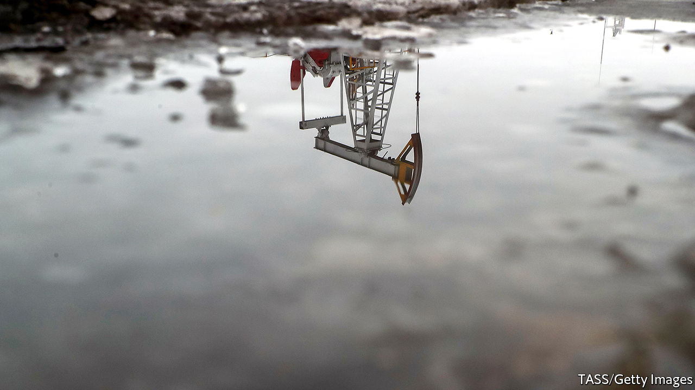
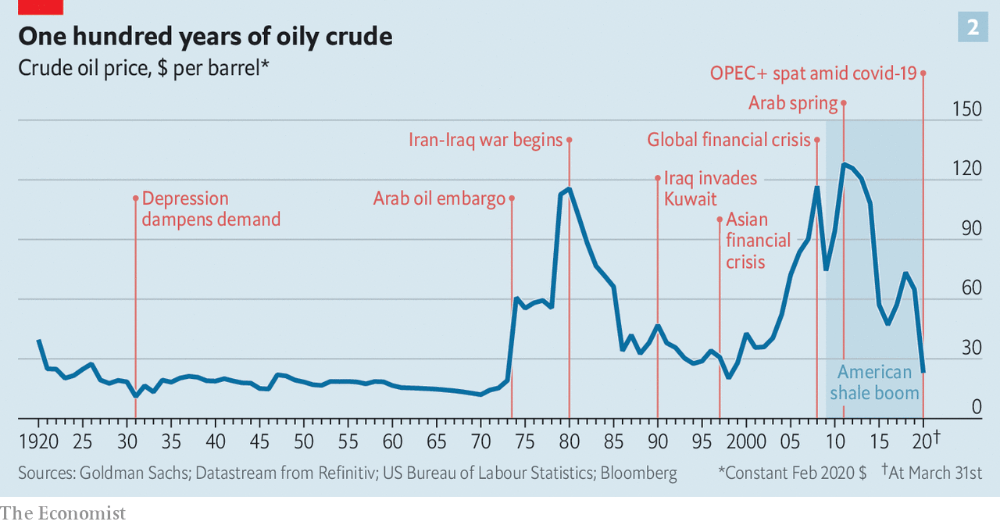
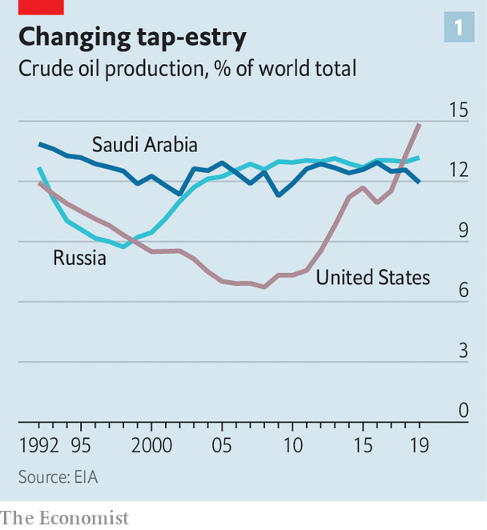

###### The collapse

# An unprecedented plunge in oil demand will turn the industry upside down 

##### Many producers will not survive the pandemic’s aftershock 

 

> Apr 8th 2020 

Editor’s note: The Economist is making some of its most important coverage of the covid-19 pandemic freely available to readers of The Economist Today, our daily newsletter. To receive it, register . For our coronavirus tracker and more coverage, see our 

EACH DAY about 100m barrels of oil rise from reservoirs deep below Earth’s surface. A ship called Liza Destiny sits off the coast of Guyana, collecting the black stuff from wells on the seabed nearly 2km below. On Norway’s continental shelf the Johan Sverdrup project is ramping up faster than expected. In Texas some 174,000 wells are at work, from big shale operations to solitary pumpjacks nodding as cattle graze nearby. Last month Saudi Arabia said it would ship a staggering 12.3m barrels a day to customers in April. From the Niger delta to Siberia, oil continues to flow. The rest of the world, meanwhile, is standing still.

In recent years oil producers have faced a spectre of depressed demand that could up-end the industry. All of a sudden the wraith has materialised—not out of concern for the climate, as oilmen feared, but because of covid-19. Crude fuels the movement of people and goods around the world. A lot of this has stopped as governments limit travel and other economic activity to contain the pandemic. Oil demand has dipped in only two years of the past 35. In the first six months of 2020 it may plunge by more than 20%.


If that weren’t enough, a brawl between Saudi Arabia and Russia has led to a price war. The price of Brent crude, the global benchmark, fell by more than half in March, below $23 a barrel. The last time it was this cheap, in 1999, Britney Spears topped the charts and the dotcom bubble had not burst. As for the drop, “nothing like this has ever happened before,” says Daniel Yergin, a historian and vice-chairman of IHS Markit, a consultancy.

…Baby, one more time

Saudi Arabia and Russia were expected to discuss production cuts with other petrostates on April 9th, after The Economist went to press, then again at a G20 meeting the next day. Any deal is unlikely to end oversupply. Covid-19 is already exposing vulnerabilities of petrostates and oil firms. With prices poised to sink lower, the entire industry may be forever transformed.

A few months ago demand was expected to rise modestly this year. But trouble festered. Surging production in Guyana, Norway and Brazil seemed sure to weigh on prices. More worrisome, the world’s energy powers were increasingly at odds. In 2016 Russia teamed up with the Organisation of the Petroleum Exporting Countries (OPEC), led by Saudi Arabia, in an attempt to offset booming American shale production. This OPEC+ alliance proved both fractious and ineffectual. Russia regularly ignored the group’s self-imposed production limits, forcing Saudi Arabia to curb its own output more sharply. That pushed oil prices high enough to shore up investment in American shale but too low to balance the budgets of Saudi Arabia and other petrostates.

 


America, which in 2018 eclipsed Saudi Arabia and Russia as the world’s top oil producer (see chart 1), indeed looks like the main beneficiary of OPEC+. In an effort to snuff out shale Russia shocked OPEC in March by refusing further production cuts. Furious Saudis declared the price war in response.

American frackers and international oil giants had problems of their own. Even as shale production surged, shale firms’ valuations sank, with more investors sceptical of their ability to produce steady profits. Worries over climate change clouded the long-term prospects of supermajors such as ExxonMobil and Royal Dutch Shell while other industries offered better short-term returns. Energy was the worst-performing sector in the S&amp;P 500 index in four of the past six years.

The oil market has witnessed big shocks before (see chart 2). In the late 1990s supply rose while a demand-sapping financial crisis rocked Asia. In 2014 the Saudis opened the taps in an attempt to drown American shale. But never before has anyone seen anything like covid-19. In the coming weeks crude will come perilously close to filling the capacity to store it. Citigroup, a bank, says that global supply needs to fall by 10m barrels a day, 12% of the total, for tanks not to spill over. Prices in parts of the world may fall below $10, says Goldman Sachs, another bank—or turn negative, as producers pay to have their oil taken away rather than shut in wells.

 


With OPEC+ in tatters and America’s shalemen clamouring for help, on April 2nd Donald Trump, who two days earlier welcomed cheap oil as a tax cut for American consumers, tweeted that a production deal between Russia and Saudi Arabia was imminent. This pushed Brent up by 20%, the biggest one-day gain since 1986.

Mr Trump wanted to support American oil companies further by buying their crude and storing it in the government’s strategic reserves. But he is not an autocrat presiding over a petrostate and his idea was rejected by Congress. Another of his suggestions, to levy a tariff on imported oil, might benefit some of America’s 9,000 or so oil and gas producers. But it would harm integrated giants such as ExxonMobil, which use heavier overseas crudes in their American refineries. Large companies also resist national production caps that would prop up smaller, less profitable rivals.

Some petrostates have trouble grasping that Mr Trump cannot call oil bosses and tell them to do this or that, says Mr Yergin. But, he adds, the president does have “an enormous amount of influence”. If the government’s power over oil firms is limited, its control of aid is plainer. A group of American senators from oil-producing states have threatened to withhold military support for Saudi Arabia if it refuses to limit output.

Mr Trump may therefore help broker an agreement, particularly if armed with data showing that American companies are already cutting spending. However, continued animosity between Russia and Saudi Arabia, combined with instability within OPEC’s smaller members, will lead at best to temporary production deals of limited impact. Output cuts agreed now would take time to be felt in the physical market. Even a cut of 15m barrels a day—around ten times what the Saudis sought in March—would be dwarfed by covid-19’s obliteration of demand, of as much as 20m barrels a day in April. “We are not going to fully recover until we are through corona,” says Mike Sommers of the American Petroleum Institute, a powerful lobby group.

Even then, it is unclear that the industry, in its current form, recovers at all. Russia is in a position of relative strength. It can balance its budget with oil at $42 a barrel and has more than $500bn in foreign reserves. Saudi Arabia has low operating costs of just $3.20 a barrel, about one-third of America’s, according to Rystad Energy, a consultancy. That would help it in a drawn-out battle for market share, though the current crisis has hit about a decade too soon for comfort—economic reforms to diversify the Saudi economy away from oil are a work in progress and the country still needs $84 a barrel to finance its budget.

Other producers look more vulnerable. Low oil prices will tighten the vise on Iran and Venezuela, each already squeezed by American sanctions. In Iran deteriorating finances will make it even harder to deal with high rates of coronavirus transmission. Cheap oil will exacerbate strife in Libya and may feed unrest in Iraq, as well as Algeria. A few big projects in Africa require an oil price of $45 or more just to break even, reckons Rystad; many may now be put on hold. Listed oil giants are paring spending in an effort to protect dividends. ConocoPhillips has delayed drilling in Alaska. Chevron has cut its capital budget for this year by 20%.

More damage will come as low prices compel firms and governments not just to cancel new projects but mothball existing wells. That may hurt countries with high production costs, like Brazil and Britain.

The sudden plunge in demand means that shut-ins will depend as much on logistics as on production cost, argues Damien Courvalin of Goldman Sachs. As inland tanks fill, landlocked wells with limited access to storage and transport will suffer. Canadian crude has the double misfortune of being costly and hard to ship—on April 7th a barrel of Western Canadian Select fetched about $10, a third as much as Brent. Some inland American and Russian production may stop, too.

Oops…I did it again

When the world economy begins to open up after the pandemic, it will find the oil industry looking different. In America less productive shale beds may be gone, finally “flushing out production that was never really warranted”, says Ed Morse of Citigroup. The number of shale bankruptcies jumped by 50% last year. In 2020 more inefficient companies will vanish. Some wells, once closed, are too costly to reopen. And with oil at $35 a barrel, the return on renewable projects—which most energy firms have largely ignored—can rival that of a new oilfield, notes Valentina Kretzschmar of Wood Mackenzie, a consultancy.

A sudden loss of production could, if demand picks up quickly, create an opportunity for more drilling. But investors may now be warier of oil companies’ spending plans. Especially if they suspect covid-19 fundamentally alters oil demand: more people may work remotely, a lot of international travel could come to be seen as unnecessary and companies may bring supply chains closer to home to avert disruptions. “Are we about to see a structural change in oil consumption?” wonders Mr Courvalin. “It is a very valid question.” Oilmen used to take comfort that it was an abstract one. No longer. ■

Dig deeper:For our latest coverage of the covid-19 pandemic, register for The Economist Today, our daily , or visit our 

