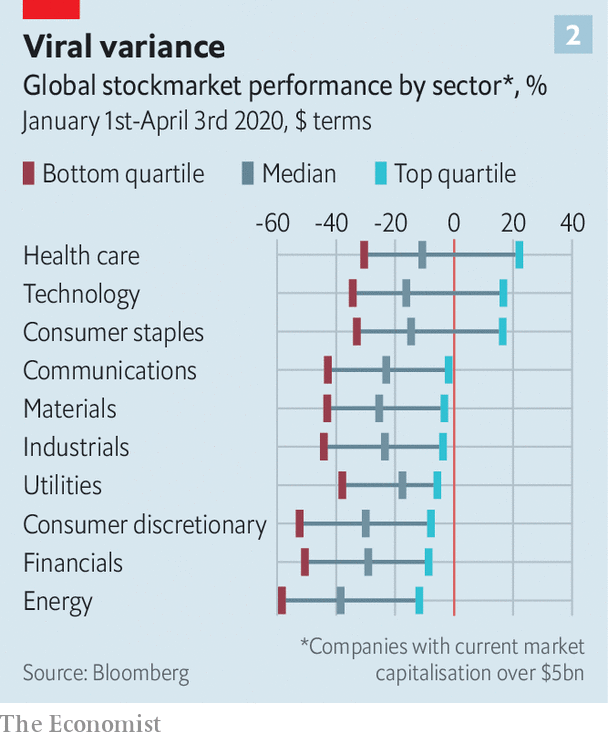

###### Less globalisation, more tech

# The changes covid-19 is forcing on to business 

##### The big ones are oddly familiar 

 

> Apr 11th 2020 

Editor’s note: The Economist is making some of its most important coverage of the covid-19 pandemic freely available to readers of The Economist Today, our daily newsletter. To receive it, register . For our coronavirus tracker and more coverage, see our 

SOMETIMES CHANGE is so vast and dislocating that it is hard to tell disaster from opportunity. In March Ocado, a British online grocer, saw its servers so overloaded that it suspected hackers. “We thought that we were under a denial-of-service attack,” says Tim Steiner, the company’s boss. In fact, Britons were desperately trying to arrange to get food and drink deliveries for the weeks ahead. After Boris Johnson, the prime minister, announced a national lockdown the site filled three weeks’ worth of delivery slots in an hour.

Companies for which the ill wind of covid-19 has blown some good have been very much in the minority. In February, even as stockmarkets began to crash, business leaders could console themselves with three observations. First, they bore no blame for the crisis. Some downturns, such as the dotcom bust of 2000-01 and the financial crisis of 2007-09 are seen through a quasi-biblical lens of retribution—just deserts for orgies of speculation. This was more like a tsunami, or a war; its casualties had some hope of being treated as innocent victims deserving of support, rather than the authors of their own fate.


Second, most companies—particularly in America—went into the crisis in pretty solid shape; employment was booming, order books were relatively full and the easing of America’s trade war with China augured well. Third, within days of global markets melting down China was tentatively reopening some factories and lifting some of its draconian lockdowns. This suggested a V-shaped recovery, or at worst a U-shaped one, something requiring not life-and-death measures but a battened-down Sufi stoicism: “This, too, shall pass.” As Dara Khosrowshahi, who runs Uber, said confidently as late as early March, “At least from what we’ve seen the bounceback can be pretty quick.”

Unfortunately, many European countries and some American states immediately began to impose social-distancing measures and, soon thereafter, lockdowns. Businesses found themselves looking into the abyss of a largely moribund economy. According to the International Labour Organisation sectors now facing a severe decline in output, and thus a high risk of lay-offs and furloughs, employ almost 38% of the global workforce: some 1.25bn workers (see chart 1).

 


Government handouts in America and Europe should ease the pain of some of that unemployment—if fully implemented and if the benefit systems work. But many of the proposed beneficiaries, such as florists, gyms and bakeries, will still go short. Whether they scrape by or go under, that will prolong the slump in consumer confidence—as will the possibility of a second wave of illness after restrictions are lifted. One pessimistic Wall Street banker talks of a future neither V-shaped, U-shaped or even W-shaped, but “more like a bathtub”.

Yet even as they walk through the valley of the shadow of death, chief executives and corporate strategists are beginning to look to the post-covid world to come. What they think they see, for good or ill, is an acceleration. Three existing trends—the deglobalisation unpicking the business world that grew up in the 2000s; the infusion of data-enabled services into ever more aspects of life; a consolidation of economic power into the hands of giant corporations—look likely to proceed at a faster rate than before, and perhaps to go further, too. Optimists—and business folk tend to look on the bright side—see this acceleration as offering new possibilities for reinvention, even resurrection. Pessimists see inefficiencies and insularity weighing on profitability for many years to come.

Seasick

Whether or not such doldrums lurk in the future, the present is a mad swell of chop and change in which the fortunes of different regions and sectors vary wildly.

China’s economy shows distinct signs of recovery. Bernstein, an investment firm, notes that many of the swanky metropolitan restaurants it tracks there were full by the first weekend in April. That said, many migrant workers have yet to return to work. Air and rail traffic remain severely curtailed, as do car sales. The Chinese, though, are at least making cars to sell. European and American plants are shuttered.

Neither is the gloom within countries evenly spread. Some sectors are doing worse than others, and in all the fortunes of the most and least resilient are far apart (see chart 2). Should the coming recession not kill off animal spirits entirely, there will be lots of opportunities for corporate upheaval, takeovers and strategic shifts. 

 


China’s government may encourage its state-owned firms to go global by buying distressed car companies in Europe. The share price of Daimler is less than half what it was when Geely, a Chinese carmaker, bought a 10% stake in 2018. Car companies may also see offers from technology giants keen to improve co-operation between metal bashers and the engineers of autonomy—currently wary at best. The healthier airlines, such as Qantas and IAG, owner of British Airways, will snap up airport slots from their bankrupt rivals and may try to acquire others only just staying aloft. Private-equity firms, which have mountains of committed investor cash, may start buying up fundamentally sound but impecunious suppliers in various industries, aware that when demand returns such companies will see its first fruits. Anand Mahindra, chairman of the Mahindra group, one of India’s largest conglomerates, says that as well as big corporations buying smaller ones, many smaller firms will look to merge with peers.

Around the world, small and medium-sized firms are particularly exposed. In America, a survey published on April 3rd by MetLife, an insurer, and the US Chamber of Commerce found that 54% of non-sole-proprietor firms with fewer than 500 employees were either closed or expected to close in coming weeks. It has been a similar story in China. As well as driving unemployment, this has systemic implications. Though such firms are often relatively inefficient, the nimbler ones can play a role in supply chains that would be hard to duplicate. Aware of this, some big firms, such as Unilever, are attempting to buoy up suppliers by paying them more quickly.

Much of this activity will happen on the fly, as disasters and opportunities present themselves. As time goes by, though, the currents of the great acceleration will begin to assert themselves. For companies enmeshed in the comparatively freewheeling, Anglo-American model of business that has been in competition with Chinese-style state capitalism in recent years it will be a distinct shock.

Take China and its supply-chain primacy first. By 2017, when average Chinese manufacturing wages had become as high as those in the poorer parts of Europe, it was clear that the logic which saw a large fraction of the world’s supply chains pass through the country needed re-examining. The former boss of a big American company’s Chinese operations says that in the past few years the trade war and other risks of business disruption saw many global firms seek to reduce their dependency on China. One of their favoured strategies was to put more business into factories elsewhere in Asia.

 


But the acute stage of China’s covid-19 crisis made it clear how essential China remains as a provider of inputs to such factories elsewhere in Asia and around the world. “What people thought was a global supply chain was a Chinese supply chain,” says Mr Mahindra. The quest for supply chains independent of Beijing needs to go further, and deeper.

Joerg Wuttke, president of the EU Chamber of Commerce in China, says that if there is one lesson people are drawing from the pandemic in this regard it is that “single source is out and diversification is in.” In other words, companies do not just need suppliers outside China. They need to build out their choice of suppliers, even if doing so raises costs and reduces efficiency. Mr Mahindra expects to see new demand for production in Vietnam, Myanmar and possibly, if it can grasp the opportunity, India.

For some, the need to have more suppliers looks like an opportunity to promote possibilities at home. The government-owned Development Bank of Japan plans to subsidise relocation costs of companies that bring production facilities back to the country. Rich Lesser, the CEO of Boston Consulting Group (BCG), which advises big global firms, says that robotics and other new approaches to manufacturing make the case for moving factories closer to home more compelling, because they reduce the cost difference. Just as previous information technology was put to work underpinning the spread of supply chains, so today’s can be used to shorten them—potentially making companies more responsive to local tastes.

And the range of the changes information technology makes possible will only increase: that is the essence of the second current of post-covid acceleration. The growth of firms built on digital connections with and between hundreds of millions, or billions, of people, and which collect reams of cloud-based data in the process, was central to the bull market that met its end in February. That growth still has plenty of room to run.

Responding to covid-19 has seen many people and companies realise that IT had more to offer them than they had realised. Zoom, an online videoconferencing service, was serving 10m customers a day at the beginning of the year, most of them in business meetings. Now it is providing 200m people a day not just with meetings, but with Tai Chi classes and “quarantinis”. Slack, which provides a medium by which far-flung colleagues can co-ordinate things, has become part of dinner-table conversation. It is not only young tech-companies, and tech companies that were previously mostly used by the young, that have prospered. Microsoft’s Teams product is gaining many converts. No one expects the amount of distance working ever again to be as low as it was before the virus hit.

Restrictions put in place during the SARS outbreak of 2003 helped accelerate China’s embrace of e-commerce. Covid-19 is having a similar effect, even in economies where e-commerce is already common. Chris Grigg, boss of British Land, one of Britain’s biggest retail and office landlords, says that as a result of covid-19 his company has brought forward by several years the time when it expects the share of shopping done online in Britain to double from its current 20%—already among the highest levels in the world. The pandemic may not just highlight the convenience of online life; it may also make some of its drawbacks less disturbing. Germans, who have historically well-founded privacy concerns, are resistant to anything that looks like “surveillance capitalism”. But Karl Haeusgen, chairman of HAWE, a maker of hydraulic pumps, says an app that helped maintain public health by tracing covid-19 infections could make them less protective of their data. If that were the case, they might become converts to other data-driven business, too.

This trend will be good news for giants of the tech scene such as Alphabet, Amazon and Apple. So will other factors. The need for economic resilience will be added to the arguments against breaking up the biggest tech companies. If the tech world splinters into rival Chinese and Western camps each side will want its champions.

If things look pretty good for big tech, though, they look none too shabby for big everything else. As the world gets back on its feet, big firms will have better access to capital markets, giving them an extra edge over smaller competitors. And across the world there will be one increasingly big customer, too—the state. As Mr Mahindra says, “the only engine of consumption for the next 12 to 24 months will be government.” Big companies fit well with big government: they make its life simpler; they lobby it more assiduously.

These trends will inevitably have pernicious side-effects. Less dependence on China will mean less access to the rapid-fire innovation that takes place there. The bigger the tech firms, the harder it will be for startups to gain sufficient scale to challenge them. Not impossible; Zoom has done well in a world where bigger companies offer services along similar lines. But more difficult.

But though innovative businesses may face challenges in the post-covid world, they may also help bring it into being. This is not just because pharmaceutical and biotech companies are feverishly searching for drugs and vaccines. It is because business can knit people together. Mr Lesser of BCG argues that companies which build a bond with “emotionally vulnerable” consumers during the crisis may help reduce their anxieties on the other side—anxieties which might otherwise linger. Businesses will need to encourage people back to restaurants, bars and boutiques when lockdowns end but fears persist. And because small companies are being badly hit, recovery in these sectors will need to see new relationships formed.

Mr Lesser recalls the anxiety he used to feel walking through Grand Central Station after September 11th 2001. He would look at the throngs and queues for coffee and quicken his step at the thought of another catastrophic attack. Eventually, though, that fear subsided and the cavernous space regained its appeal. This, too, shall pass. ■

Dig deeper:For our latest coverage of the covid-19 pandemic, register for The Economist Today, our daily , or visit our 

