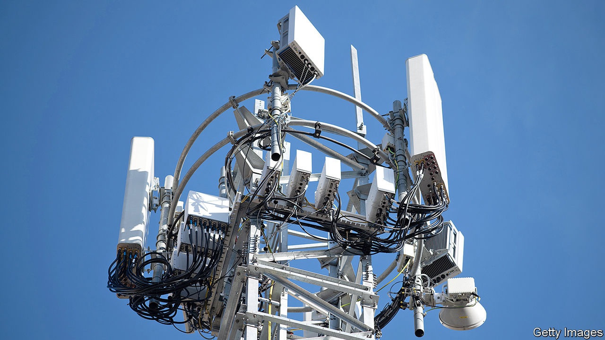
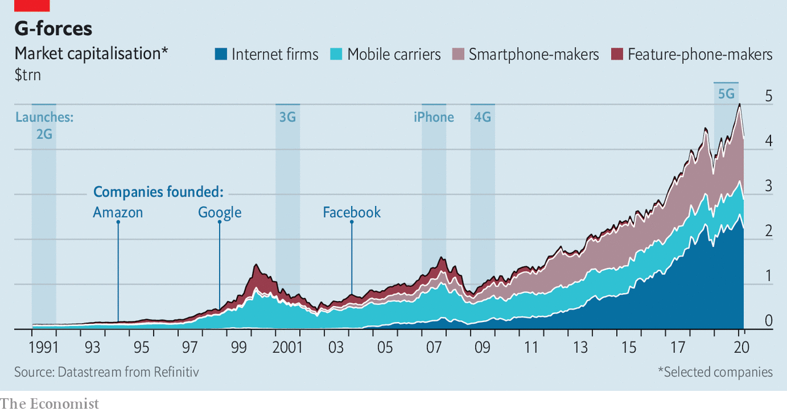

###### 5Geopolitics

# America does not want China to dominate 5G mobile networks 

##### It is going about it the wrong way 

 

> Apr 11th 2020 

IN THE 1990S America’s telecoms industry was split between two rival factions. On one side were the “bellheads”, named after the former telephone monopolist, Bell, and representing firms created by its break-up in the 1980s. They championed “circuit switching”, which linked customers via dedicated connections with highly specialised, highly reliable hardware arranged in a strict hierarchy. They believed in proprietary technology, vertical monopolies and deference to regulators.

Set against them were the “netheads”. They had grown up with the internet, which is based on “packet switching”: information is digitised, cut into small packets, each routed along the best available connection to the destination, and then recombined. Netheads favoured open-source software, collaboration between firms and decentralised decision-making.


This old debate is playing out again, this time in mobile technology—specifically its fifth generation, or 5G. Present-day bellheads are behind America’s assault on Huawei, the world’s biggest maker of telecoms gear and China’s best shot at dominating the global 5G market. New netheads can be found among proponents of “fully virtualised mobile networks”, built on cheap hardware and controlled by software in a manner similar to computing clouds. They include Rakuten, a Japanese technology group, which launched the first full-scale virtualised network on April 8th. If netheads have their way, it may prove as momentous as Amazon’s launch in 2006 of its trailblazing cloud-computing arm.

Earlier iterations of mobile technology all had their winners (see chart): mobile carriers and handset producers like Nokia and Ericsson (2G), smartphone-makers, notably Apple, and online giants reaching consumers on such devices, such as Amazon or Google (3G and 4G). 5G will be no different. It is too early to say with conviction who will take the biggest slice of the $2trn annual connectivity boost to global GDP by 2030 that the McKinsey Global Institute, the consultancy’s think-tank, predicts in health care, manufacturing, transport and retail alone. But one thing is clear: America does not want it to be China. The battle over 5G is spilling over from commerce into geopolitics.

 


At first blush, Western panic over Huawei seems overblown. Many telecoms experts dismiss 5G as hype by makers of devices and networking kit drumming up business. They are partly right. 5G will not profoundly alter consumers’ lives. It promises faster connections, but often only in optimal conditions (with a base-station antenna in line of sight). Similar download speeds can be achieved by extending 4G. Outside China, South Korea and a few other Asian countries, the uptake of 5G may be barely half as quick as of 4G, which reached 30% of mobile users within five years of launch in 2009, reckons UBS, a bank.

Edging ahead

But 5G is more than just a faster way to stream Netflix on the go. It enables networks that can support the “Internet of Things” (IoT): a world of connected devices from toothbrushes to tooling machines. Rather as the cloud has turned computing into a utility like electricity, 5G networks would permit moving more number-crunching to places where it is needed. The extra processing oomph could allow base stations on networks’ “edge” to guide self-driving cars, or robots on factory floors.

Cristiano Amon, president of Qualcomm, a big American maker of chips for smartphones, says that 5G will not just power telecoms but much of economic activity, making wireless networks into critical infrastructure. Self-serving, perhaps, given that his firm stands to make billions from 5G processors—but not implausible. The technology can be conceived of as the weft in a dense carpet of wireless connectivity whose warp comprises things like next-generation Wi-Fi, novel short-range links, constellations of low-orbit satellites and, yes, 6G (already under development).

It is Chinese dominance of this wireless tapestry that spooks many Western security hawks. If Huawei, suspected of links to the Chinese state, is allowed to build even parts of these networks, it could wreak havoc if ordered by its Communist overlords, worries Elsa Kania of the Centre for a New American Security, a think-tank. The risk is less that Huawei hoovers up data—exfiltration would probably be spotted and could be prevented by encryption. A bigger fear is that in a conflict between China and the West, the firm could shut down an enemy’s network, and maybe even turn IoT devices, such as driverless cars, into weapons.

Western security experts disagree on the practicality of such an attack—or its wisdom, given the retaliation it would invariably provoke. But the possibility has President Donald Trump’s administration in a bellheaded tizzy. It has obsessed over China’s hardware, bemoaned the lack of an all-American vertical monopoly of its own and declared 5G a “race”, which China must lose for America to win.

This zero-sum approach has had limited success, even on its own terms. American technology companies quickly found legal loopholes which let them keep selling to Huawei. On March 31st the firm reported a 19% rise in annual revenue last year, to $123bn. It spent $19bn with American suppliers in 2019, $8bn more than the year before. Despite threats to cut off the flow of American intelligence to allies that refuse to banish Huawei from their networks, only three of them—Australia, Japan and New Zealand—have complied. Even Britain, America’s closest partner in security matters, in January permitted its carriers to use Huawei kit in parts of the country.

America’s tough talk has backfired, prompting Huawei to redouble efforts to wean itself off American technology. Although such claims are hard to verify, Tim Danks, a Huawei executive, has said that of the 600,000 base stations the firm has shipped to mostly Chinese carriers, 50,000 had no American parts. Engineers who recently took apart Huawei’s top-end smartphone identified only a few American-designed chips.

Hawks in Washington are now urging Mr Trump to tighten the screws, for instance by lowering from 25% to 10% the share of American technology by value that products can contain for their makers, in America or elsewhere, to be allowed to supply Huawei. For all his China-bashing, Mr Trump appears to have demurred, instead heeding the concerns of America’s tech bosses, who warn that such a move would hurt their industry. A cabinet-level meeting at the White House in late March came up with a new plan. This would require any firm, domestic or foreign, that uses American chipmaking equipment or know-how to obtain an export licence if it wants to sell certain processors to Huawei.

Whatever its final shape and severity, the plan lays bare that for the Trump administration the 5G race is not about out-innovating China but hobbling it. It has no credible strategy for a speedy rollout of 5G across America, says Paul Triolo of Eurasia Group, a consultancy. Ideas such as having the state build a national network and rent capacity to carriers (as Mexico is doing in 4G) or letting a private firm operate a wholesale one have gone nowhere.

Base instincts

Left to their own devices, American carriers have put up 10,000 5G base stations. Covid-19 lockdowns will slow installations in the West, even as China eases its own curbs now that its epidemic is apparently under control. Chinese carriers, which boast 150,000 base stations, want more than 1m across 330 cities by the end of 2020.

In the ultimate act of desperation, Washington is toying with European-style industrial policy, once considered antithetical to American capitalism. In February William Barr, the attorney-general, suggested that America put its “large market and financial muscle” behind Ericsson and Nokia, Huawei’s enfeebled European rivals, and the only firms besides Samsung of South Korea allowed to build 5G networks in America (Lucent, America’s last domestic producer, merged with Alcatel of France in 2006; Nokia later bought the pair). There has been talk of subsidies for the Europeans, sweeteners for a tie-up between them or a takeover by an American tech giant or private-equity firm.

Samm Sacks of New America, a think-tank, warns that European and, ironically, Chinese regulators may block any deal on competition grounds. More fundamentally, as Rakuten shows, the bellhead approach they embody is no longer the only game in town. Mobile networks have been the bellheads’ last bastion. Base stations rely on specialised hardware. Mixing kit from different suppliers in one network risks dropped connections as users move around and switch from one base station to another. So carriers don’t do it.

Many would like to, fed up with pricey, inflexible kit. Luckily, engineers can now replicate all functions of a network in software. New industry groups to promote such alternatives, such as the O-RAN Alliance, are devising open specifications for base stations. The Telecom Infra Project, which grew out of Facebook’s efforts to lower the costs of connectivity in poor countries, helps network operators everywhere procure and combine components from different producers. Some carriers, including Spain’s Telefónica and Vodafone in Britain, are testing the new approach.

But it is Rakuten that has built an entire network based on an open architecture. Though 4G for now, 5G is promised in June. The firm has assembled a network with kit from different suppliers (such as Nokia and America’s Cisco), built its own computing platform and manages it all using software from Altiostar, an American startup in which it has a majority stake. “We did our own integration, which was not easy. But there was no plan B,” says Tareq Amin, Rakuten’s chief technologist. He hopes other firms will follow its lead, perhaps even use its technology. A few are considering it. Asked if Rakuten was a model for Dish Network’s planned $10bn investment in 5G, the American satellite-TV provider’s boss, Charles Ergen, said that Dish “learned a lot” from the Japanese firm.

The “telco cloud”, as Pierre Ferragu of New Street, a research firm, calls it, looks poised to billow. When it does, carriers may be less desirous of Huawei gear, which tends to be cheaper than Ericsson’s or Nokia’s and no less nifty. Rakuten claims its network cost roughly half as much as a conventional one to build; some of its 5G base stations will be no pricier than a Wi-Fi router, it says. Emerging-world consumers should love it. So should security hawks. An open architecture gives operators more control over what gear goes into their networks; Rakuten’s network contains no “black box” it must blindly trust.

Huawei has dismissed the nethead approach as “a dream”. In contrast to Ericsson and Nokia, the Chinese giant has yet to join the O-RAN Alliance. Perhaps channelling his former self as a lawyer for telecoms firms, Mr Barr has called it “pie in the sky”. Stéphane Téral of Informa Tech, a research firm, warns that “making parts from different firms work well together is always tricky”; such niggles delayed Rakuten’s launch by six months. And many carriers that have already begun erecting conventional 5G base stations may have locked themselves into a single supplier for years to come.

Still, governments could promote the nethead alternative, argues Tom Wheeler, a former chairman of America’s Federal Communications Commission, now at the Brookings Institution, a think-tank. A bipartisan bill in the Senate would create a $750m research fund to spur the development of open-architecture networks and help carriers purchase such equipment. Some American lawmakers want to mandate the use of gear with open interfaces.

The Trump administration faces a clear choice. It can either bellheadedly try to beat the Chinese at their own game, going after Huawei and embracing industrial policy. Or it can do something altogether more American: help usher in innovation that lets many companies thrive at a time when cheaper, better connectivity is precisely what a post-pandemic world needs. ■

