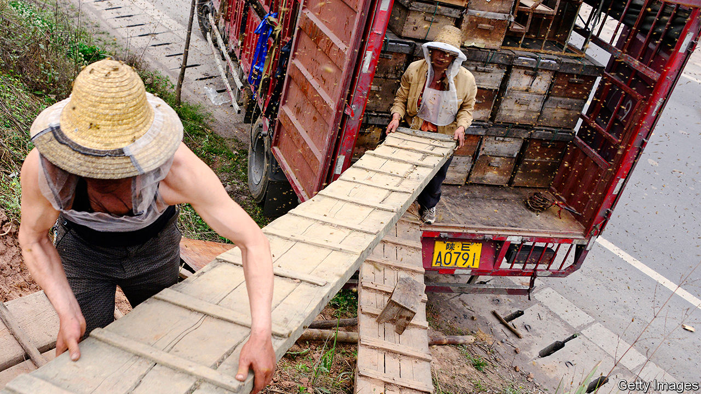

###### The honey trap

# China’s beekeepers feel the sting of covid-19 

##### Lockdown can be fatal for apiarists’ colonies 

 

> Apr 11th 2020 

Editor’s note: The Economist is making some of its most important coverage of the covid-19 pandemic freely available to readers of The Economist Today, our daily newsletter. To receive it, register . For our coronavirus tracker and more coverage, see our 

ZHANG YALI remembers the pains of living in the Chinese countryside when she was growing up. On the mountainside in rural Shanxi, the northern province where her family lived, snakes and scorpions lurked. If they did not bite, the mosquitos certainly would. But the Zhangs could not move their isolated home to the safety of a village, because only the mountain was free of pesticides. What worried the Zhangs more than the odd sting were chemicals that might kill their bees.

Pesticides have long plagued China’s honey-making industry, which is by far the world’s largest. This year, however, covid-19 has been a bigger headache for the country’s 250,000 beekeepers, who produce around one-quarter of the global supply. Many of them are itinerant, moving their colonies around the country on lorries in search of pollen and nectar. For many days, restrictions imposed to curb the epidemic made this difficult.


The average honey bee flies for more than 1,500km in her lifetime. Many of China’s beekeepers travel about twice that distance in a season, criss-crossing the western and southern plains. But late in January local governments began to limit people’s movements. Many keepers who had taken advantage of the cold weather, when bees huddle in their hives, to leave their colonies and visit relatives, found themselves stuck. They were unable to return to take their bees on the road. Those united with their hives could not set off either. Many of the insects died of starvation. “In previous years, our relatives would go south for spring flowers and rapeseed. But no one can go this year,” says Ms Zhang.

In mid-February the central government announced measures to make it easier for agricultural workers and goods to move around. But there are still obstacles of various kinds, including frequent health checks. Woe betide the beekeeper required to self-quarantine—that can mean separation from bees. Even those who manage to go about their business normally will struggle to make up their losses. Margins are thin at the best of times. Wang Baorong, a beekeeper in Yunnan, normally makes about 1,000 yuan ($140) a month, about average for a rural household in the poor southern province. “Beekeepers have to rely on heaven to eat,” he says.

Some may be able to supplement their income by turning to a growth industry for owners of bees: pollinating farmers’ crops. In parts of China wild bee populations have been falling because of pesticide use, climate change and diseases such as deformed-wing virus, forcing farmers to pollinate by hand. It is a labour-intensive process and results in lower yields. (Around one-third of China’s pear trees are pollinated in this way.) But Ms Zhang says that regions where demand for these services is highest, such as Xinjiang in the far west and Inner Mongolia in the far north, are too far away to make it worthwhile for her family to travel there.

The economy is slowly recovering. Travel is getting easier. But for itinerant beekeepers it is too late to catch the early blooms of spring. Ms Zhang grumbles that life even before covid-19 was “mediocre”—not helped by her father’s poor health. “We must practise the spirit of the bees, live and learn, keep busy and grow old,” she says. ■

Dig deeper:For our latest coverage of the covid-19 pandemic, register for The Economist Today, our daily , or visit our 

