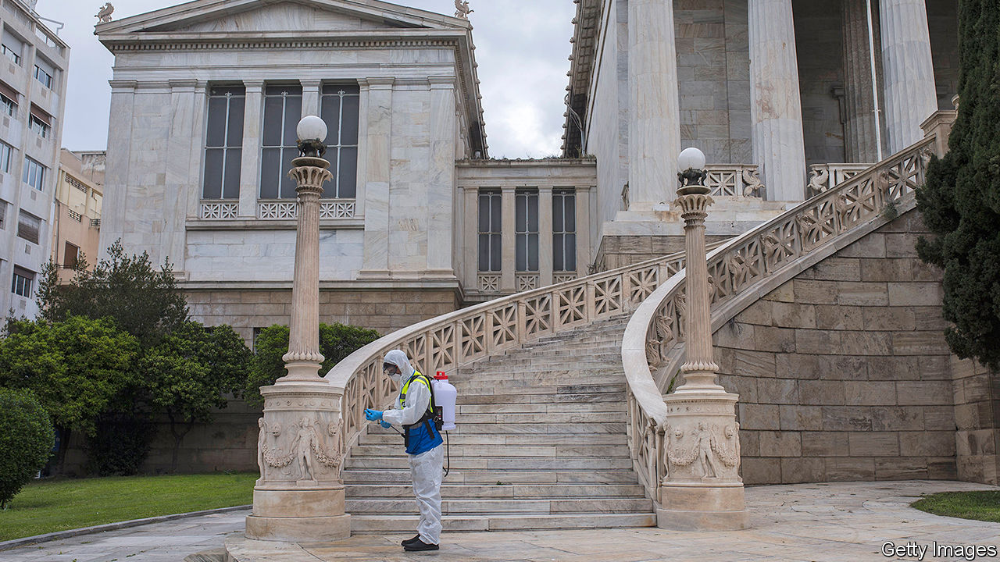

###### A terrible toll on tourism

# Covid-19 hits Greece even harder than the rest of the euro zone 

##### Just as it was beginning to turn a corner 

 

> Apr 11th 2020 

Editor’s note: The Economist is making some of its most important coverage of the covid-19 pandemic freely available to readers of The Economist Today, our daily newsletter. To receive it, register . For our coronavirus tracker and more coverage, see our 

AT THE START of this year it seemed as if Greece might have turned a corner. After a downturn that lasted longer than America’s Great Depression, its economy was growing again. Market capitalisation at the Athens Stock Exchange rose by 47% in 2019, the sharpest increase in the world. Tourism was booming, consumers were spending and Greek banks were reducing their burden of non-performing loans.

Business confidence at the start of this year was at an all-time high, bolstered by the election last July of a pro-business conservative prime minister, Kyriakos Mitsotakis, who promised to sweep away obstacles to business. The Harvard-trained former banker started well. He cut Greece’s labyrinthine red tape to make it easier to start a new business. He reformed labour laws, reducing the cost of firing an employee. He lowered taxes on corporations from 28% to 24%. Last September he fully lifted capital controls for individuals and companies. In November he signed off on a €600m ($650m) investment by China Ocean Shipping Company in Piraeus, Greece’s largest port.


That cheery mood seems like ancient history. Greece faces some of the severest disruption of any euro-zone economy, says Jakob Suwalski of Scope, a credit-rating agency, who predicts a fall of anything from 7% to 18% in GDP this year. No country in the euro zone other than Cyprus depends more than Greece on tourism, which has practically ceased to exist. The sector accounted for half of economic growth in 2018, more than 20% of GDP (90% in some parts of the southern Aegean) and a quarter of the country’s jobs. Now the tourists have stopped coming. On March 19th the government ordered hotels across Greece to close from March 23rd until April 30th, a date that will surely be extended. The Hellenic Chamber of Hotels estimates that the loss of profits thanks to cancellations has already exceeded half a billion euros.

In mid-March the Greek government restricted public gatherings to ten people. It also banned arrivals of non-European Union residents and travel to and from Albania, Italy, North Macedonia and Spain. And it ordered the closure of all retail businesses other than supermarkets, pharmacies, petrol stations, pet shops, food-delivery companies, groceries, bakeries, kiosks and banks. Greece is a nation of small businesses, most of which have scant resources to weather hard times. On March 23rd the government further tightened restrictions by imposing a national lockdown.

On top of an emergency boost of €10bn, Mr Mitsotakis insists that the country has “more weapons” to protect the economy, after around €12bn of its paper was declared eligible for inclusion in a €750bn bond-purchasing programme that has been launched by the European Central Bank. That should help to hold down the risk premium on Greek government debt. It is also, perhaps, a signal that the EU is prepared to believe in Greece’s recovery—once the virus is tamed. ■

Dig deeper:For our latest coverage of the covid-19 pandemic, register for The Economist Today, our daily , or visit our 

