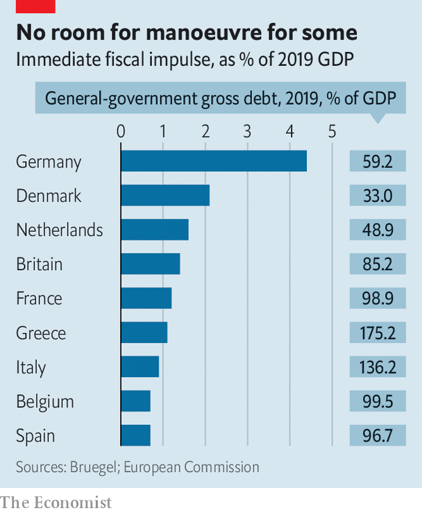

###### Paying for it

# European finance ministers ponder coronabonds 

##### Once again, the euro zone is consumed by rows over debt 

 

> Apr 9th 2020 

Editor’s note: The Economist is making some of its most important coverage of the covid-19 pandemic freely available to readers of The Economist Today, our daily newsletter. To receive it, register . For our coronavirus tracker and more coverage, see our 

IT IS “impossible to be more optimistic than [António] Costa,” Portugal’s president once said about his country’s irrepressible prime minister. Yet on March 26th Mr Costa’s bonhomie was nowhere to be seen. After EU leaders had held a fractious video-conference on the covid-19 crisis he stood before cameras, his face like thunder, to declare: “If we don’t respect one another…no one has understood anything about the EU.” Attacks by Wopke Hoekstra, the Dutch finance minister, on southern Europeans’ overspending were “disgusting” and “mean-spirited”. Things have not got much better since then.

Some analysts forecast a slump of nearly 10% in euro-zone GDP this year. But though rich countries like Germany have marshalled huge domestic responses, solidarity has been lacking. Border checks were imposed and medical supplies hoarded. The EU has at least relaxed fiscal and state-aid constraints to give afflicted countries room to respond. And on March 18th, with bond yields in Italy and Spain creeping up, the European Central Bank announced a €750bn ($810bn) asset-purchase plan and relaxed its rules over what it can buy. Christine Lagarde, its president, said there were “no limits” to its commitment.


That was enough to calm the markets. But like her predecessor, Mario Draghi, whose “whatever it takes” intervention kept the euro together in 2012, Ms Lagarde wants governments to do more. Specifically, she urges the euro zone to consider issuing a jointly guaranteed, one-off “coronabond”. Nine governments, led by France, Italy and Spain, have made a similar plea.

Yet the euro zone remains divided along familiar lines. An all-night session of finance ministers on April 7th-8th failed to reach agreement after the Italians and Dutch squabbled over debt mutualisation and other matters. A smaller suite of measures may yet be signed off. These include an expansion of European Investment Bank private-sector loans, EU financial support for national wage-subsidy schemes, and perhaps credit lines from the European Stability Mechanism (ESM), the euro zone’s bail-out fund. But these amount to a “nothingburger”, says Mujtaba Rahman of the Eurasia Group consultancy.

By pitting frugal northerners, like the Germans, Dutch and Austrians, against supplicant southerners, the row recalls elements of the 2010-12 euro crisis. Yet the differences are at least as salient. During the euro crisis the ECB waited until 2012 to act decisively; this time Ms Lagarde moved quickly (after an early misstep), ensuring governments did not have to battle market and health-care meltdowns at the same time. Moreover, most coronabond proposals envisage a one-off issuance to pay for specific aims like health capacity or wage subsidies, rather than an ongoing commitment or the mutualisation of old debt. “You don’t win the debate with the same old arguments about Eurobonds, because this is a shock that hit everyone without being anyone’s fault,” says Lucas Guttenberg of the Jacques Delors Centre in Berlin.

A more worrying difference is political. In Italy, which sits on a debt pile of over €2.5trn, Euroscepticism had emerged as a powerful force even before the corona crisis—channelled largely through Matteo Salvini, a former deputy prime minister who leads the hard-right Northern League. In early April one poll found that 53% of Italians were ready to leave the euro or EU. This has forced Giuseppe Conte, the non-partisan prime minister, to toughen his line, describing the ESM as “utterly inadequate”. Recalling the austerity forced on euro-zone wards like Greece by foreign creditors, many Italians fear that ESM loans will bring impossibly exacting conditions—even though Germany has promised leniency. The loans also stack up on national balance-sheets. As the Italian government negotiated on April 7th Mr Salvini appeared on television to denounce the “loan sharks” of Berlin and Brussels.

Spain’s Socialist prime minister, Pedro Sánchez, is less hostile than Mr Conte to the ESM. But he has also abandoned Spain’s typical Euro-quietism, warning that ruling out coronabonds would risk the credibility of the EU in countries like his. During the euro crisis, in which Spain’s banks had to be bailed out by the ESM, Spaniards knew they were paying the price of their own irresponsibility in inflating a property bubble. This time they have simply been hit by bad luck. Rejection will spur Eurosceptic sentiment that populist parties on the left and right would be happy to harness.

Neither Italy nor Spain is on the precipice. But the weakness of their fiscal positions—debt-to-GDP ratios of 136% and 97% respectively last year—is showing. Their responses to covid-19 have been more timid than Germany’s (see chart), despite the havoc it has wrought in their countries. More worryingly, growing debt may inhibit their ability to pay for recovery. The ECB is no panacea: its bond-buying could be indirectly undermined in May, when Germany’s constitutional court rules on the legality of its quantitative-easing programme; and anyway it cannot last forever. “At some point, markets will question Italy’s debts,” says Nicola Nobile at the Oxford Economics consultancy.

 


That calls for a “second line of defence”, says Grégory Claeys at Bruegel, a think-tank. Yet Germany continues to rule out coronabonds, and the Dutch appear even more immovable (although Mr Hoekstra eventually apologised for his tone). The sceptics’ old arguments about moral hazard and the risks of common borrowing without centralised supervision have been supplemented with new ones: a coronabond would take too long to establish, and institutions like the ESM and EIB involve some mutualisation anyway. And like their southern counterparts, northern governments must also deal with restive parliaments and troublemaking populists.

Countless proposals aim to square the difference. There is talk of turning the EU’s small seven-year budget into a new “Marshall Plan”. The Dutch have proposed a small fund that would dispense no-strings aid. Perhaps most prominent is a plan of Bruno Le Maire, France’s finance minister, to establish a temporary post-crisis rescue fund that would issue common bonds worth several billion euros, perhaps to be repaid by a European “solidarity tax”. Mr Le Maire carefully avoids the word “coronabond” while echoing Mr Sánchez’s apocalyptic talk about the risks of failure. But so far he has failed to win over Germany.

Even Angela Merkel, Germany’s chancellor, calls the corona crisis the biggest test the EU has ever faced. Yet her government’s diagnosis of the problem remains fundamentally at odds with much of the rest of the euro zone. The debate is not over, but Costa-style optimism is thin on the ground. “Whatever they do magic up is unlikely to meet the scale of the need,” says Mr Rahman. “Something may break.” ■

Dig deeper:For our latest coverage of the covid-19 pandemic, register for The Economist Today, our daily , or visit our 

