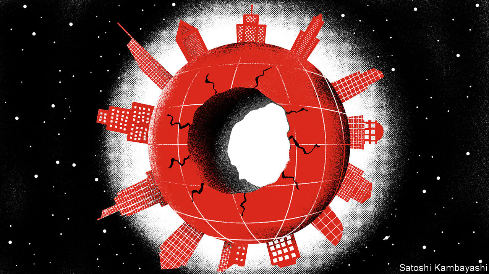
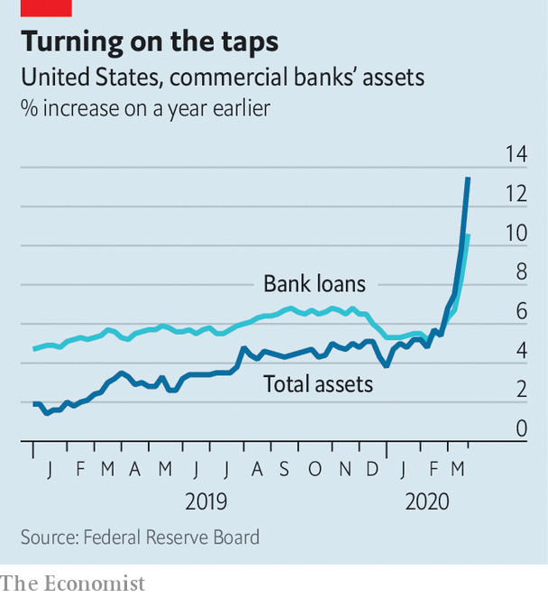
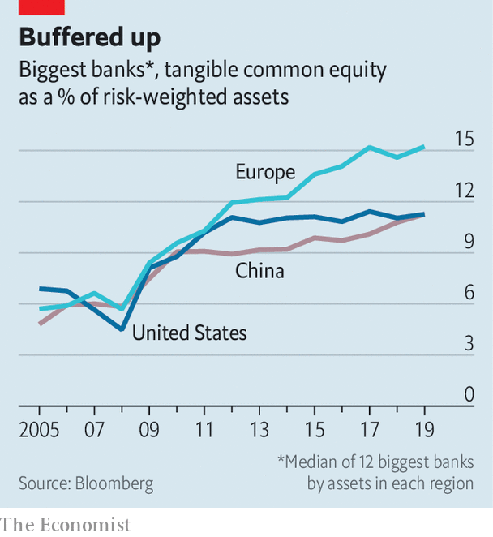

###### This time we’re different

# How sick might banks get? 

##### They have entered this crisis in better health than the previous one 

 

> Apr 8th 2020 

Editor’s note: The Economist is making some of its most important coverage of the covid-19 pandemic freely available to readers of The Economist Today, our daily newsletter. To receive it, register . For our coronavirus tracker and more coverage, see our 

FROM EBENEZER SCROOGE to Gru in “Despicable Me”, the villain redeemed is a time-honoured trope in fiction. There has been much talk lately of bankers enjoying a similar rehabilitation. Reckless overextension by lenders was the root cause of the financial crisis of 2007-09. This time the blame lies with a microbe, not moneymen, and banks are seen as potentially part of the solution, not least as conduits for massive state support for stricken firms and households.

The corona-crisis does indeed give banks a chance to improve their image. But it also presents them with some painful dilemmas and, worse, may ravage their bottom lines. Michael Corbat, boss of Citigroup, has warned that banks like his have to tread a “fine line” between supporting clients and undermining financial stability. They must conserve capital while also keeping dividend-dependent investors sweet. However they handle such choices, the risk of hefty losses looms: bank shares have fallen by twice as much as the stockmarket this year on fears of rising defaults.


The industry went into the crunch in decent shape. Capital cushions, depleted going into the last crisis, have since been plumped up. Banks have also been made less vulnerable to funding runs. This time the system has creaked but not buckled. Early evidence suggests that post-2009 efforts to push liquidity risk from banks into capital markets have worked, and to the extent that risk has rebounded it has been largely absorbed by central banks through their market-support programmes, not by commercial banks, says Huw van Steenis of UBS, a Swiss lender.

 


Under those schemes, and their own steam, banks have increased lending dramatically, especially in America (see chart). In March public companies there drew down $191bn from bank credit lines, after taking next to nothing in January and February. The odd one out is China, where loan growth is similar to last year’s rate. In 2008-09 officials arm-twisted lenders into leading stimulus efforts. They may fear that another such push could break them. Chinese banks’ assets have ballooned to 285% of GDP, from 195% in 2007.

To encourage banks to lend more and offer forbearance, regulators in the West have rushed to relax or delay rules brought in after the financial crisis. These cover everything from loan-loss accounting to the thickness of capital buffers (see chart). By one estimate, such (presumably temporary) regulatory forbearance has created $5trn of lending capacity.

 


At the same time, regulators in Europe in particular have nudged or ordered banks to bolster their defences by freezing payouts to shareholders and star performers. British banks, for instance, are withholding £8bn-worth ($9.9bn) of dividends. American ones have not followed suit, though they have suspended share buy-backs. Bonuses are in regulators’ cross-hairs too: Andrea Enria, the European Central Bank’s top bank supervisor, has called for “extreme moderation”.

For now, the threat to banks does not look existential. “Unlike 2008, it’s primarily an earnings issue, not a balance-sheet one,” says Nathan Stovall of Standard &amp; Poor’s (S&amp;P), a rating agency. If charge-offs are similar to back then, American banks’ capital ratios would remain above their levels after recapitalisation in 2008-09.

But with major economies at a near-halt for an indeterminate period, loan losses could be bigger this time. Analysts cannot seem to downgrade bank-earnings forecasts quickly enough. Some now think American banks, which made combined profits of $230bn last year, could slip into loss in 2020. Investment banking won’t ride to the rescue. Equity issuance and corporate dealmaking have sagged (though debt-raising remains strong in pockets). Trading volumes and profits have leapt, as they often do early in a crisis, but are expected to fall dramatically.

Europe is in worse shape. A senior banker says the outlook for British lenders is “really shitty”. He fears some smaller banks and non-bank providers may not survive. Italian lenders, battered by the euro-crisis, were on the mend until covid-19, having cut their bad loans in half, but now look precarious again. Deutsche Bank, which has been struggling to get back to good health for years, risks a relapse.

In China, the shock to growth will push banks beyond the limits of what regulators had anticipated. In 2019 the central bank stress-tested the resilience of 30 banks in a variety of scenarios. In the most extreme hit to the economy envisaged—growth slowing to 4.15%—it said 17 of 30 banks would need more capital. The World Bank expects growth this year to be just 2.3%. S&amp;P has estimated—based on assumed growth of 4.4%—that the bad-loan ratio could climb to nearly 8%, a quadrupling from its pre-virus level. The questionable-loan ratio could hit an eye-watering 13%.

The growing worry in the West is that the short-lockdown, quick-snapback scenario proves too rosy. Several more months of restrictions could mean years of losses on soured loans. Bankers may start to find that there is a fine line between forbearance and forgiveness: in America calls for credit-card interest to be waived indefinitely are growing louder.

Ultra-low interest rates set by central banks to fight the pandemic are another headwind. An important factor in a bank’s profits is its “net interest margin” (NIM)—the difference between the rate at which it makes loans and that at which it remunerates the deposits it has gathered. Even before the corona-crisis this was a scrawny 3.3% for American banks. With policy rates likely to stay on the floor until well after the pandemic has abated, NIMs will remain emaciated for years.

Whether banks end up drowning in red ink, or merely spattered with it, depends on a host of unknowns. “The tail event is no vaccine in a year,” says Sir Paul Tucker, chair of the Systemic Risk Council, a group of former policymakers. “Banks need to be stressed against such scenarios, as post-crisis capital requirements were not calibrated against anything like that.”

In a letter on April 6th Jamie Dimon, boss of JPMorgan Chase (JPM), assured shareholders the bank could comfortably withstand an extreme (“and, we hope, unlikely”) scenario, in which GDP falls by 35% and unemployment hits 14%, emerging with capital above the safe minimum. JPM is the strongest, most profitable of the world’s big banks. Others, faced with such a storm, could find themselves in trouble. ■

Dig deeper:For our latest coverage of the covid-19 pandemic, register for The Economist Today, our daily , or visit our 

