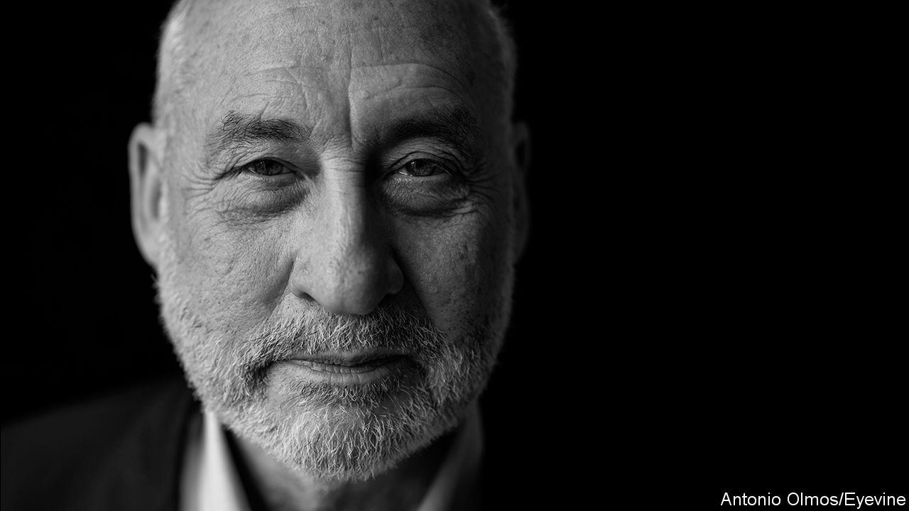

###### Pilgrimage to the gamma quadrant

# Joe Stiglitz and the IMF have warmed to each other 

##### The fund seems to have won over its most fearsome critic 

 

> Apr 11th 2020 

FEW JOBS are as daunting as minister of the economy of Argentina. But Martín Guzmán, who was given the post in December, has two things going for him. He is a brilliant student of unsustainable debt, which Argentina has in abundance, including $44bn owed to the IMF and almost $100bn of foreign-currency debt owed to private lenders. And he is a protégé of Joe Stiglitz, a Nobel-prizewinning economist at Columbia University who once served as chief economist of the World Bank.

That close affiliation presumably helped endear him to Argentina’s powerful vice-president, Cristina Fernández, who flouts economic orthodoxy but is fond of citing Mr Stiglitz. And the celebrated economist’s warm endorsement also gave Mr Guzmán credibility in his dealings with the IMF—or so the government must have hoped when it appointed him.


But the neat logic of his appointment surely suffers from an obvious flaw. Mr Stiglitz is admired as an economic theorist, but is also renowned as a bitter critic of the IMF. His book, “Globalisation and its Discontents”, published after the emerging-market crises from 1997 to 2001, castigates the fund for imposing unfettered capital flows, fiscal austerity and tight money on vulnerable countries. In a notorious passage, he speculated that Stan Fischer, a revered economist who was the fund’s second-in-command from 1994 to 2001, won a lucrative job at Citigroup as a reward for serving American financial interests at the IMF. In retaliation Ken Rogoff, then the fund’s chief economist, implied that Mr Stiglitz had wandered off into the “gamma quadrant”—a nerdy way of asking him what planet he was on. “It was”, Mr Stiglitz says now, “a very tense moment.”

The kind of allegations Mr Stiglitz made in his book still dog the IMF. As countries flock to it for help in handling the financial fallout of covid-19, many worry that the fund may demand austerity in return. And several of the stronger emerging economies that could qualify for the fund’s unconditional loans (known as flexible credit lines) have steered clear, fearing the stigma that any approach to the IMF still carries.

Given this bad blood, Mr Guzmán’s links with Mr Stiglitz might have been a liability rather than an asset. But the Argentines (who are nothing if not close students of the IMF) have grasped something that is still underappreciated elsewhere. Mr Stiglitz has warmed to the fund—and the fund has warmed to him.

“I’ve been amazed [and] impressed at the transformation of the IMF over the past decade and a half,” he says. The transformation began under Dominique Strauss-Kahn, the fund’s boss from 2007 to 2011, who responded to the global financial crisis with calls for stimulus, not austerity. It continued under his successor, Christine Lagarde, who championed the fund’s new concern for inequality. Economic disparities, the fund’s research demonstrated, were more damaging to growth than many economists presumed, and redistribution was less so. (These findings became a book, “Confronting Inequality” by Jonathan Ostry, Prakash Loungani and Andrew Berg, that carried a foreword by Mr Stiglitz and was published by his university.)

Kristalina Georgieva, who took over at the fund last year, “is making another very big step forward”, Mr Stiglitz says. They overlapped at the World Bank (where Ms Georgieva worked for about 20 years, all told) and kept in touch after Mr Stiglitz left. He wrote her a letter about Argentina shortly after she was appointed. And the fund quickly endorsed Mr Guzmán’s view that the country’s debt was “unsustainable”. That declaration has increased the pressure on Argentina’s creditors to forgive a hefty chunk of their claims.

The IMF’s fight against covid-19 may further redeem the institution in Mr Stiglitz’s eyes. He supports its desire for a new allocation of “special drawing rights”, which would give the fund’s poorer members a claim on the currency reserves of its richer ones (see ). It is an instrument he has promoted since at least 2006. Much of the fund’s habitual hard-nosedness reflects its fear that bail-outs might encourage imprudence. But such concerns hardly apply to a pandemic. Rescuing a country from the virus will not make it likelier to succumb to another outbreak.

Does Mr Stiglitz worry that his followers will like him less if he likes the fund more? He insists that he has stayed true to the “broad principles” that motivated his original criticisms. He has been “steadfast” in his belief that markets fail, capital can flow too freely, inequality matters and depressed economies need stimulus, not austerity. But he is, perhaps, more tactful. The revised edition of “Globalisation and its Discontents”, published in 2017, still mentions Mr Fischer’s departure for Citigroup. But the passage suggesting an explicit quid pro quo has disappeared. ■

