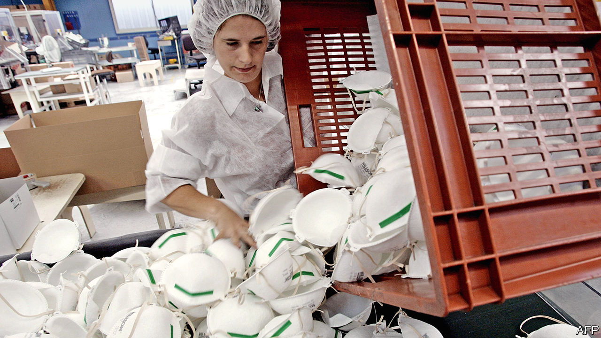

###### Signal failure

# Many economists defend disaster profiteers. They are wrong 

##### With price gouging, morality trumps economics 

 

> Apr 11th 2020 

Editor’s note: The Economist is making some of its most important coverage of the covid-19 pandemic freely available to readers of The Economist Today, our daily newsletter. To receive it, register . For our coronavirus tracker and more coverage, see our 

MUCH ABOUT the pandemic sweeping across the world is unprecedented, but one aspect is all too familiar: price gouging in the wake of a disaster. In New York police arrested a man who had stockpiled medical gear, allegedly selling it for a 700% mark-up. Indonesian authorities seized 600,000 masks from hoarders. In Italy the government launched a probe into sky-high online prices for basic protective equipment. Such crackdowns are popular. Who could possibly endorse disaster profiteering? Many economists, as it turns out.

To be clear, it is not that they want the public to miss out on life-saving products. Quite the contrary. They believe that soaring prices stimulate greater output, and that policies to cap costs might limit supplies and so do more harm than good. In 2012 the University of Chicago surveyed 32 eminent economists about legislation that banned price gouging during a weather-related emergency. Only three supported the ban; more than half criticised it. Similar views have been aired in recent weeks. An economist with the Cato Institute, a conservative think-tank, lamented the “madness” of anti-gouging rules, saying that profits are what entice firms to meet rising demand for safety equipment.


Yet a closer look at one key piece of equipment—masks—during the coronavirus crisis shows that this standard view needs revamping. Economists are normally loth to tamper with prices, the most basic element of any market. But little about this pandemic has been normal. Price signalling alone would have been inadequate to the challenge of ensuring vast increases in supply.

First, consider the manufacture of masks. They might look simple, but producers need sterile factories and sophisticated machinery to churn out melt-blown fabric. Upfront costs would be hard to justify if the virus were quickly snuffed out. So in January, the early phase of the outbreak, Chinese firms began by scouring the world for masks rather than by making more of their own. It took government action to change that. Officials offered subsidies to firms producing safety gear: promising not outsized gains but an avoidance of losses. China went from making 20m masks per day before the crisis—half the world’s output—to nearly 120m by the end of February.

Profit, narrowly defined as the income earned from making masks, also fails to explain corporate motives. Regulation has been crucial. Companies in China could not resume operations until all their workers had masks, so automakers, phone manufacturers and oil giants all added mask-production lines. And big companies also want to look like good corporate citizens. Peter Navarro, a trade adviser to America’s president, accused 3M, one of the world’s biggest manufacturers of high-end masks, of putting money before people. In fact, 3M has stuck to its list prices and doubled its production.

Pricing is usually the best way to allocate resources, by revealing who is willing and able to pay for something. But there is no doubt now that masks are most essential for medical workers. Ordering large supplies at fixed prices is the right policy. The public benefit of a functioning health system far outweighs any harm in impeding sellers from maximising their profits. This was a point made to the University of Chicago’s survey by one of the dissenting economists, who argued that it was fair to cap prices after a natural disaster. “Efficiency is less important than distribution under such transitory conditions,” said Angus Deaton, now a Nobel laureate. In a global health crisis, his argument is even more compelling. Conventional morality—the revulsion against price gouging—trumps conventional economics. ■

Dig deeper:For our latest coverage of the covid-19 pandemic, register for The Economist Today, our daily , or visit our 

