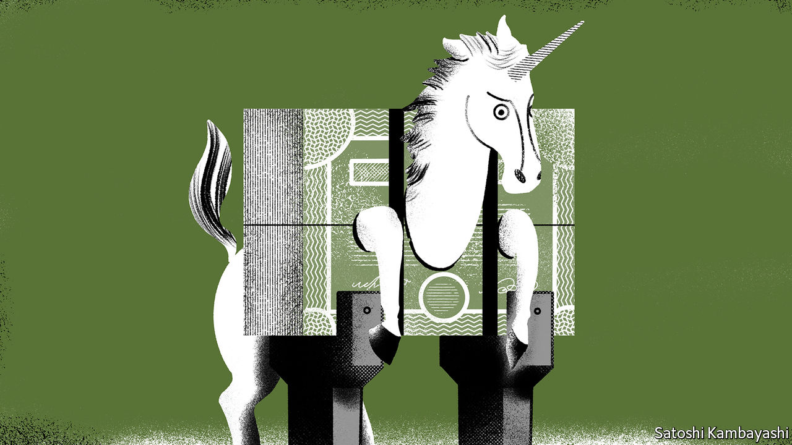

###### Buttonwood

# Why a lot of startups will come to regret their unicorn status 

##### After many funding rounds, they could be sitting under a mountain of debt-like claims 

 

> Apr 11th 2020 

IN JULY 2006 Yahoo, a faded internet giant, offered to buy Facebook, then a fledgling, for $1bn. Billion-dollar offers for startups were then quite rare. “I thought we should at least consider it,” recalls Peter Thiel, an early Facebook backer, in his book, “Zero to One”. The initial reaction of Mark Zuckerberg, its founder, was firmly to say no. “This is just a formality,” he told his board. “We’re obviously not going to sell here.”

Entrepreneurs are supremely confident about their eventual success. They have to be. Startups usually fail; in the vernacular of Silicon Valley, they have a high “kill rate”. It takes unusual self-belief to even set up. Mr Zuckerberg’s was vindicated in spades. Until recently investors were tripping over themselves to throw money at would-be Zucks. Founders were willing to cede certain protections to their venture-capital (VC) backers to get a billion-dollar valuation. They will now regret it. They are, in effect, sitting under a mountain of debt-like claims on their companies.


Take the case of an imaginary startup. WeWhack is a tech platform that connects people who carry grudges to contract killers. (In a bull market for VC, the legal and moral concerns about the business model are dismissed as so much naysaying.) The founder, Mr Soprano, owns all of its common stock. An early-stage VC firm, called Seedy, gives him $20m in exchange for a 20% stake. Mr Soprano can boast that his company is worth $100m, the “post-money” valuation. This is the figure quoted in newspapers and trade magazines.

But in reality it is worth less. VC backers such as Seedy typically receive convertible preferred stock. This is a security that is specific to venture capital, says Jean-Noel Barrot of HEC Paris, a business school. “Convertible” means the security converts into common stock at “exit” ie, when the company is either sold to a bigger company or is listed on the stock exchange. “Preferred” means the backer will be paid back before common stockholders: it has liquidation preference. If, in our hypothetical case, the exit value is between $0 and $20m, Seedy gets everything. If it is between $20m and $100m, the VC gets $20m and Mr Soprano gets the rest. Only if the exit value is above $100m will both parties be paid in proportion to their shareholding.

Were Seedy granted common stock, Mr Soprano could in principle immediately sell WeWhack for $20m (the value of its cash holdings), pocket $16m (his 80% share) and return the rest to Seedy. Preferred stock is a disciplining device. It encourages the founder to use the $20m to create a firm that is worth a lot more.

Things become more complex as the business matures. Mr Soprano decides to sell a further 20% of WeWhack to fund its global expansion. There is lots of interest from VC firms. The highest bid comes from SoftMoney. It is willing to pay $150m for senior preferred convertible stock, meaning it is first in the queue at the exit, ahead of Mr Soprano and Seedy. The post-money valuation is $750m.

But Mr Soprano wants to be the founder of a unicorn, a startup valued at $1bn or more. SoftMoney says it will pay $200m, for a post-money valuation of $1bn, if it gets greater protection should things go wrong. It is granted two times liquidation preference: an assurance that it will make back its $200m twice over. WeWhack’s exit price must reach $400m before anyone else makes a cent. But Mr Soprano is fine with that. He is confident that his business is worth billions.

A good early-stage investment partner will advise founders not to go for a headline valuation if it comes with such terms, says Richard Wong, of Accel, a VC firm. They don’t always listen. After many funding rounds, a venture-backed company might have half a dozen layers in its capital stack, each with its own protections and voting rights.

When funds are raised at lofty values, it can create misalignment later on between founders, early-stage VCs and late-stage investors, says Simon Levene of Mosaic, a London-based VC firm. A founder sitting under a mountain of preference stock is like the manager of an over-indebted firm. In a bear market, his stake is probably worthless. So why not blow the company’s remaining cash on perks, take undue business risks (“gamble for redemption”) or simply give up? He may use his voting rights to stymie an exit for other investors. It can get messy.

Everyone can be a dreamer in a buoyant market. The kill rate is low. But when trouble strikes, it reverts to the mean—and, as a VC bigwig puts it, “a lot of things get whacked.”

