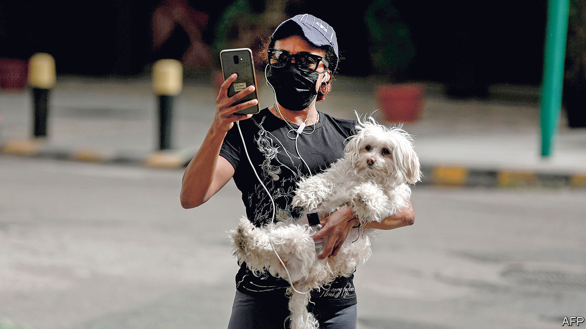

###### Covid couture

# Lebanon embraces sweatpants during the outbreak 

##### A stylish nation lets standards slip 

 

> Apr 11th 2020 

Editor’s note: The Economist is making some of its most important coverage of the covid-19 pandemic freely available to readers of The Economist Today, our daily newsletter. To receive it, register . For our coronavirus tracker and more coverage, see our 

THE ODDITIES begin the moment you step outside in Lebanon, now in its fourth week of near-total lockdown. Streets once choked with traffic are empty. At the entrance to a supermarket shoppers don masks and plastic gloves, while staff check their temperatures. But the strangest sight is inside. Customers stroll the aisles in sweatpants, pyjamas, even flip-flops. Asked about this unusually dégagé fashion, one shopper observed, with mock horror, that the Lebanese were starting to dress like Americans. Her tracksuit top, coincidentally, had the stars and stripes sewn on one arm, a relic of more casual days studying in America.

Depending on whom you ask, Lebanon’s 4m citizens are stereotyped as either stylish or vain, bon vivants or parvenus. It is a stereotype, they admit, rooted in some truth. A quick trip to the bakery might require a dab of make-up or a splash of cologne. Banks used to offer loans for plastic surgery. Cars, clothes, champagne in clubs—public life was a stage on which to show off.


Until the curtain fell. Nightclubs were first to close, then bars and restaurants. Even the Sunday lunch, a regular gathering of family and friends, has been curtailed: a government decree issued on April 5th limited car travel six days a week and forbade it entirely on Sundays. With nowhere to go but the supermarket, no one can be bothered to dress up. Drive into the mountains outside the capital, Beirut, and the deserted roads are full of tracksuit-clad families out for a stroll, another oddity in a country notorious for its lack of public space.

The glamorous Lebanon of tourism ads and diaspora fantasies was always a veneer. A clubgoer wearing designer labels tosses her Mercedes keys to a valet earning a few hundred dollars a month. A diner at a fancy restaurant steps outside for a cigarette and draws a crowd of beggars, some of them only children. An estimated 45% of Lebanese live on less than $3,100 a year. More than 60% of the 2.8m accounts in local banks contain under 5m Lebanese pounds ($3,300).

The virus has not erased these distinctions, but rather inverted them. Whereas the well-off huddle invisibly at home, the poor must flaunt their desperation. Scores of people in Tripoli defied curfew last month to protest about their living conditions. A taxi driver in Beirut set his car on fire after being fined for violating rules that limit him to one passenger. A Syrian refugee tried to self-immolate on April 5th. The cabinet has belatedly asked the army to distribute 400,000 pounds to every needy family, but it does not even know which families need help.

For those old enough to remember the civil war, lockdown feels familiar: long hours spent at home, quick sprints out for supplies. The country’s joie de vivre was a reaction against hardship.

But this shock is different. Even before the coronavirus arrived, Lebanon was mired in a monetary crisis. Thousands of businesses had closed; more are now quietly going under. When the pandemic passes, there may be less demand for designer clothes.■

Dig deeper:For our latest coverage of the covid-19 pandemic, register for The Economist Today, our daily , or visit our 

