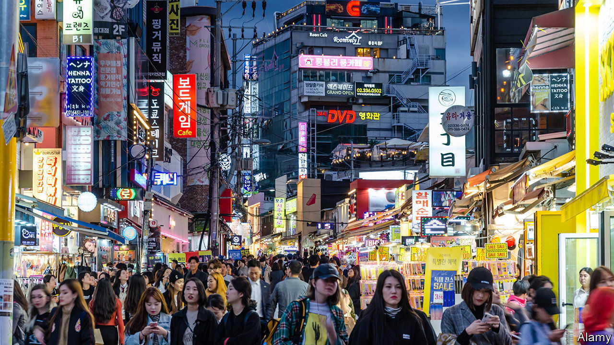

###### The future

# South Korea’s transformation is still fragile 

##### And covid-19 could damage it even more 

 

> Apr 11th 2020 

WHEN PARK HYE-SOO was a young girl, her path to success seemed clearly defined. “My parents said, study hard, get into a good university and everything will be fine, so I was a good daughter and did that,” she says. “But when I finished I didn’t know what to do and my parents didn’t either and I realised nobody had ever taught me how to make decisions for myself.”

Ms Park, now in her 40s, is a child of the Asian financial crisis. When she left university in the late 1990s, South Korea’s economy was in the doldrums and the model that had seemed obvious to her parents no longer held the same promise for people of her generation. For Ms Park, who ended up becoming an artist, success required abandoning most of the assumptions she had held about what constituted it, and years of looking for a new version.


Today her work is exhibited in London and New York as well as Seoul and her country is lavishing awards on her. Her mother, who for years was horrified by her daughter’s life choices, is at last proud of her. Ms Park won’t quite say that she is happy. “But I’m living the life I want.”

The journey that she has already made is one which her country still needs to complete. The increased willingness to challenge prevailing conditions and to try something new is behind many of the developments highlighted in this special report. In the 1980s South Koreans went out into the streets to demand an end to military dictatorship—and succeeded. At the end of the 2010s, they took to the streets once more and succeeded in removing a government which many felt had failed to live up to the promises of democratisation. Ms Park, the artist, is heartened by the increasing willingness to discuss social constraints. “When I was young we never talked about it,” she says. “Young people today do talk about things. They complain.”


In South Korea, complaining has begun to work. It has expanded the range of individual life choices that society will tolerate. Women are no longer obliged to get married or become domestic helpers to their husband’s family. Young graduates have a wider choice of job options. At work, they are less oppressed by hierarchy. They can occasionally say no to an evening of drunken carousing with the boss. Politicians are feeling the pressure to be more accountable to those who elected them.

This process is far from complete. Many Koreans still feel they must follow a narrow script for success: get into a good university, get a job at a chaebol, toil uncomplainingly until retirement. The pressure to do the same thing as everyone else is strong. “We care a lot more about external validation of our choices than about our personal assessment,” says Suh Eun-kook, who studies life satisfaction at Yonsei University in Seoul. “That is very disadvantageous for personal happiness—but changing it takes guts.” It may also still turn out to be a bad decision, points out Paul Chang of Harvard University. “There’s this cliché that South Koreans, particularly South Korean parents, are crazy for being so competitive—but actually it’s a rational response to a situation where there are not enough good jobs or places at the right universities.”

Everybody doing the same sensible thing has apparently also helped South Korea weather the covid-19 pandemic. Still, the outbreak has the potential to retard some of the developments discussed in this special report, perhaps severely.

Economically, deep crises, such as the one that is likely to result from the pandemic, tend to promote market consolidation. Large companies usually find it easier to weather economic storms, both because they are more likely to have bigger cash reserves than smaller firms, and because they are more effective at lobbying the government to include industry-specific measures that benefit them in fiscal-stimulus packages.

South Korean governments have a long-standing habit of turning to the chaebol in hard times; it is not clear yet whether the current one will be any different. If it is not, the pandemic could entrench the dualism of the economy that South Koreans had just begun shaking up, delaying long-term change.

As for social change, the consequences are more difficult to predict. But in the short term, it looks as though the pandemic may slow progress there, too. The measures which the government has so far taken to curb covid-19 affect different social groups in different ways. Closing schools, for instance, disproportionately affects women. There are already reports of mothers quitting their jobs to shoulder the additional responsibilities of caring for children and other relatives at home during the day.

Depending on how long the epidemic lasts and how widespread such responses are, that could prove a setback in advancing the goals of South Korean feminists, reinforcing traditional divisions of labour and social roles.

Like most countries in the world, South Korea may look different a few months from now. The challenge will be for its people not to go back to how things were, but to keep reimagining the future, even as they fight to hold on to their hard-won social and economic gains. ■

