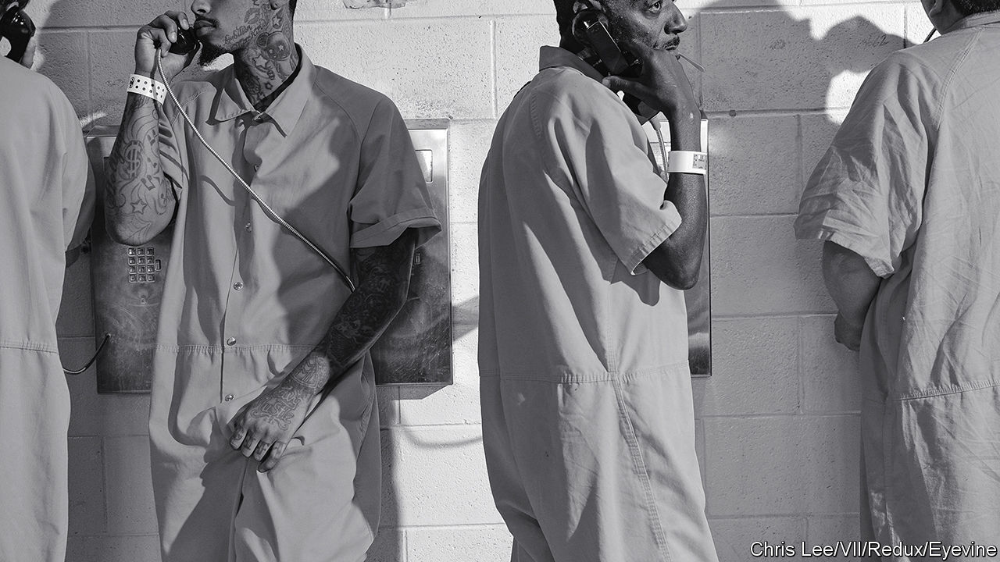

###### Ghost constituents

# The United States census has an inmate problem 

##### Critics say registering the incarcerated as residents of their prisons’ counties leads to gerrymandering 

 

> Apr 11th 2020 

ROBERT HOLBROOK was 17 years old when he went to prison in 1991. For the next 27 years he was incarcerated in several state prisons in Pennsylvania. He was imprisoned at SCI Greene, a supermax prison in the south-western corner of the state, during the 2010 census. Since 1790, the Census Bureau—which began its decennial count on April 1st—has registered incarcerated people as residents of the counties where their prisons are located, not the last address before their arrest. This is important because states then use the census data to draw legislative maps. A prison can bump up a state legislative district’s population, even in places where prisoners cannot vote, which in America means everywhere apart from Maine and Vermont.

Critics call this practice prison-based gerrymandering. Mr Holbrook, an African-American man from the outskirts of Philadelphia, was counted as a resident of Greene County, a mostly white rural area. He, two other formerly incarcerated people and the NAACP Legal Defense Fund filed a lawsuit in February in a Pennsylvania state court over this practice.


The lawsuit asserts that prison gerrymandering has two unconstitutional effects. First, it inflates the political power of the voters in counties with prisons, mainly in rural, mostly white districts. Second, it dilutes the political power of voters in the incarcerated person’s urban home district. Pennsylvania’s prison population is predominantly black or Latino and comes from Philadelphia and Pittsburgh.

Prisons can also lower the income per person for the county while the home district could lose government funding. Mr Holbrook, who had been locked up 300 miles away from home, reckons that “no one should benefit or profit from people in cages. However, if anyone wants the benefit from my incarceration, it should have been the community I harmed.”

A 2018 study by Brianna Remster and Rory Kramer, two Villanova University sociologists, found that if prison-based gerrymandering were done away with and the incarcerated were counted where they lived before they went to prison, several districts with prisons would lose representation and several urban districts would gain it. Their research showed a “substantial likelihood” that Philadelphia would gain an additional majority-minority district in the state house.

The Census Bureau does not intend to change its policy for the 2020 count. So states are taking matters into their own hands. In 2019 a state lawmaker proposed a bill to end the practice in Pennsylvania. It has not made much headway but momentum is building elsewhere. At least eight other states have legislation on the table. Last month Colorado’s governor signed a bill ending the practice. Seven other states, including New York and California, have passed bills ending the practice. Anamosa, a small city in Iowa, changed its law in 2009 after a candidate was elected with just two votes; one was his wife and the other a neighbour. Most of the district residents were prison inmates who could not vote.

Wanda Bertram of the Prison Policy Initiative, a research group, says that as more people focus on gerrymandering in general, it is becoming “easier for folks to understand how taking people out of their home communities and reallocating to their prison cells, for the purposes of redistricting can really change how political power is allocated.”

Mr Holbrook was released in 2018. He is now a registered voter and paralegal but according to the census is still technically considered a resident of Greene County.■

Dig deeper:


